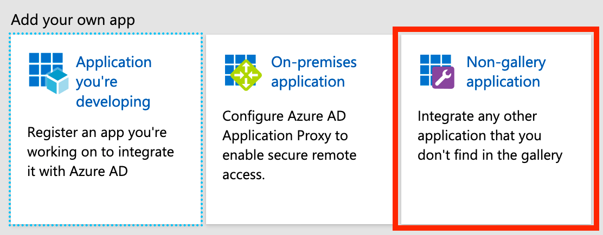
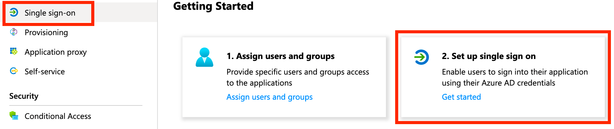
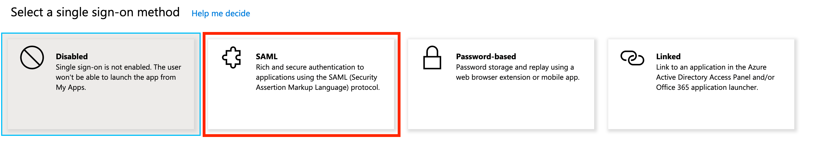
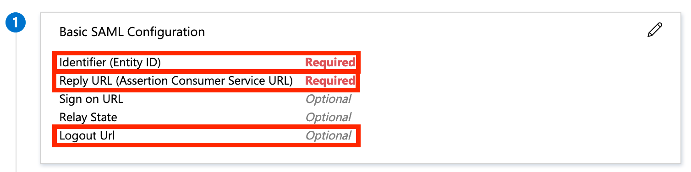
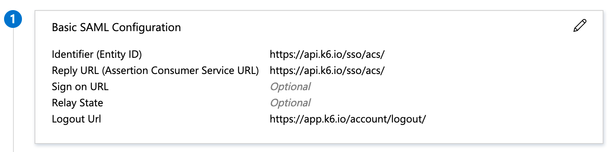
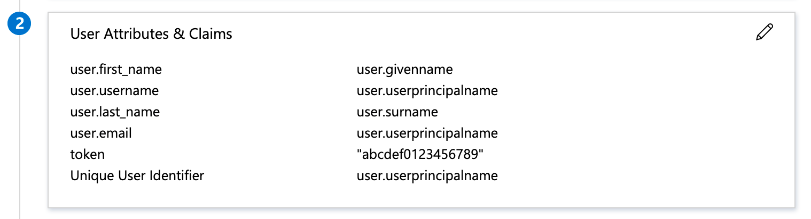
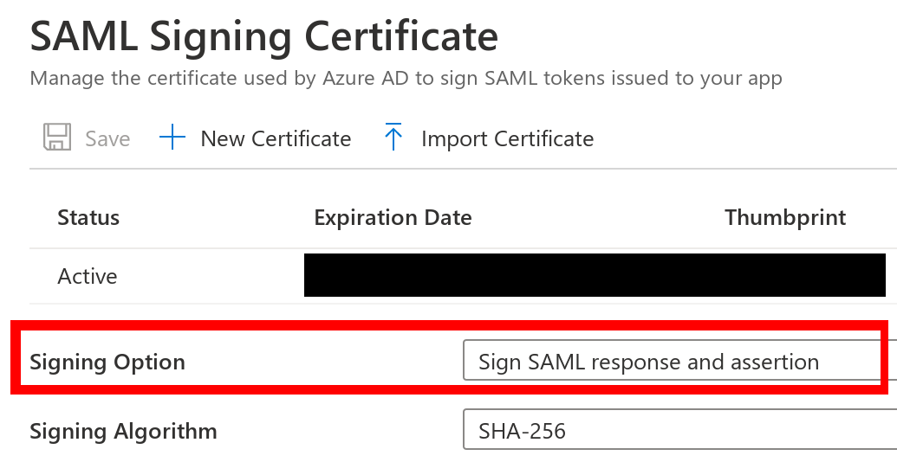
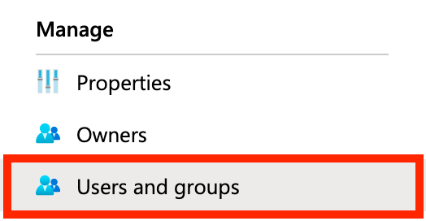
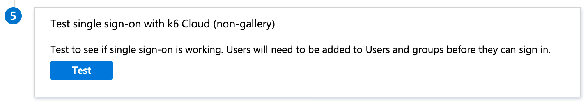
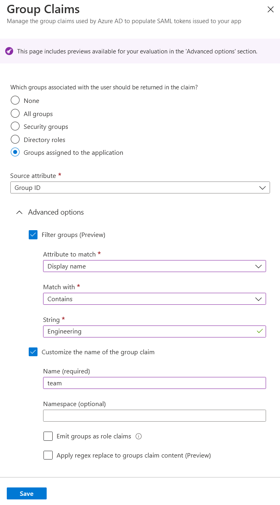

> ⭐️ SAML SSO is available on Enterprise plans.

Microsoft's Active Directory has been a long time the standard for managing an enterprise's users and their access permissions, and Azure Active Directory is its direct cloud counterpart. k6 Cloud integrates with Azure AD to provide organizations with a compliant way to handle on- and offboarding of team members to the service.

## Prerequisites

To setup Azure AD SAML SSO based authentication to k6 Cloud you must have:

1. An [Enterprise plan](https://k6.io/pricing) or a plan with the SAML SSO add-on.
2. An [Azure AD Premium Subscription](https://azure.microsoft.com/en-us/pricing/details/active-directory/).

## Configuration

1. Navigate to [https://portal.azure.com/](https://portal.azure.com/).
2. Log in to Azure Portal and go to **Azure Active Directory** tab.
3. Select the **Enterprise applications** service.
4. Click on the **New application** button.
5. Select **Non-gallery application**.
    
6. Give the application a name, e.g. **k6 Cloud**.
7. Click **Add**.
8. When your application has successfully been added, click **Set up single sign on** (or the equivalent "Single sign-on" link in the left menu):
    
9. Click **SAML** to enable it:
    
10. Edit **Basic SAML Configuration**:
    

    Setting:

    | Property                                   | Value                              |
    | ------------------------------------------ | ---------------------------------- |
    | Identifier (Entity ID)                     | `https://api.k6.io/sso/acs/`       |
    | Reply URL (Assertion Consumer Service URL) | `https://api.k6.io/sso/acs/`       |
    | Logout Url                                 | `https://app.k6.io/account/logout` |

    Resulting in:
    

11. Edit **User Attributes & Claims**:
    

    Setting the following user attributes (and clearing the "Namespace" property for each attribute):

    | Attribute                | Value                                                                      |
    | ------------------------ | -------------------------------------------------------------------------- |
    | `Unique User Identifier` | `user.userprincipalname`                                                   |
    | `user.email`             | `user.userprincipalname`                                                   |
    | `user.username`          | `user.userprincipalname`                                                   |
    | `user.first_name`        | `user.givenname`                                                           |
    | `user.last_name`         | `user.surname`                                                             |
    | `token`                  | An unique token that you'll be provided with by the k6 Cloud support team. |

    Resulting in:
    

12. Copy the "App Federation Metadata Url" and send it to k6 Cloud support for completion of the setup.
    
13. Also, edit **SAML Signing Certificate** and set the "Signing option" to "Sign SAML response and assertion":
    
14. Before moving to the final step of testing the integration, make sure you've added the appropriate users and groups to the application in Azure AD:
    
15. Once you've gotten confirmation from k6 Cloud support that your account is ready we advise you to test the integration by clicking the "Test" button in Azure AD:
    

## Teams setup

Take the following steps to enable mapping of Azure Active Directory groups with k6 Cloud projects:

1. Navigate to [https://portal.azure.com/](https://portal.azure.com/).
2. Log in to Azure Portal and go to **Azure Active Directory** tab.
3. In the right pane, click on the **Groups** menu item.
4. Click on the **New Group** button.
5. Choose **Security** as the group type and choose a name for the group.
6. Click on the **No owners selected** and choose the group owner (usually the administrator).
7. Click on the **No members selected** and choose members of this group and click on **Select** when you're done.
8. Click on **Create** when you've done setting up your group. You'll be redirected back to the **Groups** page, and after a few seconds, your group will be created.
9. Go to your **k6 Cloud** enterprise application. To do so, search for **Enterprise Applications** in the top search bar.
10. Click on the **Users and groups** in the right pane, and you'll be presented with the list of users and groups assigned to your k6 Cloud application.
11. Click on the **Add user/group**, choose the newly created group, and click on **Assign**. This application is now assigned to all the members of that group. You can assign as many groups as you want to your k6 Cloud application. The group members will be later assigned to their projects on k6 Cloud.
12. Now click on the **Single sign-on** option in the right pane. In the  **Attributes & Claims** section, click on **Edit** on the frame top right corner.
13. Click on the **Add a group claim** and add a group claim as shown below:
    
14. You've successfully set up teams on your end. Inform your point of contact about the object id of each group and the list of projects on k6 Cloud you want the users from those groups to land on. You can retrieve the object id of the group by navigating to your **Azure Active Directory** and then clicking on **Groups** in the right pane. The list of groups and their object ids will be shown.

## See also

- [Project and Team Management / SAML SSO](/cloud/project-and-team-management/saml-sso/)
