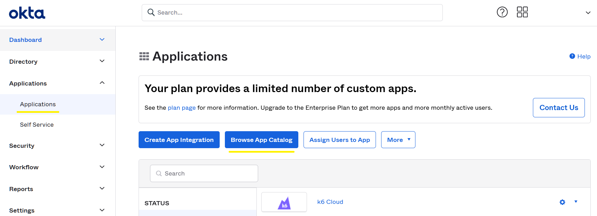
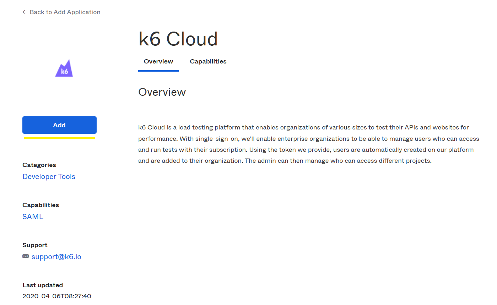
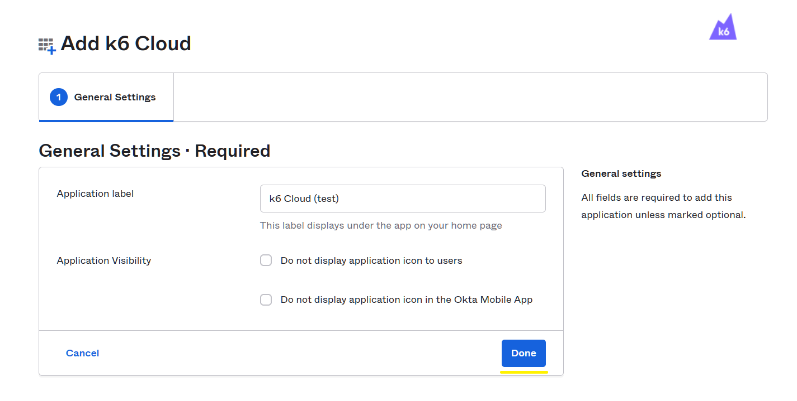
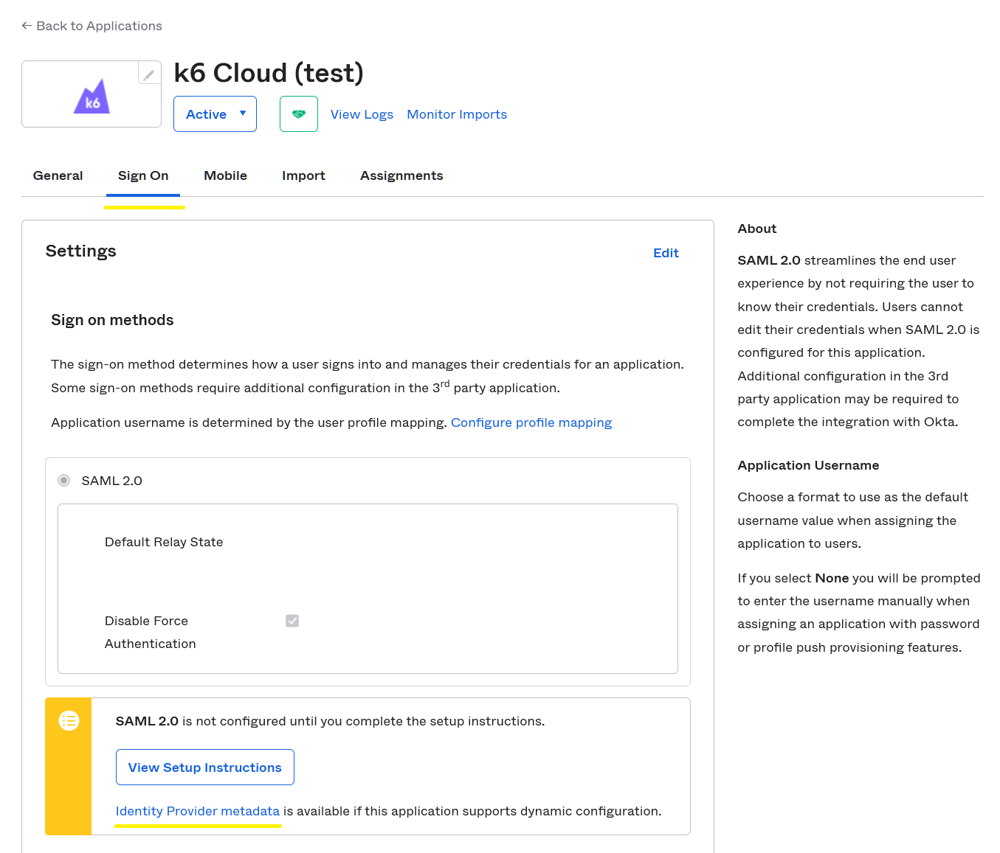
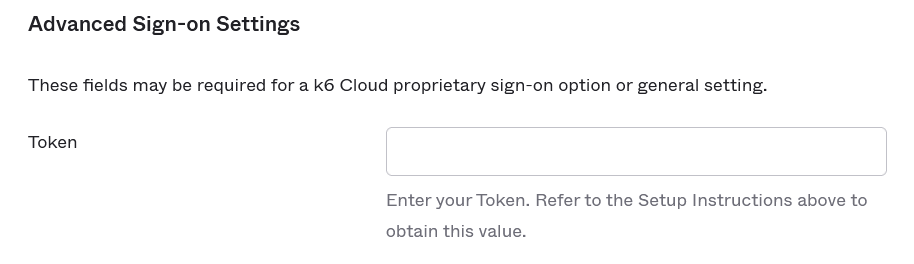
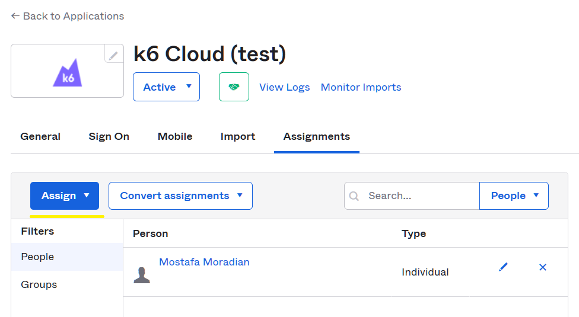
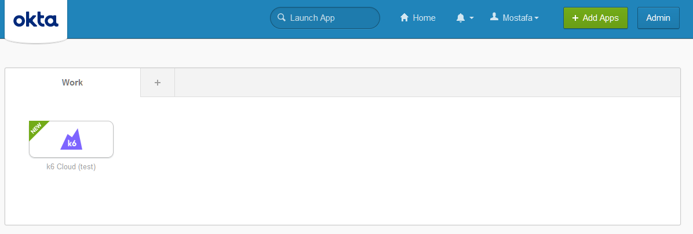
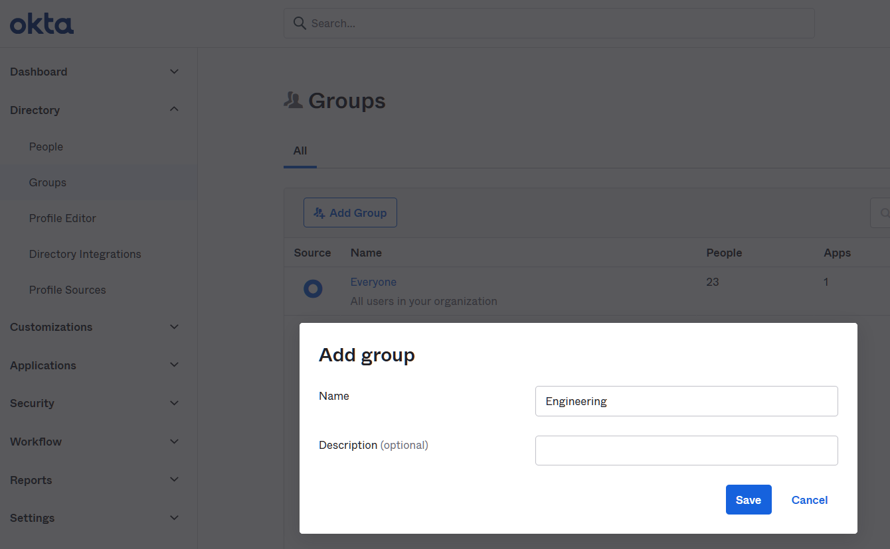
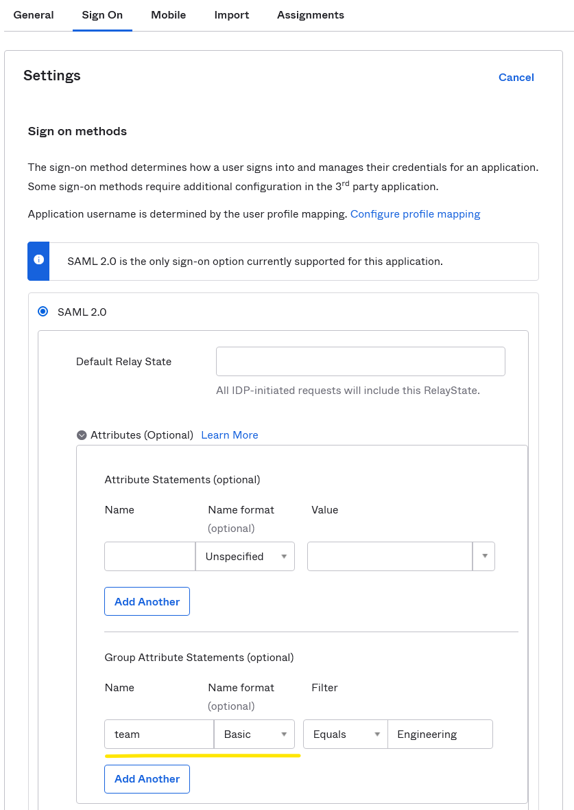

> ⭐️ SAML SSO is available on Enterprise plans.

Okta is a well-known identity and access management service that provides means for provisioning and user management all in a single place. k6 Cloud integrates with Okta to provide organizations with a compliant way to handle on- and offboarding of team members to the service.

## Prerequisites

To setup Okta SAML SSO based authentication to k6 Cloud you must have:

1. An [Enterprise plan](https://k6.io/pricing) or a plan with the SAML SSO add-on.
2. An [Okta Subscription with SSO Integrations](https://www.okta.com/pricing/).

## Configuration

1. Head over to [https://your-organization.okta.com/](https://your-organization.okta.com/).
2. Go to Applications menu item and click on Applications.
3. Click on Browse App Catalog button.

4. Search for k6 Cloud and choose the application from the drop-down, and then click on Add.

5. You'll be presented with a few setup options. Choose your desired application label and visibility settings and click on Done.

6. You'll be sent to the k6 Cloud application configuration page, where you can copy the Metadata URL from the Sing On tab. The link referenced by the Identity Provider metadata should be copied and sent to the customer success team for further setup. The link usually looks like
[https://your-organization.okta.com/app/your-app-id/sso/saml/metadata](https://your-organization.okta.com/app/your-app-id/sso/saml/metadata)

7. The customer success team will convert your k6 Cloud organization to a SAML organization and provide you with a token. On the same tab (Sign On), click on Edit in the top right corner and paste the token in the Advanced Sign-on Settings and click on Save button at the bottom of the same box.

8. Now go to Assignments tab and assign the app to the users:

9. The app will appear on the users' dashboard and when they click on the app icon, they will be redirected to k6 Cloud app and will be provisioned the first time or signed in the second time on. Upon provisioning, they will be automatically assigned to the default project(s) with **project read/write** permissions.

## Teams setup

Take the following steps to enable mapping of Okta groups with k6 Cloud projects:

1. Go to **Directory** -> **Groups** and click on the **Add Group** button. Enter **Engineering** in the name field and hit **Save**.
By default, all the people, aka. accounts, are added to the **Everyone** group, but you can create as many groups as you want and assign people to those groups. We'll need the group name later. Let's create an **Engineering** group and add some accounts. If you want to map multiple groups, you need to add a prefix, like **MyOrg_Engineering**, to the group name to be partially matched in step 4 with the **Contains** filter.
    
2. Click on the **Engineering** group and click on the **Assign People** button. You can add as many users as you want to this group on a new page. After adding them, hit **Save**.
3. You have two ways to assign these groups to the **k6 Cloud** application. Both do the same thing.
   1. On the group page, you can click on the **Applications** tab and then click on the **Assign applications** button.
   2. Go to **Applications** -> **Applications** and click on your **k6 Cloud** application. On the **Assignments** tab, you can click on the **Assign** dropdown button and choose **Assign to Groups**.
4. Go to the **Sign On** tab on your **k6 Cloud** application. In **Settings**, click the **Edit** button on the top right corner of the settings frame.
5. In the **SAML 2.0** frame, click on the tiny dropdown button called **Attributes (Optional)**. In the **Group Attribute Statements (optional)**, enter **team** (or **group**) in the name box, choose **Basic** as the name format and type in **Engineering** in the filter input box after choosing the **Equals** filter from the dropdown. Then hit **Save** at the bottom of the form. If you want to include multiple groups, choose the **Contains** filter and use prefixes for your group names, like **MyOrg_**, so it can match multiple groups.
    
6. Many groups can be added to the same **k6 Cloud** application on Okta, but the users will end up in their projects in k6 Cloud based on their group name. Joining users to the project(s) only happens on provisioning.
7. Inform your point of contact of the exact group names (plus prefixes) and the list of projects on k6 Cloud you want the users from those groups to land on.

## See also

- [Project and Team Management / SAML SSO](/cloud/project-and-team-management/saml-sso/)