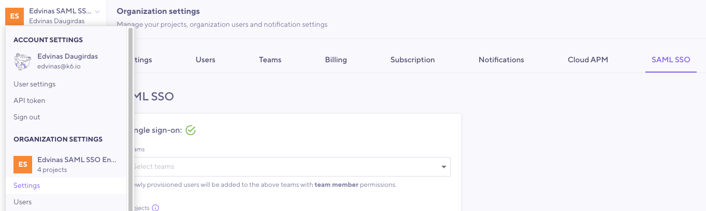
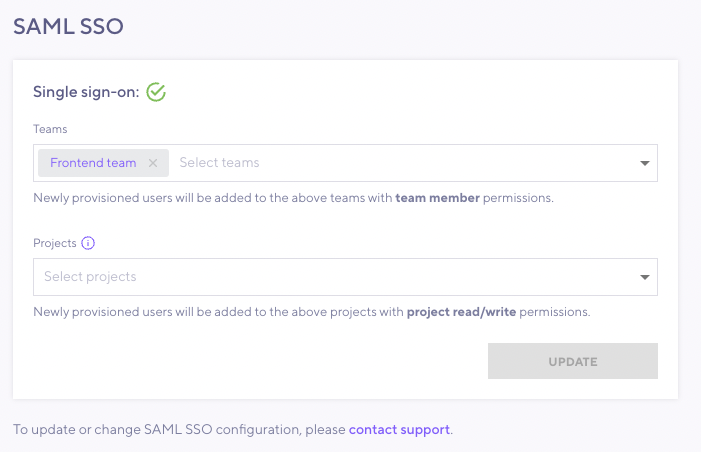

> ⭐️ SAML SSO is available on Enterprise plans.

For single sign on to k6 Cloud, you can set up SAML SSO.
Through SAML SSO, your members can sign in through an IdP and be automatically assigned to designated Teams and Projects.

In these docs, read about:
- How SAML SSO works with k6 Cloud
- How to set up your k6 Cloud account for SSO

To configure k6 Cloud with a specific identity partner, you can consult the following
supplementary references and procedures:
- [Okta with k6 Cloud](./okta)
- [Azure AD with k6 Cloud](./azure-ad)

## About SAML SSO

[SAML](https://en.wikipedia.org/wiki/Security_Assertion_Markup_Language) is an open standard to exchange authentication and authorization data.
One use of SAML is _single sign-on_ (SSO), which lets an organization manage users through a central Identity Provider (IdP) application (such as [Azure Active Directory](/cloud/project-and-team-management/saml-sso/azure-ad) and [Okta](/cloud/project-and-team-management/saml-sso/okta)).

<blockquote mod="note" title="Provisioning in SAML SSO">

In SAML SSO, _provisioning_ happens the first time a user signs in to k6 Cloud web app via SAML SSO from their IdP dashboard.
This process causes the user to be created, joined to its organization, and assigned to default organization units.

</blockquote>

### SAML SSO with k6 Cloud

Once you set up SAML SSO with your k6 Cloud organization, the only further step is to grant access to new users.
With access, members can log in to k6 Cloud without any additional authentication.
When they connect, users will be directed to the correct k6 organization and have access to k6 [Teams](/cloud/project-and-team-management/teams) and [Projects](/cloud/project-and-team-management/projects) based on the Okta or Azure Groups you assign them to.

### Suggested identity providers

k6 suggests the following IdPs:

- [Okta](https://www.okta.com)
- [Azure Active Directory](https://www.microsoft.com/en-us/security/business/identity-access/microsoft-entra-id). Azure is supported, but Azure passes only _group IDs_ to k6 Cloud, not _group names_. This means that for anything more advanced, you need to manually create Teams or Projects in k6 Cloud side, then contact us to map them to the IDs sent from Azure AD.
- [Auth0](https://auth0.com/) is tested, but not supported, because it can't map [custom attributes](https://community.auth0.com/t/adding-custom-saml-attribute-when-auth0-is-idp/45691) in assertions.
- Since we support the open [SAML 2.0](https://en.wikipedia.org/wiki/SAML_2.0) standard, you can connect k6 Cloud to practically any SAML 2.0 identity provider, not just the ones documented here. For further assistance, please contact support.

## Set up SAML SSO

Currently, setting up SAML SSO is a manual process that requires communication with the k6 customer success team.
The full procedure to set up SAML SSO with k6 Cloud is as follows:

1. Coordinate with the k6 support team to trade SAML URLs and tokens.
2. Configure your IdP to send data to k6 Cloud,
3. Use k6 Cloud to assign default teams and projects

<Blockquote mod="attention" title="">

If you remove users from the IdP, they also completely lose access to k6 Cloud.

</Blockquote>

### Before you start

To set up SAML SSO for your organization, you need the following:

- Admin access to your k6 Organization
- Admin access to the admin panel of the IdP you are using.

<!--double blank lines for styling -->
- SAML URLs for k6 Cloud:
  
  | Resource                    | URL                                |
  |-----------------------------|------------------------------------|
  | k6 Cloud SAML SSO URL       | `https://api.k6.io/sso/acs/`       |
  | SAML SSO logout (if needed) | `https://api.k6.io/sso/acs/logout` |

### Configure your IdP and k6 Cloud

1. Choose or create the `k6 Cloud` SAML SSO application on your IdP of choice (such as Okta or Azure). We recommend organizing your users into _Groups_ on the IdP side.
1. Find the **IdP Metadata URL** for your SAML SSO application
   and forward it to the k6 customer success team.
    - For Okta, go to **Sign on**, then **SAML Signing Certificates > Actions > View IdP metadata**. Copy the URL of the page that opens. Refer to [Okta with k6 Cloud](./okta) 
    - For Azure, go to **Single sign-on**. Copy the field at **SAML Certificates > App Federation Metadata Url**. Refer to [Azure AD with k6 cloud](./azure-ad)

After you send the URL, the customer success team will send you a **token**.
When you get your token, you can finish the procedure:

1. In the SAML SSO application, add a custom **attribute** `token` and set it to the value of the token you received.
1. _Optional_: If your IdP supports it, create custom attributes that point to the IdP _Groups_  that you want to map to k6 cloud Teams or Projects.
  For examples, refer to the supplementary docs for Okta and Azure AD.
1. Assign IdP Groups (or users) to the application so they can use it.
1. _Optional_: Request that the k6 customer success team enforces SAML SSO on all existing and new users. This disables username/password authentication for all users, even the owner.
1. _Optional_: In k6 Cloud, go to **Organization > Settings > SAML SSO**. Choose the default Teams or Projects that newly provisioned users.

After these steps, users with access to the IdP `k6 Cloud` app can select the icon to log into k6 Cloud for the first time.

After users log in once (that is, after they are provisioned), they can log in through both the IdP dashboard and the SAML SSO button available on the login page of [k6.io](https://app.k6.io/account/login).

<Blockquote mod="attention" title="With SAML SSO, you cannot invite users through the k6 Cloud app">

If your organization has set up SAML SSO, you cannot invite members through the k6 Cloud web app.
Instead, use the following methods to provision and sign them in:

- Username/password and SAML SSO (mixed): 
   This is limited to the owner and the users created in advance via invitation with username/password.
- SAML SSO: 
   All new users should be solely created via SAML SSO provisioning.

</Blockquote>

## Assign default Teams and Projects to newly provisioned users

When new users are provisioned into k6 Cloud, they automatically join your organization and are assigned to its default [Project](/cloud/project-and-team-management/projects/).

However, if your organization can use [Teams](/cloud/project-and-team-management/teams/), consider assigning users on the Team level instead.
Many projects can belong to the same Team, so Team-level assignment offers more flexibility and control.

To change default Teams and Projects, go to the k6 app settings at **Organization > Settings > SAML SSO**. For team-level assignment, refer to the procedure in the subsequent section.

While Teams and Projects can be auto-created on-connection
(if you arranged for this with the k6 customer success team), they need to already exist for you to assign them as defaults.

<Blockquote mod="note" title="You cannot assign retroactively">

Changes to default organization units affect only new users (i.e. haven't been provisioned yet) on k6 Cloud.

</Blockquote>

### Assign users on the Team level

If you have access to Teams, k6 recommends that you [set up your Teams](/cloud/project-and-team-management/teams#creating-a-team) to grant access to the Projects you like.
Then, you can update the list of default Teams and Projects for new users:

1. Make sure you correctly set up the SAML organization with the help of the customer success team. You can use your admin account to test.
2. Go to your organization settings and choose the **SAML SSO** tab.

3. From the dropdown, choose the default Teams or Projects to assign newly provisioned users to.

Now the users assigned to the IdP application can sign in to k6 Cloud.
They will join Teams with a `team read only` permission
(but the Team normally grants `project read/write` projects to all projects linked to the team).
