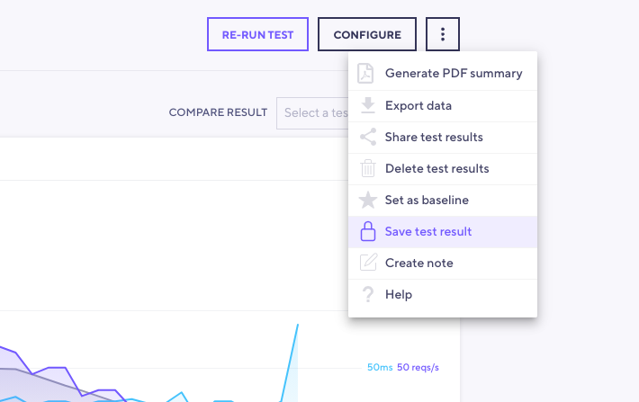

Data retention refers to the policy that specifies how long the k6 Cloud service will keep your test result data.

k6 differentiates between test result data and your user data (projects, profiles, etc.). In terms of data retention, we are referring only to test result data. Your **user data and test configurations are saved indefinitely** on your user profile.

<Blockquote mod="warning">

Data is retained on a rolling basis. **Test result data older than what is specified in your plan is automatically deleted**. If you need to save data, please be sure to export, set the test as baseline, or purchase a period of data retention that meets your requirements.

</Blockquote>

## How long is my data retained

Data is retained on a rolling basis, depending on your subscription. For plans with 1 month of data retention, we will retain data for 30 days from the test run. After that period the data is deleted. This rolling period only applies while you have an active subscription. If you cancel your subscription, data is retained for 7 days past subscription expiration.

## How do I save my baseline test result

**Baseline test results** are exempt from data retention rules and are **saved indefinitely.**

You can select a single test run per test as a baseline test. The purpose of this is to serve as a point of comparison for future tests. To mark a test as baseline, use the three dot menu in the top right corner of your test run and click `Set as Baseline`.

## Save test result

In addition to saving tests as baseline, each premium k6 Cloud subscription will allow you to save a number of your results of a number of tests indefinitely. The number of saved tests attached to the subscription will depend on the subscription level. Once you save test it will populate 1 of the available slots for saving, removing that test run from the saved tests list in your UI (Manage section on the left hand side menu) will open a slot for a new test run to be saved.

The difference to save as baseline feature is that saved tests are not limited by 1 test run per test.

In order to mark a test run as saved, use the three dot menu in the top right corner of your test run and click `Save test result`

## Can I export my data

Yes, you can export your test results. Read more [here](/cloud/analyzing-results/result-export).

## When can I purchase Data Retention

Every subscription plan automatically includes a period of data retention that specifies how long the k6 Cloud retains your test results. For more info about each plan's data retention policy, read [How long is my data retained](#how-long-is-my-data-retained) and visit the [pricing page](https://k6.io/pricing/). 

If you need a data retention policy longer than specified in our plans, please reach out to support for pricing information.

## Buying a Data Retention plan after cancelation

When canceling your subscription, you are able to buy a Data Retention plan. This plan allows you to retain your result data at a lower rate between testing periods.
