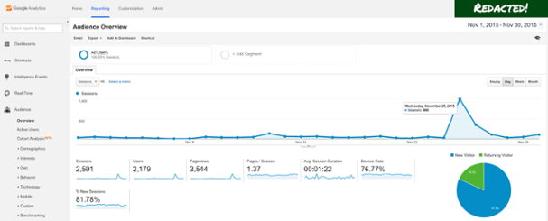

To calculate the number of Virtual Users you need to test with, you should consider this formula:

>Virtual Users = (Hourly Sessions x Average Session Duration in seconds) / 3,600

Google Analytics and other tools are great for seeing where your users are coming from, and it also offers plenty of data that can help you create realistic load tests.

Google Analytics tracks new visitors (“Users”) and how long they stay on your site. During their stay — the "Session" — they will perform actions (page loads, AJAX requests) that cause traffic to be generated that will load your servers.

The formula above takes it's inputs and determines how many users are in the middle of a "Session" at any one time, meaning they are currently active on the site and generating traffic the servers have to handle.

**Where do I get this data in Google Analytics?**

1. Login to your Google Analytics account
2. Click the “Reporting” tab across the top
3. Select “Audience” in the sidebar menu
4. Click “Overview”
5. Set the time period you want to base your data on in the top-right corner
6. And the data you need is right in front of you!

Check out the screenshot below to get an idea of the view and where you’ll find sessions and average session duration.

**Note:** This screenshot is from a small site’s Google Analytics dashboard. We redacted the name in the top-right corner in the name of privacy!

And that’s it! As you can see, Google made this data pretty easy to find.

### How to design your load test

One good way of determining what traffic to subject your site to during a load test is to check your peak hours of traffic in Google Analytics, figure out how many sessions you faced then, and perform a test that generates a similar kind of load in a similar [pattern](/test-types/introduction). You probably want to add some margin to it also — to ensure that you can handle higher traffic levels than your latest peak.

The reason we want to find the traffic peak and not just use the average level for the whole month is that, in most cases, average traffic will be quite low. It’s quite common for sites to have regular, recurring peak periods where they experience maybe 2-3x the average traffic levels, so it is important to test for that level of traffic, at the very least.

Some sites or services may also have occasional (or regular) extreme traffic peaks. It can be due to the nature of the site — perhaps it’s a new release your customers are eager to try, your app that is gaining popularity as the next bit thing, a site declaring the result of an election, or a site selling concert tickets that are released at a certain date and time.

It can also be because of user behaviour. Maybe your app provides dinner recipes, which means everyone logs on just before dinner. Regardless, such sites can have peaks that are much higher than 10x the longtime average for the site. In this case it is even more important to load test at traffic levels way beyond the average to ensure the system doesn’t break down when it counts.

So how do we do this? Here’s the Google Analytics dashboard for a small example site that has had a (relatively) big traffic spike. For this little site, nearly 40 percent of November 2015’s traffic came on a single day — Nov. 25. Keep in mind this is example data for a super small site.

Here’s the basic math we used to analyze the data:

The site averaged .08 concurrent sessions for the entire month.

- 2,591 **monthly** sessions x 82 seconds per session / 3600 = 59.0172
- 59.0172 / 720 (30 days in November x 24h per day = 720) = .08 average concurrent users in November

However, if you calculate the average concurrent sessions for just Nov. 25, you get 1.05 — that is more than 10x the monthly number. And if you calculate the average concurrent sessions between 3 p.m. and 4 p.m. on that day, when most of the traffic spike happened, the average number of concurrent sessions is 7.2. While not a huge number by itself, it is almost 100x the monthly average.

This illustrates how important it is to look at the right numbers, or the right time frames, when designing your load test. Even if you do not have a huge spike like in this case, chances are that you will still see temporary peaks that can reach perhaps 10x your average traffic level.

No matter the size of your company or the amount of traffic you typically handle, a sudden increase in traffic by nearly 100x definitely has the potential to degrade performance for the user, so spike tests are always a good idea before marketing initiatives, funding announcements, new feature rollouts and just for the sake of always being prepared.

***

See also:
- [Virtual Users](/cloud/cloud-faq/what-are-vus-virtual-users)
- [Creating tests in k6 Cloud](/cloud/creating-and-running-a-test)
- [Code Samples and Scripting Examples](/examples)
- [Test configuration options](/using-k6/options)
- [Test ramping configurations](/test-types/introduction)
