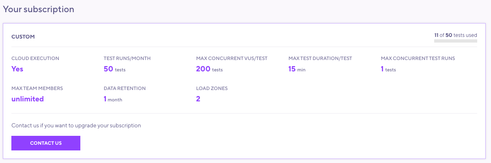

To view or update your subscription, select your profile icon, then **Manage > Subscriptions.**
The subscription menu outlines your current plan limits and shows how many tests remain in your current period.

## View subscription

In the subscription view, note your current active subscription and any add-ons you may have.

To find usage for the current period, use the counter in the right corner.

## Upgrade subscription

If you paid online with a credit card, you can upgrade anytime.
We will prorate your existing subscription towards the cost of a new one.

## Downgrade subscription

To downgrade your subscription, select a new plan at any time.
We will bill the new cost immediately and start the new plan at the end of your current period.

## Cancel subscription

You can cancel your online subscription at any time through the web app.
If you cancel, you can use your plan through the end of the current period.

## Retain data

When you cancel, you can opt in to [Data Retention](/cloud/billing-user-menu/data-retention) to save your result data longer-term or between projects.

If you don't choose data retention, k6 clears all test-result data seven days after your subscription expires.
