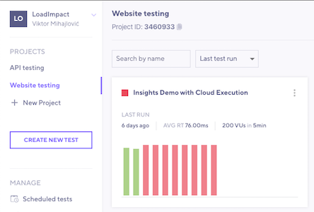
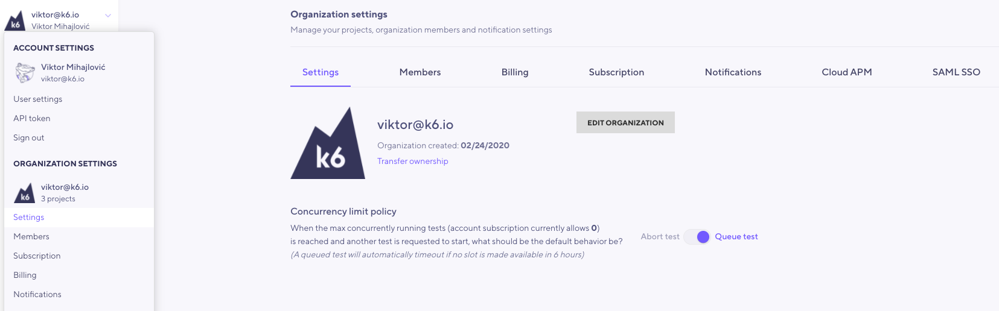

## FAQ

- [What IP addresses are used by the k6 Cloud?](#what-ip-addresses-are-used-by-the-k6-cloud)
- [What is the best way to debug my load test scripts?](#what-is-the-best-way-to-debug-my-load-test-scripts)
- [I was invited to an organization and I cannot run tests](#i-was-invited-to-an-organization-and-i-cannot-run-tests)
- [What's the difference between LoadImpact's version 3.0 (Lua) and k6 Cloud?](#whats-the-difference-between-loadimpacts-version-3-0-lua-and-k6-cloud)
- [How to open a firewall to k6 Cloud service for cloud tests?](#how-to-open-a-firewall-to-k6-cloud-service-for-cloud-tests)
- [Test status codes](#test-status-codes)
- [What are VUs (Virtual Users)?](#what-are-vus-virtual-users)
- [How many VUs can be run from the same Dedicated IP?](#how-many-vus-can-be-run-from-the-same-dedicated-ip)
- [Why am I receiving Max concurrency reached error message and how do I get rid of it?](#max-concurrency-reached-error-message)
- [Data uploads with k6 Cloud](#data-uploads-with-k6-cloud)
- [Pricing FAQ](/cloud/cloud-faq/pricing-questions)

### What IP addresses are used by the k6 Cloud?

k6 uses AWS for cloud load generators. For the IP addresses used in the different load zones and filtering methods please refer directly to [Amazon](http://docs.aws.amazon.com/general/latest/gr/aws-ip-ranges.html).

If you prefer to view the ranges directly, within the above link, the [ip-ranges.json](https://ip-ranges.amazonaws.com/ip-ranges.json) file provides the updated list of IP addresses used by our load generators. In order to know which IP ranges can be used, you need to filter the `service` of type EC2 and the `region` of the selected load zone/s in your test configuration.

The zone codes are mapped as follows:

<Glossary>

- `af-south-1`: Cape Town
- `ap-east-1`: Hong Kong
- `ap-northeast-1`: Tokyo
- `ap-northeast-2`: Seoul
- `ap-northeast-3`: Osaka
- `ap-southeast-1`: Singapore
- `ap-southeast-2`: Sydney
- `ap-south-1`:  Mumbai
- `ca-central-1`: Montreal
- `eu-north-1`: Stockholm
- `eu-central-1`:  Frankfurt
- `eu-south-1`: Milan
- `eu-west-1`: Dublin
- `eu-west-2`:  London
- `eu-west-3`:  Paris
- `me-south-1`: Bahrain
- `us-east1`: Ashburn
- `us-east-2`: Columbus
- `us-west-1`: Palo Alto
- `us-west-2`: Portland
- `sa-east-1`: São Paulo

</Glossary>

----

### What is the best way to debug my load test scripts?

Debugging helps to ensure your code produces the expected results.  While there is a [script editor](/cloud/creating-and-running-a-test/script-editor) built into the k6 web application, it has limited debugging abilities. 

Using k6 locally, you can actually execute your test scripts on a small scale to quickly see how the script executes. Debugging locally is beneficial for two reasons:

1. A cloud test counts against any subscription limits you may have.
2. Execution is slower when streaming or executing in the cloud. We want debugging to be a fast iterative process.

<CodeGroup labels={[""]}>

```bash
k6 run test.js
```

</CodeGroup>

If you've configured Virtual Users or duration in your script, adding the flags `-i 1 -u 1` instructs k6 to execute 1 iteration with 1 Virtual User, making the debugging sometimes easier.

<CodeGroup labels={[""]}>

```bash
k6 run test.js -i 1 -u 1
```

</CodeGroup>


> To develop and debug your load tests, we recommend, in most cases, running your tests locally - using the **`k6 run`** command.
>
> When your script is ready, execute the test on the k6 Cloud with the `k6 cloud` command.


For debugging, k6 also provides a few builtin options:


- [`--http-debug`](/using-k6/options#http-debug) prints all the requests and responses to the console. Read more [HTTP debugging](/using-k6/http-debugging).

  <CodeGroup labels={[""]}>

  ```bash
  k6 run test.js --http-debug="full"
  ```

  </CodeGroup>


- `Console logging methods` can print any message to the console. In the cloud, the console logs are shown on the [Logs Tab](/cloud/analyzing-results/logs).

  <CodeGroup labels={[""]}>

  ```javascript
  import http from 'k6/http';

  const res = http.get('http://httpbin.test.k6.io/json');
  console.log(JSON.stringify(res));
  ```

  </CodeGroup>

  Note that you can also use the [`--console-output`](/using-k6/options/#console-output) option to redirect console logs to an output file.

    <CodeGroup labels={[""]}>

  ```bash
  k6 run --console-output "loadtest.log" script.js
  ```

  </CodeGroup>

----

### I was invited to an organization and I cannot run tests

> I was invited to an organization with a subscription. However, When I try to run tests, I get an error that my subscription doesn't have enough Virtual Users/exceeds the duration/uses too many load zones. Our subscription allows for the test I want to run. What is wrong and how do I fix this?

If you encounter a similar situation, probably, the problem is that you run the test from a different organization with another subscription.

This situation often happens because when you register your account, the k6 Cloud automatically creates a "personal" default organization for you. In this case, you might have two organizations; your "personal" organization and the invited organization. 

By default, tests run from your "personal" organization.

**How do I change the organization to fix this?**

If you run tests from the web interface, you will need to use the User menu - on the top of the left sidebar- to select a project within the desired organization.



If you run tests from the k6 CLI, you will need to set the `projectID` in the test script. 

To do this, copy the project ID from the top left corner of the project dashboard (see image above) and set the `projectID` as a [cloud execution option](/cloud/creating-and-running-a-test/cloud-tests-from-the-cli#cloud-execution-options).

<CodeGroup labels={["Example:"]}>

```javascript
export const options = {
  ext: {
    loadimpact: {
      projectID: 123456,
    },
  },
};
```

</CodeGroup>

Read more about managing [Organizations](/cloud/project-and-team-management/organizations) and [Projects](/cloud/project-and-team-management/projects).

----

### What's the difference between LoadImpact's version 3.0 (Lua) and k6 Cloud?

Read more [here](/cloud/cloud-faq/whats-the-difference-between-loadimpacts-version-3-0-and-k6-cloud-4-0).

----

### How to open a firewall to k6 Cloud service for cloud tests?

If you are running a `k6 cloud` test, you will be utilizing k6's cloud infrastructure. These are dynamically allocated from our cloud providers and we do not know the source IP until the test is running.

To open your firewall to k6 cloud traffic, you have multiple options.

1 - Open up your firewall to the whole range of AWS IP addresses used by the load zones where you want to run your load test from. We list [here](/cloud/cloud-faq/general-questions#what-ip-addresses-are-used-by-the-k6-cloud) the full range of IP addresses.

2 - Use HTTP headers, URL query parameters, or unique data that identifies the traffic as belonging to your load test, This requires that your firewall has support for scanning application payload data and apply rules based on what it finds. Here is some examples:


2.1 - You can add custom HTTP headers to any request in your script. You'll need to add the header to every single request.

<CodeGroup labels={["Custom headers"]}>

```javascript
import http from 'k6/http';

export default function () {
  const url = 'http://test.k6.io/login';
  const payload = JSON.stringify({ email: 'aaa', password: 'bbb' });
  const params = {
    headers: { 'Content-Type': 'application/json', 'Myheader': 'TOKEN_STRING' },
  };
  http.post(url, payload, params);
}
```

</CodeGroup>

2.2 - If you're not dependent on having the simulated users in your load test to be a certain user agent, you can also use the `userAgent` option to set the "User-Agent" header for all subsequent requests. That header could then contain your token value and you would not have to modify every single HTTP request in your script. In the below example the user agent is set to `MyK6UserAgentString/1.0`

<CodeGroup labels={["User agent option"]}>

```javascript
// Set a custom User Agent globally in your test options.
export const options = {
  userAgent: 'MyK6UserAgentString/1.0',
};
```

</CodeGroup>

2.3 - You might also use query parameters, if it doesn't interfere with the functionality of your application:

<CodeGroup labels={["Query parameters"]}>

```javascript
import http from 'k6/http';

// Add query parameters to your requests with a unique piece of data
export default function () {
  http.get('http://test.k6.io/?firewall_token=TOKEN_STRING');
}
```

</CodeGroup>

3 - Another option would be to request content from a certain hostname that is not in the DNS, but your site would of course need to be configured to respond to requests for that hostname. This is how you do it on the k6 cloud's side:

<CodeGroup labels={["Query parameters"]}>

```javascript
import http from 'k6/http';

// In your options, map your a unique/unused/secret hostname to the IP of the server.
export const options = {
  hosts: {
    'https://very_difficult.to.guess.hostname.com': '1.2.3.4',
  },
};
// Make your requests to that hostname
export default function () {
  http.get('https://very_difficult.to.guess.hostname.com/');
}
```

</CodeGroup>

This last solution requires that your firewall terminates SSL traffic, otherwise it will not see the Host header in unencrypted form. You could also use unencrypted HTTP, but get a bit less security.

----

### Test status codes

Below the list of test statuses in k6 along with the code returned. The code returned here is different than what is returned by k6.

<Glossary>

- [Created](#created): -2
- [Validated](#validated): -1
- [Queued](#queued): 0
- [Initializing](#initializing): 1
- [Running](#running): 2
- [Finished](#finished): 3              
- [Timed out](#timed-out): 4
- [Aborted by user](#aborted-by-user): 5
- [Aborted by system](#aborted-by-system): 6
- [Aborted by script error](#aborted-by-script-error): 7
- [Aborted by threshold](#aborted-by-threshold): 8
- [Aborted by limit](#aborted-by-limit): 9

</Glossary>


Every successful test, will go through the following statuses. The time from `Created` -> `Running`, is typically very short and hardly noticeable as you use the platform.

### Created

A test that is newly created, but has not yet been validated.

### Validated

A test which has finished initial validation, but has not been queued to run yet.

### Queued

A test which has entered our queue. Once it is picked up by a test worker, it will begin initializing.

### Initializing

A test which has been assigned to Load Generators, but has not yet started to make HTTP requests.

### Running

A test which is actively making HTTP(s) or websocket requests

### Finished

A test which has finished running. If thresholds were used, no thresholds have failed.

### Timed Out

A test which has not received or sent any information for a long time

### Aborted (by user)

A test which was aborted by the user. Tests aborted by user count against your total usage.

### Aborted (by system)

A test that was aborted by the system. These tests typically abort due to a fatal error occurring. If the test fails before launch, there may be an underlying issue with the Load Zone, unrelated to k6. If the test aborts during execution, it may be due to overutilization of the Load Generators. In this case, we suggest you look at the CPU and Memory utilization and add or increase sleep times. You may also want to set the option `discardResponseBodies` to `true`, to lower memory pressure.

### Aborted (script error)

A test that was aborted due to an error in your script. For example, if you were to capture data from the response body of a request that you reuse in a future request. If the first request were to fail, your future request would contain a null value. Sudden script errors can suggest a performance issue. Fix the performance issue or add error handling to account for these cases.

### Aborted (by threshold)

A test that exceeded your defined threshold value and that threshold was given the option to automatically abort the test.

### Aborted (by limit)

A test that has exceeded one or more of the following limits:

- The test contains too many groups (>40)
- The test reports too many metrics (>10,000)
- The duration is longer than 60 minutes (for tests longer than 60 minutes, please contact us)
- The max VUs is higher than 20,000 VUs (for tests higher than 20k, please contact us)

If your test has too many groups, please reduce their number. If your test has too many metrics, please use URL grouping to combine similar URLs. You should also remove external requests from your test script. Each URL captured will account for 7 individual metrics that we keep track of. External requests can quickly produce a large number of metrics that aren't helpful to the understanding performance of the System Under Test.

---

### What are VUs (Virtual Users)?

Virtual Users (VUs) mimics the behavior of a real user. They are used to perform separate and concurrent executions of your test script, making HTTP(s) and WebSocket requests against a webpage or API. Read more [here](/misc/glossary#virtual-users).

---

### How many VUs can be run from the same Dedicated IP?

We have 3 tiers of hardware for load-generation. The tier we choose depends on the number of VUs allocated to a load zone.

- Tier 1 is used when there are 1-999 VUs in a load zone
- Tier 2 is used when there are 1000-4001 VUs in a load zone
- Tier 3 is used when there are more than 4001 VUs in a load zone

- Tier 1 server handles up to 300VUs
- Tier 2 server handles up to 1200VUs
- Tier 3 server handles up to 5000VUs

Regardless of the tier, the amount of resources (CPU, Memory, Network) per VU is the same.

For example, if you start a test with 900VUs, we will use 3x Tier 1 servers. That means that the traffic generated from our service will be coming from 3 IPs.

If you start a test with 1000VUs in a single load zone, we will use 1x Tier 2 server. If the same test is started in 2 load zones, there will be 500VUs per load zone and 4x Tier 1 servers will be used.

> Note that these are the _defaults_. If your tests have specific requirements, please contact k6 support for a custom solution.

---

### Max concurrency reached error message

> **What is concurrency?**  In the context of the k6 Cloud, concurrency is the ability to execute more than one test run simultaneously. Your k6 Cloud subscription defines the maximum number of concurrent test runs. If you need to increase this limit, please contact our support team.

Additionally, you can change the concurrency limit policy that defines how the k6 Cloud acts when the organization reaches the limit and a new test run is triggered.  Two options are available:

- `Abort test`: the new test run will be automatically aborted. This is the default option. 
- `Queue test`: the new test run will be queued for execution and started once a slot is opened. A queued test will timeout if no slot is available in 6 hours.

Note that to change the concurrency limit policy, you must be the organization owner. You can change the policy navigating your user menu (top-left side of the screen) > Organization settings > Settings:



---

### Data uploads with k6 Cloud

The [test builder](/test-authoring/test-builder) and [script editor](/cloud/creating-and-running-a-test/script-editor) in the k6 Cloud do not allow to upload a data file in your test.

If you want to execute a cloud test that will upload a data file, you have to [run the cloud tests from the CLI](/cloud/creating-and-running-a-test/cloud-tests-from-the-cli) and follow the steps described on the [data uploads example](/examples/data-uploads).
