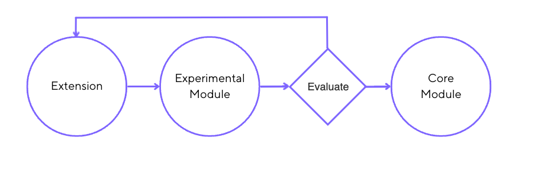

Some _Go_ extensions may one day be available within the k6 binary.
These select extensions pass through different phases to become core functionality.

This graduation process benefits both users and developers. 
k6 users can access new features and provide feedback to influence its developments. 
k6 developers meanwhile can iterate quickly and respond to feedback without worrying about breaking changes.

A _core-bound_ extension passes through the following phases:

### Extension
Most extensions in the k6 ecosystem remain _extensions_ requiring [xk6](https://github.com/grafana/xk6) to incorporate the custom functionality.
These extensions might be provided by Grafana or by the community, and _may_ be included in the [Extensions Registry](/extensions/get-started/explore/).

<Blockquote mod="note" title="">

Only Grafana-owned extensions can progress beyond the _extension_ phase to become _experimental_ or _core modules_.

</Blockquote>

### Experimental Module
This phase is the first exposure to core k6. 
The extension is still maintained outside the core of k6 but imported as a Go module, no longer requiring xk6.

There should be a reasonably high degree of quality and stability at this point.
This phase makes the feature accessible to more users, which in turn gives k6 developers more chances to receive feedback.
The key will be to achieve a balance between usability and stability.

### Core Module
The stabilized feature is now part of the standard k6 product as a built-in module.
An extension may be in the _experimental module_ phase for an extended time before progressing as a core module.

The module code is in the main k6 repository, with the old extension repository archived.
Options from the _experimental module_ phase are deprecated and removed after two k6 releases, 
providing time for users to upgrade scripts for the new module.
