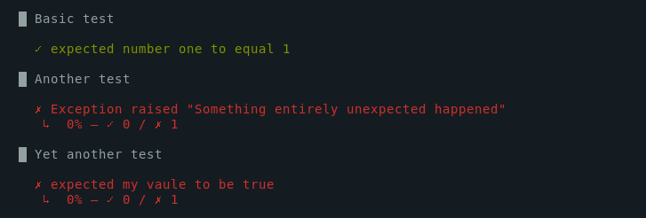
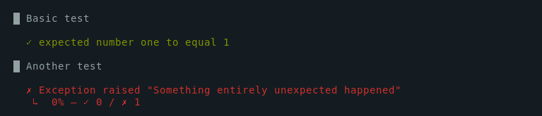

To declare a new test case, call the `describe(name, function)` function. 
The test case name should be unique within the script.
If it's not, the test cases will be grouped. 

Behind the scenes, the `describe()` function creates a k6 [group](/javascript-api/k6/group-name-fn). 


| Parameter | Type     | Description                           |
|-----------|----------|---------------------------------------|
| name      | string   | Test case name                        |
| function  | function | The test case function to be executed |


### Returns

| Type    | Description                                                                                                                                                 |
| ------- |-------------------------------------------------------------------------------------------------------------------------------------------------------------|
| bool    | Returns true when all `expect` conditions within the `describe()` body were successful, and no unhandled exceptions were raised, otherwise false. |

### Example

<CodeGroup labels={[]}>

```javascript
import { describe, expect } from 'https://jslib.k6.io/k6chaijs/4.3.4.3/index.js';

export default function testSuite() {
  const success1 = describe('Basic test', () => {
    expect(1, 'number one').to.equal(1);
  });

  console.log(success1); // true

  const success2 = describe('Another test', () => {
    throw 'Something entirely unexpected happened';
  });

  console.log(success2); // false

  const success3 = describe('Yet another test', () => {
    expect(false, 'my vaule').to.be.true();
  });

  console.log(success3); // false
}
``` 

</CodeGroup>

Execution of this script should print the following output.




Note, a failed `describe()` won't stop the execution of the next `describe()` block. 

## chaining describe() blocks

If you would like to skip the execution of the following blocks, consider chaining the `describe()` calls using `&&` as shown below.

<!-- eslint-skip -->

```javascript
import { describe, expect } from 'https://jslib.k6.io/k6chaijs/4.3.4.3/index.js';

export default function testSuite() {
  describe('Basic test', () => {
    expect(1, 'number one').to.equal(1);
  }) &&
  
  describe('Another test', () => {
    throw 'Something entirely unexpected happened';
  }) &&
  
  describe('Yet another test', () => {
    expect(false, 'my vaule').to.be.true();
  })
}
``` 

  

Note, the third `describe()` block wasn't executed because the prior block returned `false`.
