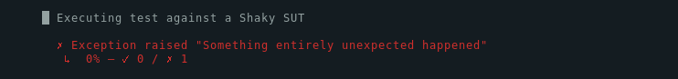

When executing a performance or integration test, your System Under Test (SUT) may crash. 
When your system crashes, the test should print useful information rather than stack traces caused by unexpected HTTP responses.

While the k6-native `check()` function requires you handle all errors on your own, k6chaijs does most of it automatically.
This makes your test code more resilient and easier to maintain.

It's not uncommon for performance testers to write fragile code that assumes the http response will contain expected data.

Here's an example of fragile code:

<CodeGroup labels={["Test code that is fragile to failing SUT"]}>

```javascript
import { check, group } from 'k6';
import http from 'k6/http';

export default function () {
  group('Fetch a list of public crocodiles', () => {
    const res = http.get('https://test-api.k6.io/public/crocodiles');

    check(res, {
      'is status 200': (r) => r.status === 200,
      'got more than 5 crocs': (r) => r.json().length > 5,
    });
  });
  // more code here
}
```

</CodeGroup>


This code will work fine as long as SUT (System Under Test) returns correct responses. When the SUT starts to fail, there's a good chance the `r.json().length` will throw an exception similar to

```bash
ERRO[0001] cannot parse json due to an error at line 1, character 2 , error: invalid character '<' looking for beginning of value
running at reflect.methodValueCall (native)
default at gotMoreThan5Crocs (file:///home/user/happy-path-check.js:7:68(5))
  at github.com/k6io/k6/js/common.Bind.func1 (native)
  at file:///home/user/happy-path-check.js:5:22(17)  executor=per-vu-iterations scenario=default source=stacktrace
```

In this example, the system was overloaded, and the load balancer returned a 503 response that did not have a valid JSON body. 
k6 has thrown a JavaScript exception and restarted execution from the beginning.
This test code is fragile to failing SUT because the first `check` does not prevent the second check from executing.
It's possible to rewrite this code to be less fragile, but that will make it longer and less readable.

Error handling of this type happens automatically when using the `k6chaijs.js` library.
When the first `expect` fails, the remaining checks in the chain are not executed, and the test is marked as failed — the execution proceeds to the next `describe()` instead of restarting from the top.


<CodeGroup labels={["Resilient code written using k6chaijs.js"]}>

```javascript
import http from 'k6/http';
import { describe, expect } from 'https://jslib.k6.io/k6chaijs/4.3.4.2/index.js';

export default function () {
  describe('Fetch a list of public crocodiles', () => {
    const response = http.get('https://test-api.k6.io/public/crocodiles');

    expect(response.status, 'response status').to.equal(200);
    expect(response).to.have.validJsonBody();
    expect(response.json().length, 'number of crocs').to.be.above(5);
  });
}
```

</CodeGroup>

# Handling exceptions

Sometimes it's hard to predict how a SUT might fail. For those cases, the library catches any exceptions 
thrown inside of `describe()` body, and records them as failed conditions.

<CodeGroup labels={[]}>

```javascript
import { describe, expect } from 'https://jslib.k6.io/k6chaijs/4.3.4.2/index.js';

export default function testSuite() {
  describe('Executing test against a Shaky SUT', (t) => {
    throw 'Something entirely unexpected happened';
  });
}
```

</CodeGroup>

Execution of this script should print the following output.


 


