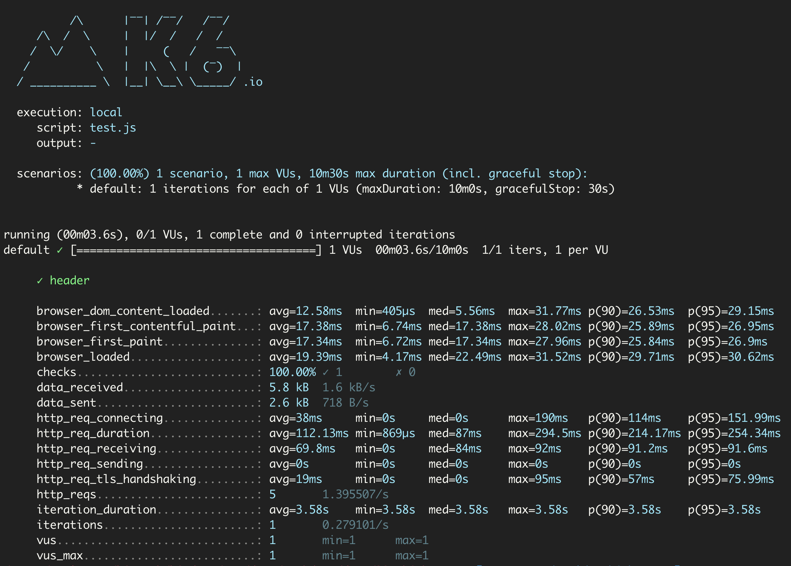

## What is xk6-browser?

[xk6-browser](https://github.com/grafana/xk6-browser) brings browser automation and end-to-end web testing to k6 while supporting core k6 features. It adds browser-level scripting APIs to interact with real browsers and collect frontend performance metrics as part of your k6 tests.

xk6-browser aims to provide rough compatibility with the Playwright API for the following two reasons:

1. Users don't need to learn a completely new API just to use xk6-browser.
2. It opens up for using the [Playwright RPC server](https://github.com/playwright-community/playwright-go) as an optional backend for xk6-browser should we decide to support that in the future.

## Why xk6-browser?

The golden rule of web performance states that 80-90% of performance errors are found in the frontend, we want to offer a unified tool to existing k6 users for both front-end and back-end 

While back-end performance testing is useful and efficient, it doesn’t represent the overall user experience. xk6-browser offers a solution to measure the front-end performance and provide a way to script tests that are much closer to the user experience. Finally, you get insight into what your user sees on a browser-level and catch issues that are skipped from the protocol level. 

## Use case for xk6-browser

The main use case for xk6-browser is to test performance on the browser level. Browser-level testing  provides a way to measure user experience and  find issues that are difficult to catch on the protocol level. Browser-level testing can help you answer questions like: 

- When my application is receiving thousands of simultaneous requests from the protocol-level, what happens to the front-end?
- How can I get metrics specific to browsers, like total page load time?
- Are all my elements interactive on the front-end?
- Are there any loading spinners that take a long time to disappear?

## A simple test using xk6-browser

<CodeGroup labels={["script.js"]} lineNumbers={[true]}>

<!-- eslint-skip -->

```javascript
import { check } from 'k6';
import { chromium } from 'k6/x/browser';

export default function () {
  const browser = chromium.launch({ headless: false });
  const page = browser.newPage();

  page.goto('https://test.k6.io/my_messages.php', { waitUntil: 'networkidle' }).then(() => {
    // Enter login credentials and login
    page.locator('input[name="login"]').type('admin');
    page.locator('input[name="password"]').type('123');
    
    // Wait for asynchronous operations to complete
    return Promise.all([
      page.waitForNavigation(),
      page.locator('input[type="submit"]').click(),
    ]).then(() => {
      check(page, {
        'header': page.locator('h2').textContent() == 'Welcome, admin!',
      });
    }).finally(() => {
      page.close();
      browser.close();
    });
  });
}
```

</CodeGroup>

The preceding code launches a Chromium-based browser, visit the application and mimics a user logging in to the application. Once submitted, it checks if the text of the header matches what is expected.

After running the test, the following [browser metrics](/javascript-api/xk6-browser/get-started/browser-metrics/) will be reported.



This gives you a representation of browser performance as well as the usual HTTP specific metrics that k6 already tracks which allows you to have a full picture on how your application behaves from a front-end and back-end perspective, all in a single script.