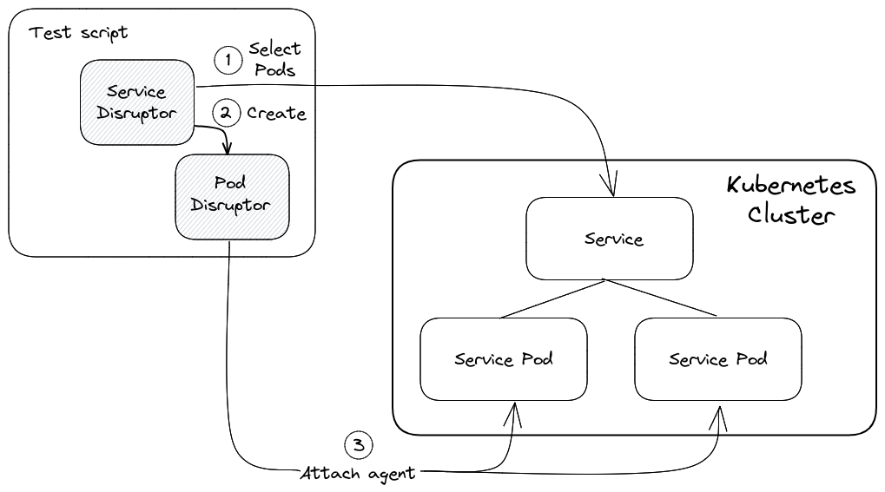

xk6-disruptor consists of two main components: a k6 extension and the xk6-disruptor-agent.

The xk6-disruptor extension provides a Javascript API for injecting faults into a target system using the xk6-disruptor-agent as a backend.

The xk6-disruptor-agent is a tool that can inject faults in the target system where it runs on. It is provided as an Docker image that can be pulled from the [xk6-disruptor repository](https://github.com/grafana/xk6-disruptor/pkgs/container/xk6-disruptor-agent).

The xk6-disruptor extension install the agent in the target and send commands in order to inject the desired faults. How this happens depends on the type of disruptor, as described in the following sections.

This mode of operation allows the xk6-disruptor to work without requiring the installation of additional components.

## PodDisruptor

The figure below show how PodDisruptor works:

1. The PodDisruptor selects the target pods based on the selector attributes defined in the [constructor](/javascript-api/xk6-disruptor/api/poddisruptor/constructor)
2. The PodDisruptor attaches the xk6-disruptor-agent to each of the target pods
3. When a fault is injected (e.g. calling the [injectHTTTFault](/javascript-api/xk6-disruptor/api/poddisruptor/injecthttpfaults/))the PodDisruptor sends a command to the agents to inject the fault in their respective pods

## ServiceDisruptor

The ServiceDisruptor works as a wrapper around a PodDisruptor targeting the pods that back the service.

1. The ServiceDisruptor uses the definition of the service specified in the [constructor](/javascript-api/xk6-disruptor/api/servicedisruptor/constructor) to create a pod selector that matches the pods that back the service
2. The ServiceDisruptor creates a PodDisruptor using this pod selector
3. The PodDisruptor installs the agent in the target pods

From this point, the PodDisruptor works as described before.

