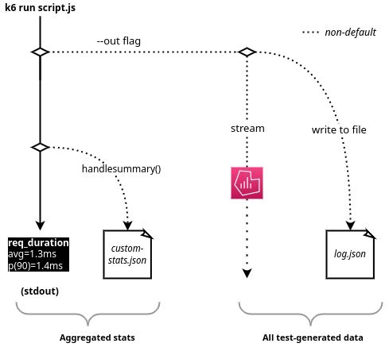

k6 provides two ways to look at test results:
* After the test runs, k6 sends a small summary to `stdout`.
* For granular analysis and time-series data, you can also stream live test data to an external output.




By default, when a test finishes, k6 provides an [_end-of-test summary report_](#end-of-test-summary-report).
This report aggregates the test results, with information about all [groups](/using-k6/tags-and-groups#groups), [checks](/using-k6/checks), and [thresholds](/using-k6/thresholds) in the load test.
It also gives basic, summary statistics about each metric (e.g. mean, median, p95, etc).

For fine-grained analysis, you can stream all the data that your test generates (e.g. all HTTP requests) to an _external output_.
This output might be a structured file format, like CSV or JSON.
But you could also stream to another program, like Datadog or Prometheus, or pipe results to our managed [k6 cloud](/results-visualization/cloud) service.
The "External outputs" section lists [all supported built-in outputs](/getting-started/results-output#external-outputs).

You have much room to handle the data in the way that best fits your use case.
You can [customize the summary report](/results-visualization/end-of-test-summary#handlesummary-callback).
In addition to the [built-in](/using-k6/metrics#built-in-metrics), you can also make [custom metrics](/using-k6/metrics#custom-metrics).


## Standard output


When k6 sends the results to [`stdout`](https://en.wikipedia.org/wiki/Standard_streams#Standard_output_(stdout)), it shows the k6 logo and the following test information:

- Test details: general test information and load options.
- Progress bar: test status and how much time has passed.
- [Test summary](/results-visualization/end-of-test-summary): the test results (after test completion).

You can completely customize the output and redirect it to a file.
You can also save arbitrary files with machine-readable versions of the summary, like JSON, XML (e.g. JUnit, XUnit, etc.), or even nicely-formatted HTML reports meant for humans!
For more details, see the [`handleSummary()` docs](/results-visualization/end-of-test-summary#handlesummary-callback).

### Test details

<CodeGroup labels={[]}>

```bash
execution: local
  script: path/to/script.js
  output: -

scenarios: (100.00%) 1 scenario, 50 max VUs, 5m30s max duration (incl. graceful stop):
        * default: Up to 50 looping VUs for 5m0s over 3 stages (gracefulRampDown: 30s, gracefulStop: 30s)
```

</CodeGroup>

- `execution: local` shows the k6 execution mode (local or cloud).
- `output: -` is the [output](/getting-started/results-output#external-outputs) of the granular test results. By default, no output is used, only the aggregated [end-of-test summary](/results-visualization/end-of-test-summary) is shown.
- `script: path/to/script.js` shows the name of the script file that is being executed.
- `scenarios: ...` is a summary of the [scenarios](/using-k6/scenarios) that will be executed this test run and some overview information:
- `(100.00%)` is the used [execution segment](/using-k6/options#execution-segment)
- `50 max VUs` tells us up to how many [VUs (virtual users)](/misc/glossary#virtual-users) will be used across all scenarios.
- `5m30s max duration` is the maximum time the script will take to run, including any [graceful stop](/using-k6/scenarios/graceful-stop) times.
- `* default: ...` describes the only scenario for this test run. In this case it's a scenario with a [ramping VUs executor](/using-k6/scenarios/executors/ramping-vus), specified via the [`stages` shortcut option](/using-k6/options#stages) instead of using the [`scenarios` long-form option](/using-k6/options#scenarios).

### End-of-test summary report

The [test summary](/results-visualization/end-of-test-summary) provides a general overview of test results.
By default, the summary prints the following statuses to `stdout`:

- Aggregated values for the [built-in metrics](/using-k6/metrics#built-in-metrics) and [custom metrics](/using-k6/metrics#custom-metrics).
- [Checks](/using-k6/checks) and [thresholds](/using-k6/thresholds).
- [Groups](/using-k6/tags-and-groups#groups) and [tags](/using-k6/tags-and-groups#tags).

You can customize the summary shown to `stdout`, redirect it to a file or `stderr`, or build and export your own completely custom report (e.g. HTML, JSON, JUnit/XUnit XML, etc.) via the [`handleSummary()` callback](/results-visualization/end-of-test-summary#handlesummary-callback).


<CodeGroup labels={[]}>

```bash
data_received..............: 148 MB 2.5 MB/s
data_sent..................: 1.0 MB 17 kB/s
http_req_blocked...........: avg=1.92ms   min=1µs      med=5µs      max=288.73ms p(90)=11µs     p(95)=17µs
http_req_connecting........: avg=1.01ms   min=0s       med=0s       max=166.44ms p(90)=0s       p(95)=0s
http_req_duration..........: avg=143.14ms min=112.87ms med=136.03ms max=1.18s    p(90)=164.2ms  p(95)=177.75ms
http_req_receiving.........: avg=5.53ms   min=49µs     med=2.11ms   max=1.01s    p(90)=9.25ms   p(95)=11.8ms
http_req_sending...........: avg=30.01µs  min=7µs      med=24µs     max=1.89ms   p(90)=48µs     p(95)=63µs
http_req_tls_handshaking...: avg=0s       min=0s       med=0s       max=0s       p(90)=0s       p(95)=0s
http_req_waiting...........: avg=137.57ms min=111.44ms med=132.59ms max=589.4ms  p(90)=159.95ms p(95)=169.41ms
http_reqs..................: 13491  224.848869/s
iteration_duration.........: avg=445.48ms min=413.05ms med=436.36ms max=1.48s    p(90)=464.94ms p(95)=479.66ms
iterations.................: 13410  223.498876/s
vus........................: 100    min=100 max=100
vus_max....................: 100    min=100 max=100
```

</CodeGroup>

> To learn more about the metrics k6 collects and reports, read the [Metrics guide](/using-k6/metrics).

### Trend metrics

[Trend metrics](/using-k6/metrics#metric-types) collect trend statistics (min/max/avg/percentiles) for a series of values.
On stdout, they are printed like this:

<CodeGroup labels={[]}>

```bash
http_req_duration..........: avg=143.14ms min=112.87ms med=136.03ms max=1.18s    p(90)=164.2ms  p(95)=177.75ms
```

</CodeGroup>

To change the stats reported for `Trend` metrics, you can use the [`summaryTrendStats` option](/using-k6/options#summary-trend-stats).
You can also make k6 display time values with a fixed time unit (seconds, milliseconds or microseconds) via the [`summaryTimeUnit` option](/using-k6/options#summary-time-unit).
And, as mentioned above, you can completely customize the whole report via the [`handleSummary()` callback](/results-visualization/end-of-test-summary#handlesummary-callback).

<CodeGroup labels={[]}>

```bash
$ k6 run --summary-trend-stats="min,avg,med,p(99),p(99.9),max,count" --summary-time-unit=ms  script.js
```

</CodeGroup>

### Export summary

To get your aggregated test results in a machine-readable format,
you can export the end-of-test summary report to a JSON file.
This helps with things like integration with dashboards, external alerts, etc.

We recommend the [`handleSummary()` callback](/results-visualization/end-of-test-summary#handlesummary-callback).
It lets you customize the end-of-test summary and export the report data to any desired format (e.g. JSON, CSV, XML (JUnit/xUnit/etc.), HTML, TXT, etc.).

You can also use the [`--summary-export` flag](/using-k6/options#summary-export), though [we now discourage using it](/results-visualization/end-of-test-summary#summary-export-to-a-json-file)).

## External outputs

If you need more data than what is condensed in the [end-of-test summary](/results-visualization/end-of-test-summary), you can integrate and visualize k6 metrics on other platforms.

To send granular results data to an external output, use the `--out` flag.

<CodeGroup labels={[]}>

```bash
$ k6 run --out statsd script.js
```

</CodeGroup>

The available built-in outputs are:

<Glossary>

- [Amazon CloudWatch](/results-visualization/amazon-cloudwatch)
- [Cloud](/results-visualization/cloud)
- [CSV](/results-visualization/csv)
- [Datadog](/results-visualization/datadog)
- [Grafana Cloud / Prometheus](/results-visualization/grafana-cloud)
- [InfluxDB](/results-visualization/influxdb-+-grafana)
- [JSON](/results-visualization/json)
- [Netdata](/results-visualization/netdata)
- [New Relic](/results-visualization/new-relic)
- [Prometheus](/results-visualization/prometheus)
- [TimescaleDB](/results-visualization/timescaledb)
- [StatsD](/results-visualization/statsd)

</Glossary>

### Multiple outputs

You can also send metrics simultaneously to several outputs.
To do so, use the CLI `--out` flag multiple times.

<CodeGroup labels={[]}>

```bash
$ k6 run \
--out json=test.json \
--out influxdb=http://localhost:8086/k6
```
</CodeGroup>

