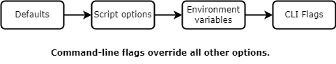

k6 provides multiple places to set options:

- In CLI flags
- In environment variables
- In the script `options` object

Most likely, your use case will determine where you want to set the particular options for a particular test.
You can also access option values as your test runs.

## Order of precedence



You can set options in multiple places.
If there are conflicts, k6 uses the option from the place with the highest _order of precedence_.

1. First, k6 uses the option's default value.
2. Then, k6 uses the script value (if set).
3. After, k6 uses the environment variable (if set). 
4. Finally, k6 takes the value from the CLI flag (if set). 

That is, **command-line flags have the highest order of precedence**.

## Where to set options

Sometimes, how you set options is a matter of personal preference.
Other times, the context of your test dictates the most sensible place to put your options.

*Options in the script or config file let you version control and keep tests tidy*.

The script `options` object is generally the best place to put your options.
This provides automatic version control, allows for easy reuse, and lets you modularize your script.

*CLI flags are good for setting options on the fly*.

When you want to run a quick test, command-line flags are convenient.
You can also use command-line flags to override files in your script (as determined by the [order of precedence](#order-of-precedence)).
For example, if your script file sets the test duration at 60 seconds, you could use a CLI flag to run a one-time shorter test.
With a flag like `--duration 30s`, the test would be half as long but otherwise identical.

*Environment variables often work well when you need to set your options from some other part of your DevOps build chain*.

For example, you could derive the option from a variable in your Docker container definition, CI UI, or vault&mdash;wherever you declare environment variables.
The [block hostnames](/using-k6/k6-options/reference#block-hostnames) option is an example of an option that works well with environment variables.

## Examples of setting options

The following JS snippets show some examples of how you can set options.

### Set options in the script

<CodeGroup labels={["example.js"]} lineNumbers={[true]}>

```javascript
import http from 'k6/http';

export const options = {
  hosts: { 'test.k6.io': '1.2.3.4' },
  stages: [
    { duration: '1m', target: 10 },
    { duration: '1m', target: 20 },
    { duration: '1m', target: 0 },
  ],
  thresholds: { http_req_duration: ['avg<100', 'p(95)<200'] },
  noConnectionReuse: true,
  userAgent: 'MyK6UserAgentString/1.0',
};

export default function () {
  http.get('http://test.k6.io/');
}
```

</CodeGroup>


### Set options with environment variables

You can also set the options from the previous example through environment variables and command-line flags:

<CodeGroup labels={["Bash", "Windows: CMD", "Windows: PowerShell"]} lineNumbers={[false]}>

```bash
$ K6_NO_CONNECTION_REUSE=true K6_USER_AGENT="MyK6UserAgentString/1.0" k6 run script.js

$ k6 run --no-connection-reuse --user-agent "MyK6UserAgentString/1.0" script.js
```

```bash
C:\k6> set "K6_NO_CONNECTION_REUSE=true" && set "K6_USER_AGENT=MyK6UserAgentString/1.0" && k6 run script.js

C:\k6> k6 run --no-connection-reuse --user-agent "MyK6UserAgentString/1.0" script.js
```

```bash
PS C:\k6> $env:K6_NO_CONNECTION_REUSE=true; $env:K6_USER_AGENT="MyK6UserAgentString/1.0"; k6 run script.js

PS C:\k6> k6 run --no-connection-reuse --user-agent "MyK6UserAgentString/1.0" script.js
```

</CodeGroup>

### Set options from k6 variables

With the `--env` flag, you can use the CLI to define k6 variables.
Then, you can use the variable to dynamically define an option's value in the script file.

For example, you could define a variable for your user agent like this:

```
k6 run script.js --env MY_USER_AGENT="hello"
```

Then, your script could then set the `userAgent` option based on the variable's value.
This allows for quick configuration.

<CodeGroup labels={["script.js"]} lineNumbers={[true]}>

```javascript
import http from 'k6/http';

export const options = {
  userAgent: __ENV.MY_USER_AGENT,
};

export default function () {
  http.get('http://test.k6.io/');
}
```

</CodeGroup>

> **Note**: Though this method uses the `--env` flag, this is not the same as using an environment variable.
> For an explanation, refer to the [environment variables document](/using-k6/environment-variables).

## Get an option value from the script

The `k6/execution` API provides a [test.options](/javascript-api/k6-execution/#test) object.
With `test.options`, you can access the consolidated and derived options of your script as the test runs.

A common use of this feature is to log the value of a tag, but there are many possibilities.
For example, this script accesses the value of the test's current stage:

<CodeGroup>

```javascript
import exec from 'k6/execution';

export const options = {
  stages: [
    { duration: '5s', target: 100 },
    { duration: '5s', target: 50 },
  ],
};

export default function () {
  console.log(exec.test.options.scenarios.default.stages[0].target); // 100
}
```

</CodeGroup>

<br/>
