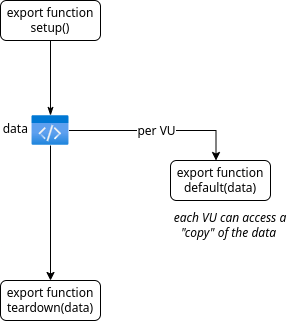

A k6 test has four distinct stages.
A script always runs through these stages in the same order.

1. Code in the `init` context prepares the script: loading files, importing modules, and defining functions.
2. (Optional) The `setup` code runs,  setting up the test environment (optional) and generating data.
3. VU code runs in the `default()` function, running for as long and as many times as the `options` define.
4. (Optional) The `teardown` code runs, postprocessing data and closing the test environment.

This order&mdash;set up, test, then tear down&mdash;follows the structure of many testing frameworks.

<CodeGroup labels={["The four life cycle stages"]} lineNumbers={[true]}>

```javascript
// 1. init code

export function setup() {
  // 2. setup code
}

export default function (data) {
  // 3. VU code
}

export function teardown(data) {
  // 4. teardown code
}
```

</CodeGroup>

## Overview of the test stages

For more technical detail, see this page's subsequent sections.

| Test stage      | Used to                                                    | Example                                                                                 | Called                                                                             | Required? |
|-----------------|------------------------------------------------------------|-----------------------------------------------------------------------------------------|------------------------------------------------------------------------------------|-----------|
| **1. init**     | Load local files, import modules, declare global variables | Open JSON file, Import module                                                           | Once per VU\*                                                                      | Required  |
| **2. Setup**    | Set up data for processing, share data among VUs           | Call API to start test environment                                                      | Once                                                                               | Optional  |
| **3. VU code**  | Run the test function, usually `default` | Make https requests, validate responses                                                 | Once per iteration, as many times as the test options require | Required       |
| **4. Teardown** | Process result of setup code, stop test environment        | Validate that setup had a certain result, send webhook notifying that test has finished | Once per script                                                                    | Optional        |

\* In cloud scripts, init code might be called more often.

## The init stage

Before the test runs, k6 needs to initialize the test conditions.
To prepare the test, the code in the `init` context:

- Imports modules
- Loads files from the local file system
- Configures the test for all `options`
- Defines functions for the `default` (VU), `setup`, and `teardown` stages (and for custom functions, too).

The init stage is required.
Separating the init stage from the VU stage removes irrelevant computation from VU code, which both improves k6 performance and makes test results more reliable.

All code that is outside of a function is code in the `init` context.
Code in the `init` context *always executes first*.

<CodeGroup labels={["Examples of init code"]} lineNumbers={[true]}>

```javascript
// init context: importing modules
import http from 'k6/http';
import { Trend } from 'k6/metrics';

// init context: define k6 options
export const options = {
  vus: 10,
  duration: '30s',
};

// init context: global variables
const customTrend = new Trend('oneCustomMetric');

// init context: define custom function
function myCustomFunction() {
  // ...
}
```

</CodeGroup>

## The VU stage

Scripts must contain, at least, a `default()` function.
The code inside this function is *VU code*.

<CodeGroup labels={["Default/Main function"]} lineNumbers={[true]}>

```javascript
export default function () {
  // do things here...
}
```

</CodeGroup>

VU code runs over and over through the test duration.

VU code can make HTTP requests, emit metrics, and generally do everything you'd expect a load test to do.
The only exceptions are the jobs that happen in the `init` context.

- VU code *does not* load files from your local filesystem.
- VU code *does not* import any other modules.

Again, instead of VU code, init code does these jobs.

### The default function life-cycle

A VU executes the `default()` function from start to end in sequence.
Once the VU reaches the end of the function, it loops back to the start and executes the code all over.

As part of this "restart" process, k6 resets the VU.
Cookies are cleared, and TCP connections might be torn down  (depending on your test configuration options).

## Setup and teardown stages

Like `default`, `setup` and `teardown` functions must be exported functions.
But unlike the `default` function, k6 calls `setup` and `teardown` only once per test.

- `setup` is called at the beginning of the test, after the init stage but before the VU stage.
- `teardown` is called at the end of a test, after the VU stage (`default` function).

You can call the full k6 API in the setup and teardown stages, unlike the init stage.
For example, you can make HTTP requests:

<CodeGroup labels={["Setup/Teardown with HTTP request"]} lineNumbers={[true]}>

```javascript
import http from 'k6/http';

export function setup() {
  const res = http.get('https://httpbin.test.k6.io/get');
  return { data: res.json() };
}

export function teardown(data) {
  console.log(JSON.stringify(data));
}

export default function (data) {
  console.log(JSON.stringify(data));
}
```

</CodeGroup>

### Skip setup and teardown execution

You can skip the execution of setup and teardown stages using the options `--no-setup` and
`--no-teardown`.

<CodeGroup labels={["Skipping setup/teardown execution"]} lineNumbers={[true]}>

```bash
$ k6 run --no-setup --no-teardown ...
```

</CodeGroup>

### Using data from setup in default and init

Again, let's have a look at the basic structure of a k6 test:

<CodeGroup labels={["Setup/Teardown"]} lineNumbers={[true]}>

```javascript
// 1. init code

export function setup() {
  // 2. setup code
}

export default function (data) {
  // 3. VU code
}

export function teardown(data) {
  // 4. teardown code
}
```

</CodeGroup>

You might have noticed the function signatures of the `default()` and `teardown()` functions take an argument, referred to here as `data`.

Here's an example of passing some data from the setup code to the VU and teardown stages:

<CodeGroup labels={["Setup/Teardown"]} lineNumbers={[true]}>

```javascript
export function setup() {
  return { v: 1 };
}

export default function (data) {
  console.log(JSON.stringify(data));
}

export function teardown(data) {
  if (data.v != 1) {
    throw new Error('incorrect data: ' + JSON.stringify(data));
  }
}
```

</CodeGroup>


For example, with the data returned by the `setup()` function, you can:

- Give each VU access to an identical copy of the data
- Postprocess the data in `teardown` code

However, there are some restrictions.

- You can pass only data (i.e. JSON) between `setup` and the other stages.
You cannot pass functions.
- If the data returned by the `setup()` function is large, it will consume more memory.
- You cannot manipulate data in the `default()` function, then pass it to the `teardown()` function.

It's best to think that each stage and each VU has access to a fresh "copy" of whatever data the `setup()` function returns.



It would be extremely complicated and computationally intensive to pass mutable data between all VUs and then to teardown, especially in distributed setups.
This would go against a core k6 goal: the same script should be executable in multiple modes.

