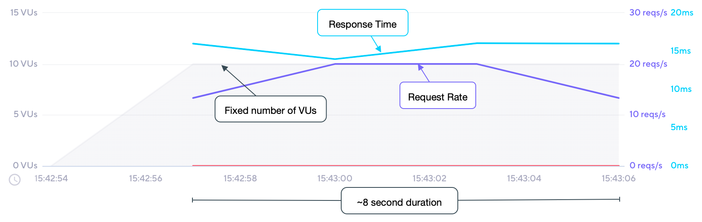

## Description

In this executor, the iterations are shared between the number of VUs.
The test ends once all iterations are executed. This executor is equivalent to the global [vus](/using-k6/k6-options/reference#vus) and [iterations](/using-k6/k6-options/reference#iterations) shortcut options.

Iterations **are not guaranteed to be evenly distributed** with this executor.
VU that executes faster will complete more iterations than slower VUs.

To guarantee that every VU completes a specific, fixed number of iterations, [use the per-VU iterations executor](/using-k6/scenarios/executors/per-vu-iterations).

## Options

Besides the [common configuration options](/using-k6/scenarios#options),
this executor has the following options:

| Option        | Type    | Description                                                                        | Default |
| ------------- | ------- | ---------------------------------------------------------------------------------- | ------- |
| vus         | integer | Number of VUs to run concurrently.                                                 | `1`     |
| iterations  | integer | Total number of script iterations to execute across all VUs.                       | `1`     |
| maxDuration | string  | Maximum scenario duration before it's forcibly stopped (excluding `gracefulStop`). | `"10m"` |

## When to use

This executor is suitable when you want a specific amount of VUs to complete a fixed
number of total iterations, and the amount of iterations per VU is not important. This will be 
the most _"efficient"_ use of VUs, therefore if **time to complete** a number of test iterations
is your concern, this executor should perform best. 

> An example use case could be to incorporate a quick performance test as part of the build cycle during development. As developers compile their changes, the test could be executed against the local code to help insure against performance regressions. This would be considered as part of _"shifting left"_; placing more emphasis on performance early in the development cycle when the _cost_ of the fix is lowest. 

## Example

In this example, we'll execute 200 total iterations shared by 10 VUs with a maximum duration of 30 seconds.

<CodeGroup labels={[ "shared-iters.js" ]} lineNumbers={[true]}>

```javascript
import http from 'k6/http';
import { sleep } from 'k6';

export const options = {
  discardResponseBodies: true,
  scenarios: {
    contacts: {
      executor: 'shared-iterations',
      vus: 10,
      iterations: 200,
      maxDuration: '30s',
    },
  },
};

export default function () {
  http.get('https://test.k6.io/contacts.php');
  // We're injecting a processing pause for illustrative purposes only!
  // Sleep time is 500ms. Total iteration time is sleep + time to finish request.
  sleep(0.5);
}
```

</CodeGroup>

## Observations

The following graph depicts the performance of the [example](#example) script:



Based upon our test scenario inputs and results:

* Test is limited to a fixed number of 200 iterations of the `default` function;
* the number of VUs is fixed to 10, and are initialized before the test begins;
* each _iteration_ of the `default` function is expected to be roughly 515ms, or ~2/s;
* maximum throughput (highest efficiency) is therefore expected to be ~20 iters/s, `2 iters/s * 10 VUs`; 
* we then see that the maximum throughput is maintained for a larger portion of the test;
* the 8 second test duration will be the shortest of all executor methods;
* we know the distribution of iterations may be skewed; one VU may have performed 50 iterations, whereas another may have only performed 10. 
