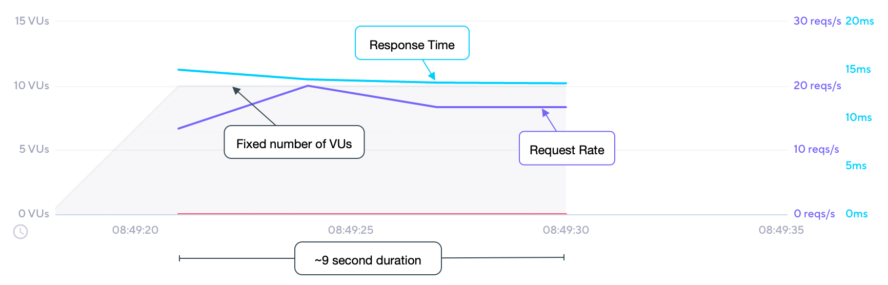

## Description

Each VU executes an exact number of iterations. The total number of completed
iterations will be `vus * iterations`.

## Options

In addition to the [common configuration options](/using-k6/scenarios#common-options) this executor
also adds the following options:

| Option        | Type    | Description                                                                        | Default |
| ------------- | ------- | ---------------------------------------------------------------------------------- | ------- |
| vus         | integer | Number of VUs to run concurrently.                                                 | `1`     |
| iterations  | integer | Number of `exec` function iterations to be executed by each VU.                    | `1`     |
| maxDuration | string  | Maximum scenario duration before it's forcibly stopped (excluding `gracefulStop`). | `"10m"` |

## When to use

Use this executor if you need a specific amount of VUs to complete the same amount of
iterations. This can be useful when you have fixed sets of test data that you want to
partition between VUs.

## Example

In this example, we'll let 10 VUs execute 20 iterations _each_, for a total of 200 iterations, with
a maximum duration of 30 seconds.

<CodeGroup labels={[ "per-vu-iters.js" ]} lineNumbers={[true]}>

```javascript
import http from 'k6/http';
import { sleep } from 'k6';

export const options = {
  discardResponseBodies: true,
  scenarios: {
    contacts: {
      executor: 'per-vu-iterations',
      vus: 10,
      iterations: 20,
      maxDuration: '30s',
    },
  },
};

export default function () {
  http.get('https://test.k6.io/contacts.php');
  // We're injecting a processing pause for illustrative purposes only!
  // Each iteration will be ~515ms, therefore ~2 iterations/second per VU maximum throughput.
  sleep(0.5);
}
```

</CodeGroup>

## Observations

The following graph depicts the performance of the [example](#example) script:



Based upon our test scenario inputs and results:

* The number of VUs is fixed at 10 VUs which are initialized before beginning the test;
* iterations are fixed at 200 iterations, `10 VUs * 20 iters each`;
* maximum throughput of 20 iters/s is reached, but not maintained;
* total duration of 9 seconds is slightly longer than [shared iterations](/using-k6/scenarios/executors/shared-iterations) due to lower efficiency;
* because distribution of iterations is even amongst VUs, a _fast_ VU may finish early and be idle for the remainder of the test;
* overall test duration lasts as long as the _slowest_ VU takes to complete 20 requests. 
