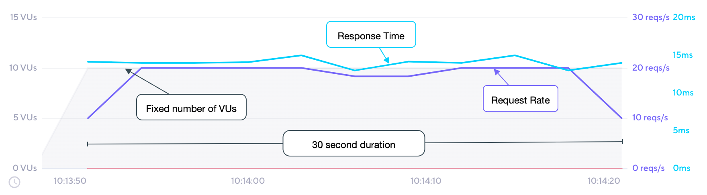

With the `constant-vus` executor, a fixed number of VUs execute as many iterations as possible for a specified amount of time.

For a shortcut to this executor, use the [vus](/using-k6/options#vus) and [duration](/using-k6/options#duration) options.

## Options

Besides the [common configuration options](/using-k6/scenarios#options),
this executor has the following options:

| Option      | Type    | Description                                         | Default |
| ----------- | ------- | --------------------------------------------------- | ------- |
| duration<sup>(required)</sup> | string  | Total scenario duration (excluding `gracefulStop`). | -       |
| vus       | integer | Number of VUs to run concurrently.                  | `1`     |

## When to use

Use this executor if you need a specific number of VUs to run for a certain amount of time.

## Example

In this example, we'll run 10 VUs constantly for a duration 30 seconds.

<CodeGroup labels={[ "constant-vus.js" ]} lineNumbers={[true]}>

```javascript
import http from 'k6/http';
import { sleep } from 'k6';

export const options = {
  discardResponseBodies: true,
  scenarios: {
    contacts: {
      executor: 'constant-vus',
      vus: 10,
      duration: '30s',
    },
  },
};

export default function () {
  http.get('https://test.k6.io/contacts.php');
  // We're injecting a processing pause for illustrative purposes only!
  // Sleep time is 500ms. Total iteration time is sleep + time to finish request.
  sleep(0.5);
}
```

</CodeGroup>

## Observations

The following graph depicts the performance of the [example](#example) script:



Based upon our test scenario inputs and results:

* The number of VUs is fixed at 10, and are initialized before the test begins;
* overall test duration is fixed at the configured 30 second duration; 
* each _iteration_ of the `default` function is expected to be roughly 515ms, or ~2/s;
* maximum throughput (highest efficiency) is therefore expected to be ~20 iters/s, `2 iters/s * 10 VUs`; 
* we see that the maximum throughput is reached and maintained for the majority of the test;
* approximately 600 iterations are therefore performed in total, `30 seconds * 20 iters/s`.
