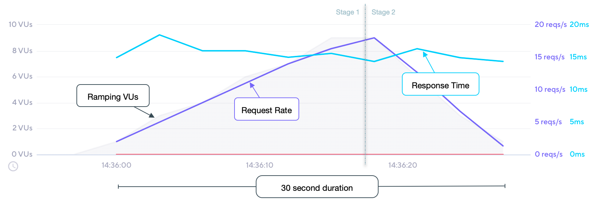

## Description

A variable number of VUs execute as many iterations as possible for a specified
amount of time. This executor is equivalent to the global [stages](/using-k6/options#stages) option.

## Options

In addition to the [common configuration options](/using-k6/scenarios#common-options) this executor
also adds the following options:

| Option             | Type    | Description                                                                                    | Default |
| ------------------ | ------- | ---------------------------------------------------------------------------------------------- | ------- |
| stages<sup>(required)</sup>          | array   | Array of objects that specify the target number of VUs to ramp up or down to.                  | `[]`    |
| startVUs         | integer | Number of VUs to run at test start.                                                            | `1`     |
| gracefulRampDown | string  | Time to wait for an already started iteration to finish before stopping it during a ramp down. | `"30s"` |

## When to use

This executor is a good fit if you need VUs to ramp up or down during specific periods
of time.

## Example

In this example, we'll run a two-stage test, ramping up from 0 to 10 VUs over 20 seconds, then down
to 0 VUs over 10 seconds.

<CodeGroup labels={[ "ramping-vus.js" ]} lineNumbers={[true]}>

```javascript
import http from 'k6/http';
import { sleep } from 'k6';

export const options = {
  discardResponseBodies: true,
  scenarios: {
    contacts: {
      executor: 'ramping-vus',
      startVUs: 0,
      stages: [
        { duration: '20s', target: 10 },
        { duration: '10s', target: 0 },
      ],
      gracefulRampDown: '0s',
    },
  },
};

export default function () {
  http.get('https://test.k6.io/contacts.php');
  // We're injecting a processing pause for illustrative purposes only!
  // Each iteration will be ~515ms, therefore ~2 iterations/second per VU maximum throughput.
  sleep(0.5);
}
```

</CodeGroup>

> Note the setting of `gracefulRampDown` to 0 seconds, which could cause some iterations to be
interrupted during the ramp down stage.

## Observations

The following graph depicts the performance of the [example](#example) script:



Based upon our test scenario inputs and results:

* The number of VUs are ramped up/down linearly over a fixed duration within their respective stage;
* the sum of each stage duration defines the overall 30 second test duration;
* total iterations will vary; our example performed ~300 iterations.
