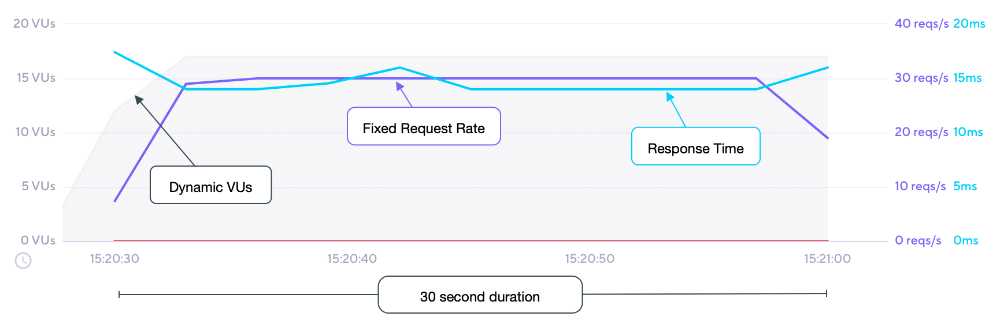

With the `constant-arrival-rate` executor, k6 starts a fixed number of iterations over a specified period of time.
It is an open-model executor, meaning iterations start independently of system response (for details, read
[Open and Closed models](/using-k6/scenarios/concepts/open-vs-closed).

This executor continues to start iterations at the given rate as long as VUs are available.
The time to execute an iteration can vary with test logic or the system-under-test response time.
To compensate for this, the executor starts a varied number of VUs to meet the configured iteration rate.
For explanations of how allocation works, read [Arrival-rate VU allocation](/using-k6/scenarios/concepts/arrival-rate-vu-allocation).

<Blockquote mod="Note" title="">

**Iteration starts are spaced fractionally.**

Iterations **do not** start at exactly the same time.
At a `rate` of `10` with a `timeUnit` of `1s`, each iteration starts about every tenth of a second (that is, each 100ms).

</Blockquote>

## Options

Besides the [common configuration options](/using-k6/scenarios#options),
this executor has the following options:

| Option             | Type    | Description                                                                             | Default |
| ------------------ | ------- | --------------------------------------------------------------------------------------- | ------- |
| duration<sup>(required)</sup>        | string  | Total scenario duration (excluding `gracefulStop`).                                     | -       |
| rate<sup>(required)</sup>            | integer | Number of iterations to start during each `timeUnit` period.                                 | -       |
| preAllocatedVUs<sup>(required)</sup> | integer | Number of VUs to pre-allocate before test start to preserve runtime resources. | -       |
| timeUnit         | string  | Period of time to apply the `rate` value.                                               | `"1s"`  |
| maxVUs           | integer | Maximum number of VUs to allow during the test run.                                     | If unset, same as `preAllocatedVUs`       |

## When to use

When you want to maintain a constant number of iterations without being affected by the
performance of the system under test.
This approach is useful for a more accurate representation of RPS, for example.


<Blockquote mod="note" title="">

**Don't put sleep at the end of an iteration.**

The arrival-rate executors already pace the iteration rate through the `rate` and `timeUnit` properties.
So it's unnecessary to use a `sleep()` function at the end of the VU code.

</Blockquote>

## Example

This example starts a constant rate of 30 iterations per second for 30 seconds, allowing k6 to dynamically schedule up to 50 VUs.

<CodeGroup labels={[ "constant-arr-rate.js" ]} lineNumbers={[true]}>

```javascript
import http from 'k6/http';
import { sleep } from 'k6';

export const options = {
  discardResponseBodies: true,
  scenarios: {
    contacts: {
      executor: 'constant-arrival-rate',

      // Our test should last 30 seconds in total
      duration: '30s',

      // It should start 30 iterations per `timeUnit`. Note that iterations starting points
      // will be evenly spread across the `timeUnit` period.
      rate: 30,

      // It should start `rate` iterations per second
      timeUnit: '1s',

      // It should preallocate 2 VUs before starting the test
      preAllocatedVUs: 2,

      // It is allowed to spin up to 50 maximum VUs to sustain the defined
      // constant arrival rate.
      maxVUs: 50,
    },
  },
};

export default function () {
  http.get('https://test.k6.io/contacts.php');
}
```

</CodeGroup>


## Observations

The following graph depicts the performance of the [example](#example) script:



Based upon our test scenario inputs and results:

* The desired rate of 30 iterations started every 1 second is achieved and maintained for the majority of the test.
* The test scenario runs for the specified 30 second duration.
* Having started with 2 VUs (as specified by the `preAllocatedVUs` option), k6 automatically adjusts the number of VUs to achieve the desired rate, up to the `maxVUs`; for our test, this ended up as 17 VUs.
* Exactly 900 iterations are started in total, `30s * 30 iters/s`.

> As in our example, using too low of a `preAllocatedVUs` setting will reduce the test duration at the desired rate, as resources need to continually be allocated to achieve the rate.
