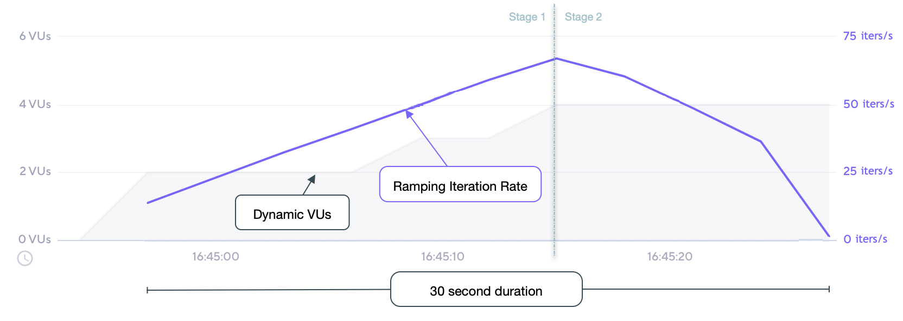

## Description

A variable number of iterations are started in specified periods of time. This is
similar to the [ramping VUs executor](/using-k6/scenarios/executors/ramping-vus/), but for iterations instead.
k6 will attempt to dynamically change the number of VUs to achieve the configured iteration rate.

See the [arrival rate](/using-k6/scenarios/arrival-rate) section for details.

## Options

In addition to the [common configuration options](/using-k6/scenarios#common-options) this executor
also adds the following options:

| Option             | Type    | Description                                                                             | Default |
| ------------------ | ------- | --------------------------------------------------------------------------------------- | ------- |
| stages<sup>(required)</sup>          | array   | Array of objects that specify the target number of iterations to ramp up or down to.    | `[]`    |
| preAllocatedVUs<sup>(required)</sup> | integer | Number of VUs to pre-allocate before test start in order to preserve runtime resources. | -       |
| startRate        | integer | Number of iterations to execute each `timeUnit` period at test start.                   | `0`     |
| timeUnit         | string  | Period of time to apply the `startRate` to the `stages`' `target` value. Its value is constant for the whole duration of the scenario, it is not possible to change it for a specific stage.                    | `"1s"`  |
| maxVUs          | integer | Maximum number of VUs to allow during the test run.                                     | -       |

## When to use

If you need your tests to not be affected by the system-under-test's performance, and
would like to ramp the number of iterations up or down during specific periods of time.

## Examples

In this example, we'll run a four-stage test. We initially stay at the defined rate of starting 300 iterations per minute over a minute period. Then, ramping up the iteration rate from 300 to 600 iterations started per minute over the next two minutes period, and staying at this rate for four more minutes. Finally, down to starting 60 iterations per minute over the last two minutes period.

<CodeGroup labels={[ "ramping-arr-rate.js" ]} lineNumbers={[true]}>

```javascript
import http from 'k6/http';
import exec from 'k6/execution';

export const options = {
  discardResponseBodies: true,

  scenarios: {
    contacts: {
      executor: 'ramping-arrival-rate',

      // Our test with at a rate of 300 iterations started per `timeUnit` (e.g minute).
      startRate: 300,

      // It should start `startRate` iterations per minute
      timeUnit: '1m',

      // It should preallocate 2 VUs before starting the test.
      preAllocatedVUs: 2,

      // It is allowed to spin up to 50 maximum VUs in order to sustain the defined
      // constant arrival rate.
      maxVUs: 50,

      stages: [
        // It should start 300 iterations per `timeUnit` for the first minute.
        { target: 300, duration: '1m' },

        // It should linearly ramp-up to starting 600 iterations per `timeUnit` over the following two minutes.
        { target: 600, duration: '2m' },

        // It should continue starting 600 iterations per `timeUnit` for the following four minutes.
        { target: 600, duration: '4m' },

        // It should linearly ramp-down to starting 60 iterations per `timeUnit` over the last two minute.
        { target: 60, duration: '2m' },
      ],
    },
  },
};

export default function () {
  http.get('https://test.k6.io/contacts.php');
}
```

</CodeGroup>

## Observations

The following graph depicts the performance of the [example](#example) script:



Based upon our test scenario inputs and results:

* We've defined 4 stages for a total test duration of 9 minutes.
* Stage 1 maintains the `startRate` iteration rate at 300 iterations started per minute for 1 minute.
* Stage 2 ramps _up_ the iteration rate linearly from the *stage 1* of 300 iterations started per minute, to the target of 600 iterations started per minute over a 2-minute duration.
* Stage 3 maintains the *stage 2* iteration rate at 600 iterations started per minute over a 4-minute duration.
* Stage 4 ramps _down_ the iteration rate linearly to the target rate of 60 iterations started per minute over the last two minutes duration.
* Changes to the iteration rate are performed by k6, adjusting the number of VUs as necessary from `preAllocatedVUs` to a maximum of `maxVUs`.
* The script waits for a period of time (defined by the `gracefulStop` option) for iterations to finish. It won't start new iterations during the `gracefulStop` period.
* The script will run the `teardown()` function (if specified) before exiting.
* Our example performed, 4020 iterations over the course of the test.
