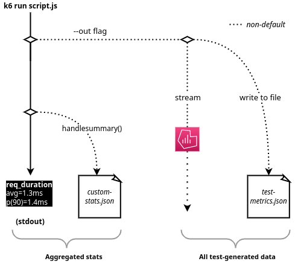

k6 emits [metrics](/using-k6/metrics) with timestamps at every point of the test.
You can study these results either **aggregated as a summary** or **in granular detail**.

- For a top-level test overview, use the [end-of-test summary](../end-of-test).
- For granular output of all timestamped metrics, you can either
  - Write them to a file
  - [Stream them in real time](../real-time)

