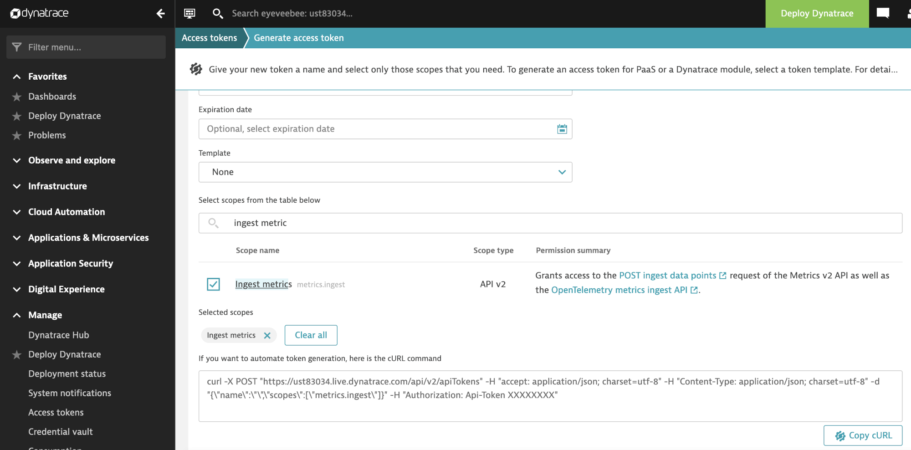
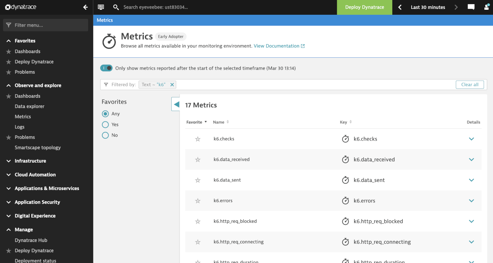
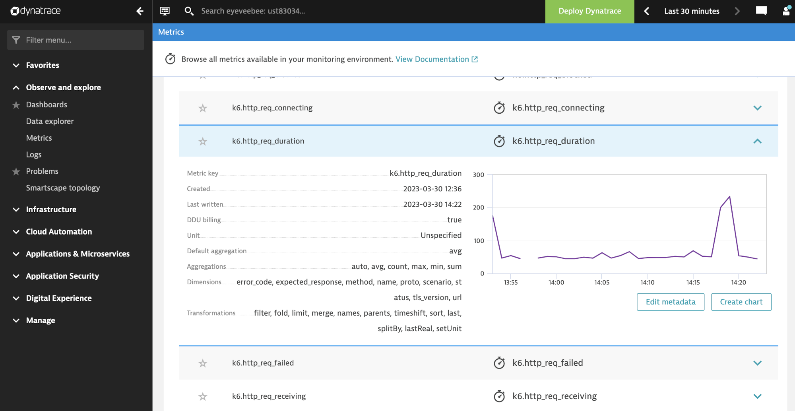

Using the [Dynatrace k6 extension](https://github.com/Dynatrace/xk6-output-dynatrace) you can send metrics to [Dynatrace](https://www.dynatrace.com/). That allows visualizing and correlating performance testing metrics with other monitored metrics in Dynatrace.

## Build the k6 version

<InstallationInstructions extensionUrl="github.com/Dynatrace/xk6-output-dynatrace"/>

## Run the test

Create a Dynatrace API token to send the data. 

<Blockquote mod="attention">
The Dynatrace API Token must have the scope name "metrics.ingest" (scope type "API v2").
</Blockquote> 

You can use the Dynatrace UI:



Or a `curl` command (replace `<environment-id>` and the `Api-Token`):

```bash
curl -X POST "https://<environment-id>.live.dynatrace.com/api/v2/apiTokens" -H "accept: application/json; charset=utf-8" -H "Content-Type: application/json; charset=utf-8" -d "{\"name\":\"\",\"scopes\":[\"metrics.ingest\"]}" -H "Authorization: Api-Token XXXXXXXX"
```

Use the previously built k6 binary and run the test passing the Dynatrace URL and API token as follows:

```bash
# export dynatrace variables
export K6_DYNATRACE_URL=https://<environmentid>.live.dynatrace.com
export K6_DYNATRACE_APITOKEN=<Dynatrace API token>

# run the test
./k6 run script.js -o output-dynatrace
```

You can now check the metrics in your Dynatrace environment, filtering for `k6`:





### Options

When streaming the k6 results to Dynatrace, you can configure the Dynatrace options below:

| Name                                     | Value                                                                                                       |
| ---------------------------------------- | ----------------------------------------------------------------------------------------------------------- |
| `K6_DYNATRACE_APITOKEN`                  | Dynatrace API token to write the metrics. The token must have the scope `metrics.ingest API v2`.  |
| `K6_DYNATRACE_FLUSH_PERIOD`              | Define how often metrics are sent to Dynatrace. The default value is 1 second.  |
| `K6_DYNATRACE_URL`                       | Dynatrace URL. The default value is `https://dynatrace.live.com`.  |
| `K6_DYNATRACE_INSECURE_SKIP_TLS_VERIFY`  | If `true`, the HTTP client kips TLS verification on the endpoint. The default value is `true`. |
| `K6_DYNATRACE_HEADER`                    | Pair of key/value headers to add to Dynatrace requests. |