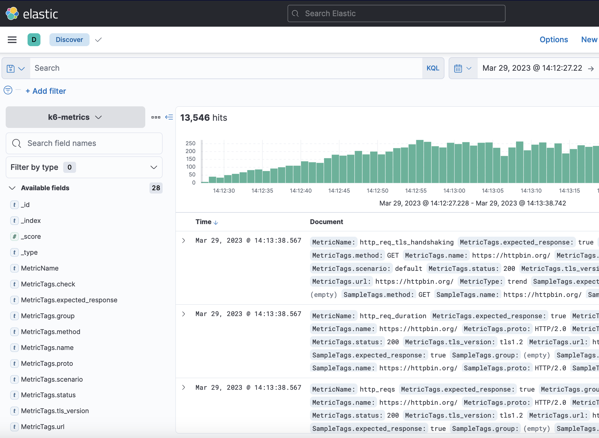

Using the [Elasticsearch k6 extension](https://github.com/elastic/xk6-output-elasticsearch), you can store k6 metrics in [Elasticsearch](https://github.com/elastic/elasticsearch) and analyze your performance results with Kibana or Grafana.


## Build the k6 version

<InstallationInstructions extensionUrl="github.com/elastic/xk6-output-elasticsearch"/>

## Run the test

Check that the Elasticsearch instance which will store the k6 metrics is running. 

If you are running on Elasticsearch cloud, use the previous k6 binary and run the test passing the cloud credentials as follows:

```bash
# export cloud configuration
export K6_ELASTICSEARCH_CLOUD_ID=your-cloud-id-here
export K6_ELASTICSEARCH_USER=your-user-here
export K6_ELASTICSEARCH_PASSWORD=your-password-here

# run the test
./k6 run script.js -o output-elasticsearch
```

k6 runs the test script and sends the metrics in real-time to Elasticsearch. 

You can also send the metrics to a local Elasticsearch cluster:

```bash
# export local url
export K6_ELASTICSEARCH_URL=http://localhost:9200

# run the test
./k6 run script.js -o output-elasticsearch
```

<Blockquote mod="attention">
Security and self-signed certificates for non-cloud clusters are not yet supported
</Blockquote>

You can now connect to Elasticsearch and query the [k6 metrics](/using-k6/metrics/) stored in the `k6-metrics` index. The example below uses an unsecured local Elasticsearch version `7.17.9`:

```bash
curl -XGET 'http://localhost:9200/k6-metrics/_search?pretty' -H 'Content-Type: application/json' -d'
{
  "sort": [
    {
      "Time": {
        "order": "desc"
      }
    }
  ],
  "size": 10
}'
```

Or use [Kibana Discover](https://www.elastic.co/guide/en/kibana/7.17/discover.html):



### Options

Here is the full list of options that can be configured and passed to the extension:

| Name                                     | Value                                                                                                       |
| ---------------------------------------- | ----------------------------------------------------------------------------------------------------------- |
| `K6_ELASTICSEARCH_CLOUD_ID`                     | Elasticsearch `cloud.id`, which can be found in the Elastic Cloud web console.  |
| `K6_ELASTICSEARCH_FLUSH_PERIOD`                     | Define how often metrics are sent to Elasticsearch. The default value is 1 second.  |
| `K6_ELASTICSEARCH_URL`                     | Elasticsearch URL.  |
| `K6_ELASTICSEARCH_USER`                     | Elasticsearch username.  |
| `K6_ELASTICSEARCH_PASSWORD`                     | Elasticsearch password.  |

