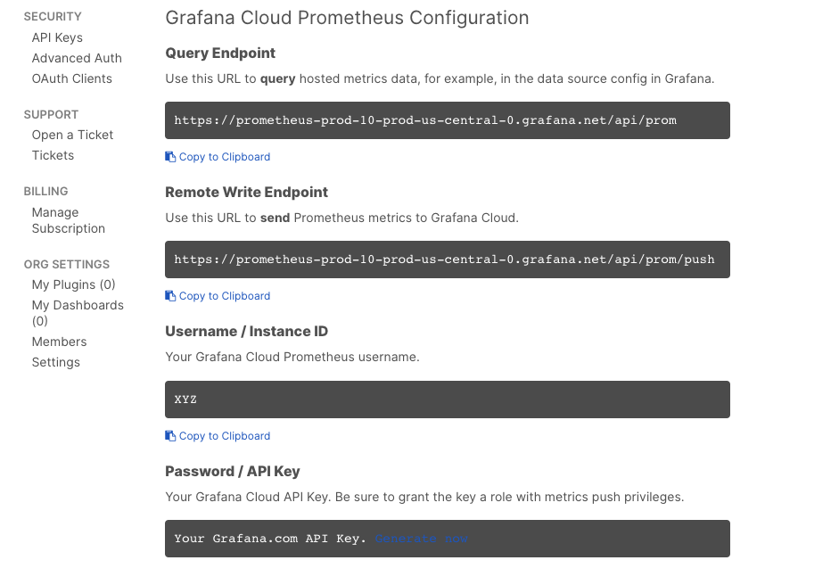
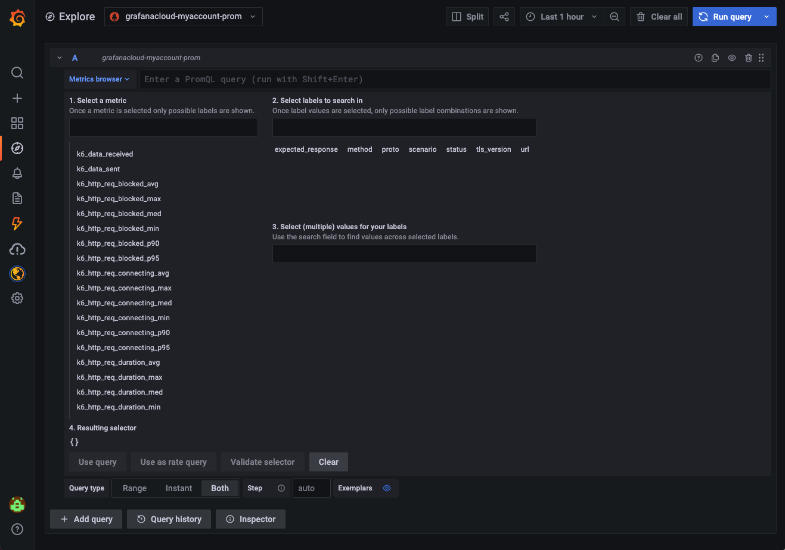

<Blockquote mod="attention" title="">

This page includes instructions for running a local test that sends the test results to a Prometheus instance in Grafana Cloud.

For running and managing cloud tests in Grafana Cloud, check out [Grafana Cloud k6](https://grafana.com/docs/grafana-cloud/k6/).

</Blockquote>


With Grafana Cloud Prometheus and the [k6 output for Prometheus remote write](/results-output/real-time/prometheus-remote-write), you can send your k6 results output to [Grafana Cloud](https://grafana.com/products/cloud) to visualize your testing results.
With k6 metrics in Grafana, you can correlate k6 metrics with other metrics of your observability stack.

While this topic uses Grafana Cloud as an example, this approach is compatible with any remote write capable Prometheus installation.


## Set up Grafana Cloud Prometheus

Before you start, you need the following:
- A Grafana Cloud account ([sign up](https://grafana.com/products/cloud/)).
The free plan includes 10,000 Prometheus series.
- The URL, username, and password of your Grafana Cloud Prometheus instance to configure the integration. 

After you've set up your account, follow these steps:

1. Log in to `Grafana.com` and visit the [Cloud Portal](https://grafana.com/docs/grafana-cloud/fundamentals/cloud-portal/).
Select the **Details** of your Prometheus service.

  

1. Copy the URL of the Remote Write Endpoint, along with the Username and Instance ID. 

  

1. In the **Password / API Key** section, create and copy an API key of the `MetricsPublisher` role. This will be used as a password.


## Run the test

Now, pass the Username, API key, and Remote Write Endpoint of the Grafana Cloud Prometheus Configuration to the k6 binary:

```bash
K6_PROMETHEUS_RW_USERNAME=Your_Username \
K6_PROMETHEUS_RW_PASSWORD=Your_API_KEY \
K6_PROMETHEUS_RW_SERVER_URL=Your_REMOTE_WRITE_ENDPOINT \
k6 run -o experimental-prometheus-rw script.js
```

## Explore k6 metrics

To explore k6 metrics in Grafana Cloud:
1. Click on the Explore icon on the menu bar.
1. Choose the Prometheus data source from the dropdown in the top left.
1. In the query field, query k6 metrics to explore your testing results.



## Read more

- [K6 makes performance testing easy with Prometheus and Grafana in Docker](https://medium.com/@rody.bothe/turning-data-into-understandable-insights-with-k6-load-testing-fa24e326e221)
