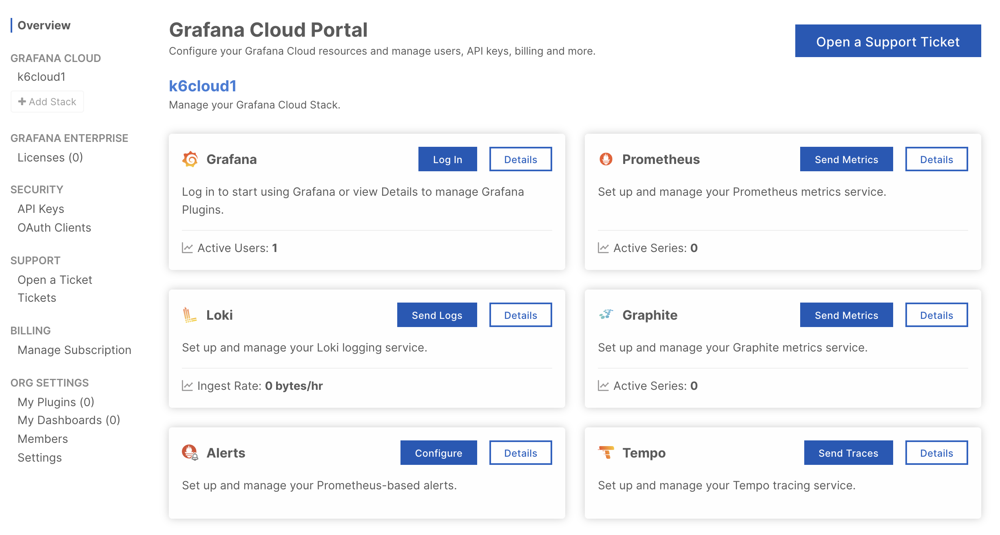
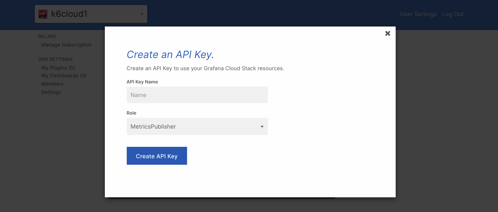

With Grafana Cloud Prometheus and the [k6 output for Prometheus remote write](/results-output/real-time/prometheus), you can send your k6 metrics into [Grafana Cloud](https://grafana.com/products/cloud) to better visualize your testing results.
With k6 metrics in Grafana, you can correlate k6 metrics with other metrics of your observability stack.

While this article focuses on Grafana Cloud, any remote write capable Prometheus installation is compatible with this approach.

<Blockquote mod="attention" title="">

For k6 Cloud tests, follow the [k6 Cloud instructions](/cloud/integrations/cloud-apm/grafana-cloud).

</Blockquote>


## Set up Grafana Cloud Prometheus

If you do not have a Grafana Cloud account, you can sign up [here](https://grafana.com/products/cloud/). The free plan includes 10,000 Prometheus series.

Now, you need the URL, username and password of your Grafana Cloud Prometheus instance to configure the integration. 

Log in to Grafana.com and visit the [Cloud Portal](https://grafana.com/docs/grafana-cloud/fundamentals/cloud-portal/). Click on the `Details` button of your Prometheus service.



Copy the URL of the Remote Write Endpoint and the Username / Instance ID. 


On the Password / API Key section, create and copy an API key of `MetricsPublisher` role that will be used as password.



## Run the test

Now, pass the Username, API key, and Remote Write Endpoint of the Grafana Cloud Prometheus Configuration to the k6 binary:

```bash
K6_PROMETHEUS_RW_USERNAME=Your_Username \
K6_PROMETHEUS_RW_PASSWORD=Your_API_KEY \
K6_PROMETHEUS_RW_SERVER_URL=Your_REMOTE_WRITE_ENDPOINT \
k6 run -o experimental-prometheus-rw script.js
```

## Explore k6 metrics

In Grafana Cloud, click on the Explore icon on the menu bar, and choose the Prometheus data source from the dropdown in the top left. In the query field, query k6 metrics to explore your testing results.


## Read more

- [K6 makes performance testing easy with Prometheus and Grafana in Docker](https://medium.com/@rody.bothe/turning-data-into-understandable-insights-with-k6-load-testing-fa24e326e221)
