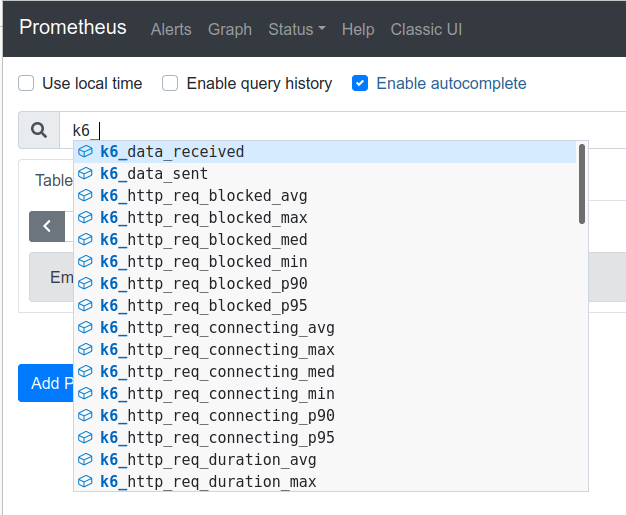

k6 supports sending test result metrics to a Prometheus Remote Write endpoint via the [`xk6-output-prometheus-remote` extension](https://github.com/grafana/xk6-output-prometheus-remote).  One option with this support is storing the metrics in Prometheus; others can be found [here](https://prometheus.io/docs/operating/integrations/).

## Instructions

<InstallationInstructions extensionUrl="github.com/grafana/xk6-output-prometheus-remote"/>


Then run the test with the new binary as follows:


```bash
./k6 run -o output-prometheus-remote script.js
```

All metrics sent by the extension get the prefix `k6_` attached to their names. In case of Prometheus, k6 metrics can be seen in its UI:



If the remote write endpoint requires authentication, the following command can be used:

<CodeGroup labels={[""]}>

```bash
    K6_PROMETHEUS_INSECURE_SKIP_TLS_VERIFY=false \
    K6_PROMETHEUS_USER=foo \
    K6_PROMETHEUS_PASSWORD=bar \
    ./k6 run script.js -o output-prometheus-remote
```

</CodeGroup>

## Options

The full list of available options that can be configured and passed to the extension:

| Name                                     | Value                                                                                                       |
| ---------------------------------------- | ----------------------------------------------------------------------------------------------------------- |
| `K6_PROMETHEUS_REMOTE_URL`               | Address of the Prometheus Remote Write endpoint. The default value is `http://localhost:9090/api/v1/write`. |
| `K6_PROMETHEUS_HEADERS`                  | Additional headers that should be included in the HTTP requests. Optional. |
| `K6_PROMETHEUS_USER`                     | User for the basic HTTP authentication at the Prometheus Remote Write endpoint. Optional. |
| `K6_PROMETHEUS_PASSWORD`                 | Password for the basic HTTP authentication at the Prometheus Remote Write endpoint. Optional. |
| `K6_PROMETHEUS_PUSH_INTERVAL`            | Interval of the metrics' aggregation and upload to the endpoint. The default value is `5s`. |
| `K6_PROMETHEUS_INSECURE_SKIP_TLS_VERIFY` | Boolean option whether to skip TLS verification on the endpoint. The default value is `true`. |

## Read more

- [k6 metrics in Prometheus](https://k6.io/blog/k6-loves-prometheus/#the-mechanics-behind-metrics-crunching)
