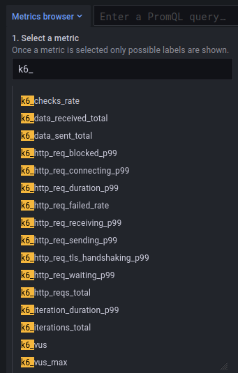
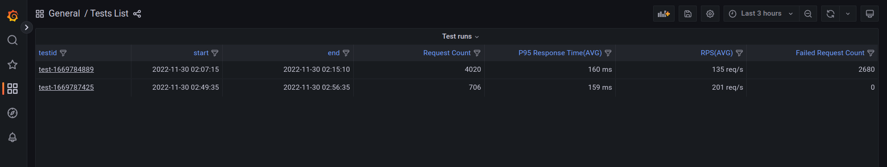

<Blockquote mod="attention" title="Experimental">
<ExperimentalBlockquote />
</Blockquote>

Prometheus Remote Write is a protocol with a defined [specification](https://docs.google.com/document/d/1LPhVRSFkGNSuU1fBd81ulhsCPR4hkSZyyBj1SZ8fWOM/edit).
It has multiple implementations.
For example, one option is to store the metrics in [Prometheus](https://prometheus.io/docs/prometheus/latest/feature_flags/#remote-write-receiver).
You can find other implementations in the Prometheus' [Integrations](https://prometheus.io/docs/operating/integrations) guide.

With the Prometheus remote write output, k6 can send test-result metrics to a Prometheus remote write endpoint.
The output during the `k6 run` execution gets all the generated data points for the [built-in  k6 metrics](/using-k6/metrics/).
It then generates the equivalent Prometheus remote write time series.

## Send test metrics to a remote write endpoint


**Before you start**:

For remote-output to work, you need the following:
- A running remote write implementation, with an endpoint that k6 can reach.
To use k6 with remote-write output, use the `--out` flag with `experimental-prometheus-rw` as the argument:

```bash
k6 run -o experimental-prometheus-rw script.js
```
 
All the time series are generated and sent with the `k6_` prefix. In the Metric Explorer UI in Grafana, it looks something  like this:



## Metrics mapping

All the k6 metric types are converted into an equivalent Prometheus remote write type:

| k6 | Prometheus | Name label |
|----|------------| ---------- |
| Counter | Counter | `k6_*_total`
| Gauge | Gauge | `k6_*_<unit-suffix>` |
| Rate | Gauge | `k6_*_rate` |
| Trend | Gauges / Native Histogram | `k6_*_<unit-suffix>` |

### Trend

The obvious conversion with a classic Prometheus Histogram is not convenient because k6 can't determine the fixed buckets in advance.
So, by default, the output maps a Trend metric into primitive Counter and Gauges where each value represents a math function (count, sum, min, max, avg, med, p(x)).
Mapping Trend by Stats has the following cons:
* It is impossible to aggregate some Gauge's value (especially the percentiles).
* It uses a memory-expensive k6 data structure.

To resolve these limitations, you can map a Trend as a [Prometheus Native Histogram](https://prometheus.io/docs/concepts/metric_types/#histogram).
You can enable conversion with the `K6_PROMETHEUS_RW_TREND_AS_NATIVE_HISTOGRAM=true` environment variable (or one of the other ways).
The output then converts all the trend types into a dedicated Native Histogram.

Native Histogram is an experimental feature, so it has to be enabled (`--enable-feature=native-histograms`). Note that other Remote Write implementations don't support it yet.

### Naming convention

The output maps the metrics into time series with Name labels.
As much as possible, it respects the [naming best practices](https://prometheus.io/docs/practices/naming) that the Prometheus project defines:

* All the time series are prefixed with the `k6_` namespace.
* All time series are suffixed with the base unit of the sample value (if k6 knows what the base unit is).
* Trends and Rates have the relative suffixes, to make them more discoverable.

## Prometheus as a remote write agent

To use remote write in Prometheus 2.x, use the `--web.enable-remote-write-receiver ` flag.
The [xk6 extension](https://github.com/grafana/xk6-output-prometheus-remote) repository has some docker compose examples in the [example](https://github.com/grafana/xk6-output-prometheus-remote/tree/main/example) directory.
For remote write storage options, refer to the [Prometheus docs](https://prometheus.io/docs/prometheus/latest/configuration/configuration/#remote_write).

## Authentication

If the remote write endpoint requires authentication, the following command can be used:

<CodeGroup labels={[""]}>

```bash
    K6_PROMETHEUS_RW_INSECURE_SKIP_TLS_VERIFY=false \
    K6_PROMETHEUS_RW_USERNAME=foo \
    K6_PROMETHEUS_RW_PASSWORD=bar \
    ./k6 run script.js -o experimental-prometheus-rw
```

</CodeGroup>

## Staleness

TODO

## Options

k6 has special options for remote write output.

| Name | Type | Default | Description |
| ---- | ---- | ------- | ----------- |
| `K6_PROMETHEUS_RW_SERVER_URL` | `string` | `http://localhost:9090/api/v1/write` | URL of the Prometheus Remote Write implementation's endpoint. |
| `K6_PROMETHEUS_RW_HEADERS_<here-the-header-key>` | list of `string` | | Additional headers to include in the HTTP requests. `K6_PROMETHEUS_RW_HEADERS_X-MY-HEADER=foo`|
| `K6_PROMETHEUS_RW_USERNAME` | `string` | | User for the HTTP Basic authentication at the Prometheus Remote Write endpoint. |
| `K6_PROMETHEUS_RW_PASSWORD` | `string` | | Password for the HTTP Basic authentication at the Prometheus Remote Write endpoint. |
| `K6_PROMETHEUS_RW_PUSH_INTERVAL` | `string` | `5s` | Interval of the metrics' aggregation and upload to the endpoint. |
| `K6_PROMETHEUS_RW_TREND_AS_NATIVE_HISTOGRAM` | `boolean` | false | If true, it maps the all defined Trend metrics as [Native Histograms](#trend). |
| `K6_PROMETHEUS_RW_TREND_STATS` | list of `string` | `p(99)` | If Native Histogram is not enabled then it defines the stats functions to map for the all defined Trend metrics. |
| `K6_PROMETHEUS_RW_INSECURE_SKIP_TLS_VERIFY` | `boolean` | false | If true, the HTTP client skips TLS verification on the endpoint. |
| `K6_PROMETHEUS_RW_STALE_MARKERS | `boolean` | false | If true, the output at the end of the test marks all the seen time series as stale. |

## Grafana Dashboards

The [xk6 extension](https://github.com/grafana/xk6-output-prometheus-remote) repository includes a [docker-compose setup](https://github.com/grafana/xk6-output-prometheus-remote/#docker-compose) with two pre-built dashboards.
You can use these dashboards to visualize the generated time series with Prometheus configured as a data source: 
- visualize the results of a test run
- list test runs



