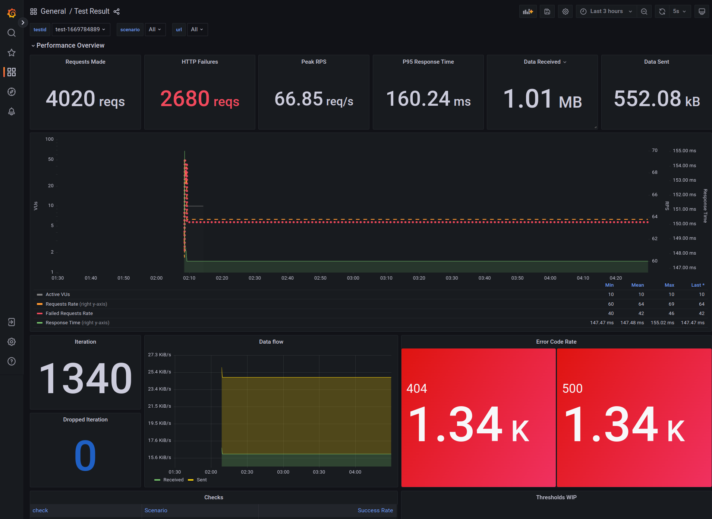

<Blockquote mod="attention" title="Experimental">
Prometheus Remote Write Output is an experimental feature and breaking change to the API or the generated time series could be introduced in the future. 
</Blockquote>

k6 supports sending test result metrics to a Prometheus Remote Write endpoint via the Prometheus Remote Write Output.
Prometheus Remote Write is a protocol with a defined [specification](https://docs.google.com/document/d/1LPhVRSFkGNSuU1fBd81ulhsCPR4hkSZyyBj1SZ8fWOM/edit) and it has multiple implementations, one option with this support is storing the metrics in [Prometheus](https://prometheus.io/docs/prometheus/latest/feature_flags/#remote-write-receiver); others can be found in the Prometheus' [Integrations](https://prometheus.io/docs/operating/integrations) guide.

The Output during the `k6 run` execution gets all the generated data points for the defined k6's [builtin metrics](/using-k6/metrics/#built-in-metrics) then it generates the equivalent Prometheus's Remote Write time series.

## How to use

A up and running Remote Write implementation is required exposing an endpoint reachable by k6's process. Check the guide below how to run Prometheus as a Remote write agent if you need one.
Then a test run with the Output can be used as follows:

```bash
k6 run -o experimental-prometheus-rw script.js
```
 
All the time series generated and sent by the Output get the prefix `k6_` attached to their names. In case of Prometheus, they can be seen in its UI:


## Metrics mapping

All the k6 metric types are converted into an equivalent Prometheus Remote Write type:

| k6 | Prometheus | Name label |
|----|------------| ---------- |
| Counter | Counter | `k6_*_total`
| Gauge | Gauge | `k6_*_<unit-suffix>` |
| Rate | Gauge | `k6_*_rate` |
| Trend | Gauges / Native Histogram | `k6_*_<unit-suffix>` |

### Trend

The obvious conversion with a classic Prometheus Histogram is not convenient because k6 can't determine the fixed buckets in advance, so the Output maps a Trend metric by default into primitive Counter and Gauges where each value represents a math function (count, sum, min, max, avg, med, p(x)).
Mapping Trend by Stats has the following cons:
* It is impossible to aggregate some Gauge's value (especially the percentiles).
* It uses a memory-expensive k6's data structure.

The previous points can be resolved by mapping Trend as [Prometheus Native Histogram](https://prometheus.io/docs/concepts/metric_types/#histogram). Enabling the conversion by the `K6_PROMETHEUS_RW_TREND_AS_NATIVE_HISTOGRAM=true` environment variable (or one of the other ways), then the Output converts all the Trend types into a dedicated Native Histogram.

Native Histogram is a Prometheus' experimental feature, so it has to be enabled (`--enable-feature=native-histograms`). Note that other Remote Write implementations don't support it yet.

### Naming convention

The Output maps the metrics into time series with Name labels respecting as much as possible the naming [best practices](https://prometheus.io/docs/practices/naming) defined by the Prometheus' project:

* All the time series are prefixed with the `k6_` namespace.
* All the time series contains when known a suffix with the Base unit used for Sample's values.
* Trend's stats and Rate contains the relative suffix for making them better discoverable.

## Prometheus as Remote Write agent

To enable remote write in Prometheus 2.x use `--web.enable-remote-write-receiver ` option. See docker-compose samples in [example/]() folder of the k6 repository. Options for remote write storage can be found [here](https://prometheus.io/docs/prometheus/latest/configuration/configuration/#remote_write).

## Authentication

If the remote write endpoint requires authentication, the following command can be used:

<CodeGroup labels={[""]}>

```bash
    K6_PROMETHEUS_RW_INSECURE_SKIP_TLS_VERIFY=false \
    K6_PROMETHEUS_RW_USERNAME=foo \
    K6_PROMETHEUS_RW_PASSWORD=bar \
    ./k6 run script.js -o experimental-prometheus-rw
```

</CodeGroup>

## Options

The Output supports different options for better adapting the behavior for different need. Take a look to the full list of available Options.

| Name | Type | Default | Description |
| ---- | ---- | ------- | ----------- |
| `K6_PROMETHEUS_RW_SERVER_URL` | `string` | `http://localhost:9090/api/v1/write` | URL of the Prometheus Remote Write implementation's endpoint. |
| `K6_PROMETHEUS_RW_HEADERS_<here-the-header-key>` | list of `string` | | Additional headers to include in the HTTP requests. `K6_PROMETHEUS_RW_HEADERS_X-MY-HEADER=foo`|
| `K6_PROMETHEUS_RW_USERNAME` | `string` | | User for the HTTP Basic authentication at the Prometheus Remote Write endpoint. |
| `K6_PROMETHEUS_RW_PASSWORD` | `string` | | Password for the HTTP Basic authentication at the Prometheus Remote Write endpoint. |
| `K6_PROMETHEUS_RW_PUSH_INTERVAL` | `string` | `5s` | Interval of the metrics' aggregation and upload to the endpoint. |
| `K6_PROMETHEUS_RW_TREND_AS_NATIVE_HISTOGRAM` | `boolean` | false | If true, it maps the all defined Trend metrics as [Native Histograms](#trend). |
| `K6_PROMETHEUS_RW_TREND_STATS` | list of `string` | `p(99)` | If Native Histogram is not enabled then it defines the stats functions to map for the all defined Trend metrics. |
| `K6_PROMETHEUS_RW_INSECURE_SKIP_TLS_VERIFY` | `boolean` | false | If true, the HTTP client skips TLS verification on the endpoint. |

## Grafana Dashboards

The [extension]() repository includes a [docker-compose setup](https://github.com/grafana/xk6-output-prometheus-remote/#docker-compose) with two pre-built dashboards that can be used for visualizing the generated time series with Prometheus configured as a data source: 
- visualize the results of a test run
- list test runs



