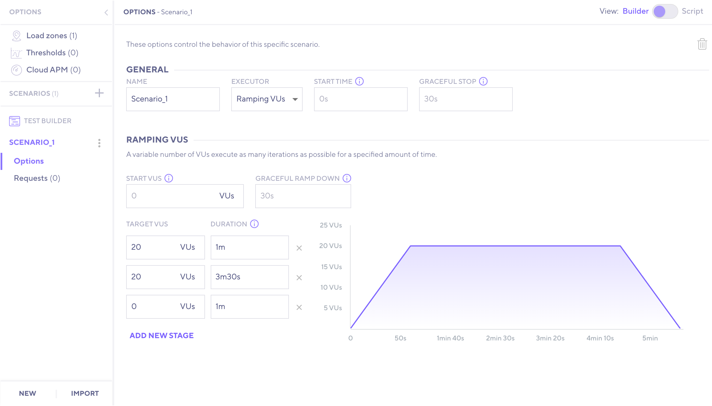
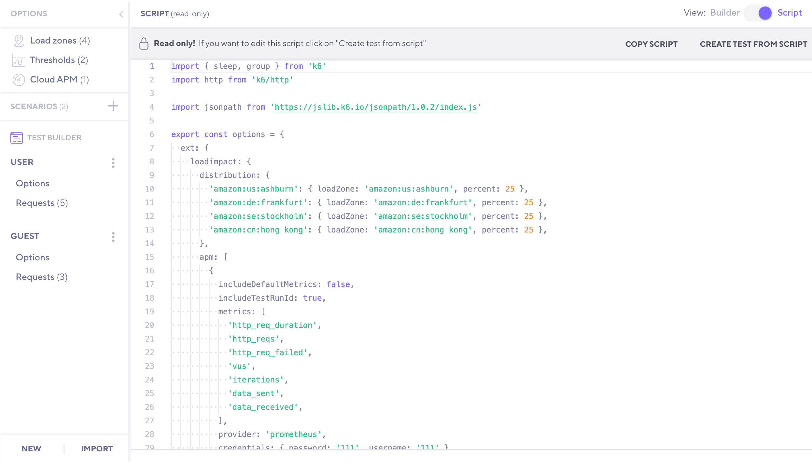

The k6 Test Builder allows you to utilize a graphical interface to create a k6 test.

Based on your input, the test builder will automatically generate the k6 script for you. Once done, you can copy the script and [run the test from the CLI](/getting-started/running-k6).

> **Note**: you need a [k6 Cloud](/cloud) account to use the test builder. However, it is **free to use**, and you do not need an active subscription to utilize this feature.

Although we strongly believe that scriptable/code-based tools will help you get the most out of your performance testing efforts, a GUI-based tool like the test builder could benefit you in:

- Speeding up the test creation.
- Learning quickly the [k6 API](/javascript-api).
- Collaborating on building tests with non-coders.

## Getting started

1. [Login](https://app.k6.io/account/login) into the k6 Cloud.

2. On the sidebar menu, click the [Create New Test](https://app.k6.io/tests/new) button.

3. Select `Test builder`.

  

4. Start building your k6 test using the graphical interface.

## Load zones

Configure the geographical zones that the load test should be run from. Select **even** to distribute load equally across all zones, and **manual** to set the percentage of load for each zone chosen.  

Check out the list of supported [load zones](/cloud/creating-and-running-a-test/cloud-tests-from-the-cli#list-of-supported-load-zones).

## Thresholds

Set pass/fail criteria to specify the performance expectations of the system under test. You can set thresholds on any result metrics. 

Read more on the [thresholds documentation](/using-k6/thresholds/).

## Cloud APM

Select where you want to export metrics from a running test in real-time.  

Read more on the [Cloud APM](/cloud/integrations/cloud-apm/).

## Scenarios

Scenarios allow us to configure how VUs and iterations are scheduled to model diverse traffic patterns in load tests. 

You can create multiple scenarios in a test. For each scenario, configure its options:

- The [scenario executor](/using-k6/scenarios/executors) and its particular configuration.
- The scenario name.
- When the scenario begins its execution. The time offset since the start of the test.
- The scenario [graceful stop](/using-k6/scenarios/graceful-stop/) option.

Read more on the [scenarios documentation](/using-k6/scenarios).

## Requests

Configure the requests that each scenario will execute. The test builder allows to:

- Add a request and name it for better description.
- Change the URL/Endpoint and `HTTP` method.
- Specify Headers and Query Parameters.
- Specify a request body (JSON, Text, or File Content).
- Reorganize requests by clicking and dragging.
- Duplicate or delete requests.

Read more on the [HTTP Requests documentation](/using-k6/http-requests/).

## View k6 script

At any moment, you can toggle the `View` button (top-right corner) to `Script` mode and see the auto-generated k6 script. 

Check out the script to get familiar with the [k6 API](/javascript-api/) or to copy the script and edit it on your IDE of preference.

  
## More features

- Add a [check](/javascript-api/k6/check-val-sets-tags) on a request response.
- Add [sleep](/javascript-api/k6/sleep-t) time between requests.
- Add a [group](/javascript-api/k6/group-name-fn) to the test.
- Import recorded requests using the [browser recorder](/test-authoring/recording-a-session/browser-recorder).
- Import requests included in a [HAR file](<https://en.wikipedia.org/wiki/HAR_(file_format)>).
- Capture a variable when dealing with dynamic data, such as authentication tokens.
- Show relevant examples.
- Run the test on the k6 Cloud.
