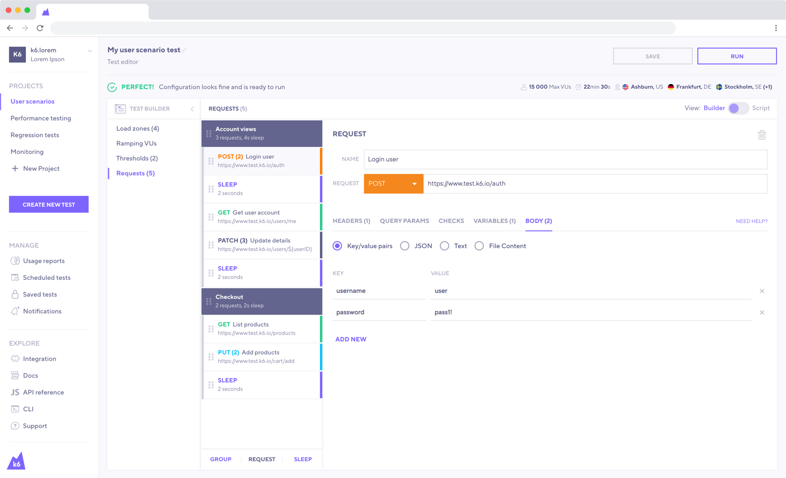
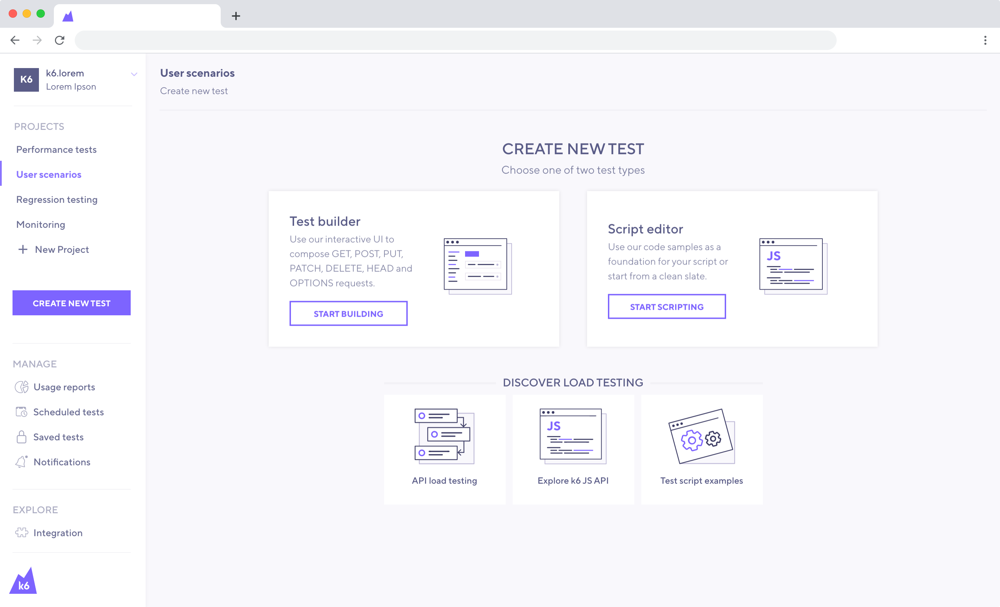
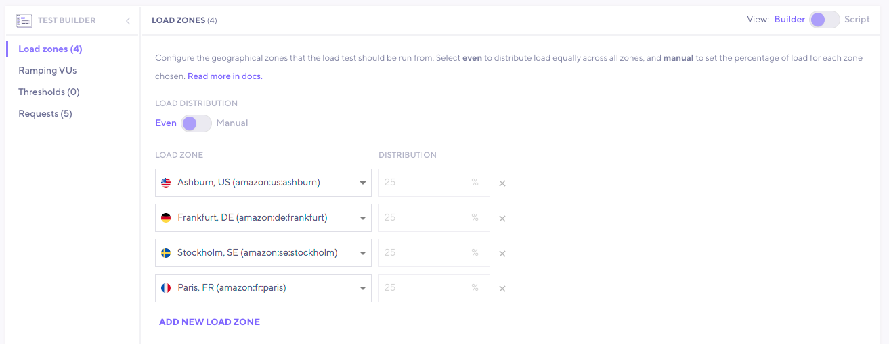
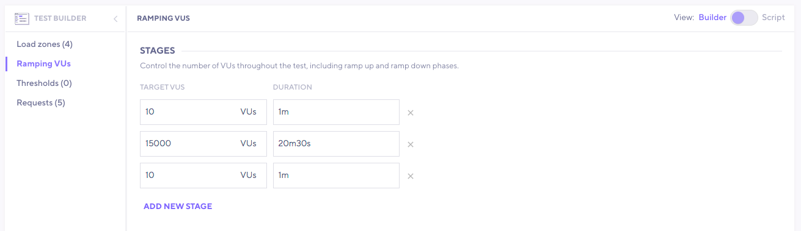
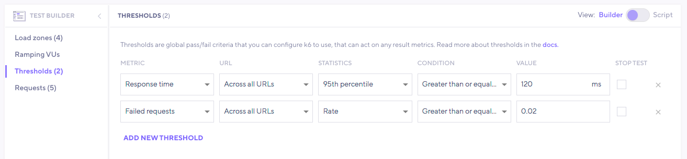

The k6 Test Builder allows you to utilize a graphical interface to create a k6 test.

Based on your input, the test builder will automatically generate the k6 script for you. Once done, you can copy the script and [run the test from the CLI](/getting-started/running-k6).

> **Note**: you need a [k6 Cloud](/cloud) account to use the test builder. However, it is **free to use**, and you do not need an active subscription to utilize this feature.

Although we strongly believe that scriptable/code-based tools will help you get the most out of your performance testing efforts, a GUI-based tool like the test builder could benefit you in:

- Speeding up the test creation.
- Learning quickly the [k6 API](/javascript-api).
- Collaborating on building tests with non-coders.

## Instructions

1 - [Login](https://app.k6.io/account/login) into the k6 Cloud.

2 - On the sidebar menu, click the [Create New Test](https://app.k6.io/tests/new) button.

3 - Select `Test builder`.

4 - Now, you can start building your k6 test using the graphical interface.

## Test builder features

We are continuously improving and adding new capabilities to the test builder. A few of the most prominent features are:

**Load zones**

Configure the geographical zones that the load test should be run from. Select **even** to distribute load equally across all zones, and **manual** to set the percentage of load for each zone chosen.  
Full list of available [load zones](/cloud/creating-and-running-a-test/cloud-tests-from-the-cli#list-of-supported-load-zones).

**Ramping VUs**

Control the number of VUs (Virtual Users) throughout the test, including ramp up and ramp down phases.  

**Cloud APM**

Select where you want to export metrics from a running test in real-time.  
Find out how to set up your provider [here](/cloud/integrations/cloud-apm/).

**Thresholds**

Thresholds are global pass/fail criteria that you can configure k6 to use, that can act on any result metrics.  
Read more in depth about thresholds [here](/using-k6/thresholds/).

**Requests**

- Add a request and name it for better description.
- Change the URL/Endpoint.
- Change the `HTTP METHOD` using the drop down menu.
- Specify Headers.
- Specify Query Parameters.
- Specify a request body (JSON, Text, or File Content) for POST/PUT/PATCH requests.
- Reorganize requests by clicking and dragging.
- Duplicate or delete requests when hovering over a specific request.

**k6 API**

- Define the [thresholds](/using-k6/thresholds) of your test.
- Control ramping [stages](/using-k6/options#stages).
- Add a [check](/javascript-api/k6/check-val-sets-tags) on a request response.
- Add [sleep](/javascript-api/k6/sleep-t) time between requests.
- Add a [group](/javascript-api/k6/group-name-fn) to the test.

**And more**

- Populate the test builder with the recorded requests using the [browser recorder](/test-authoring/recording-a-session/browser-recorder).
- Populate the test builder with the requests included in a [HAR file](<https://en.wikipedia.org/wiki/HAR_(file_format)>).
- Capture a variable when dealing with dynamic data, such as authentication tokens.
- Show examples for better onboarding.
- Toggle the view mode to see or copy the generated k6 script.
- Run the test on the k6 Cloud.
