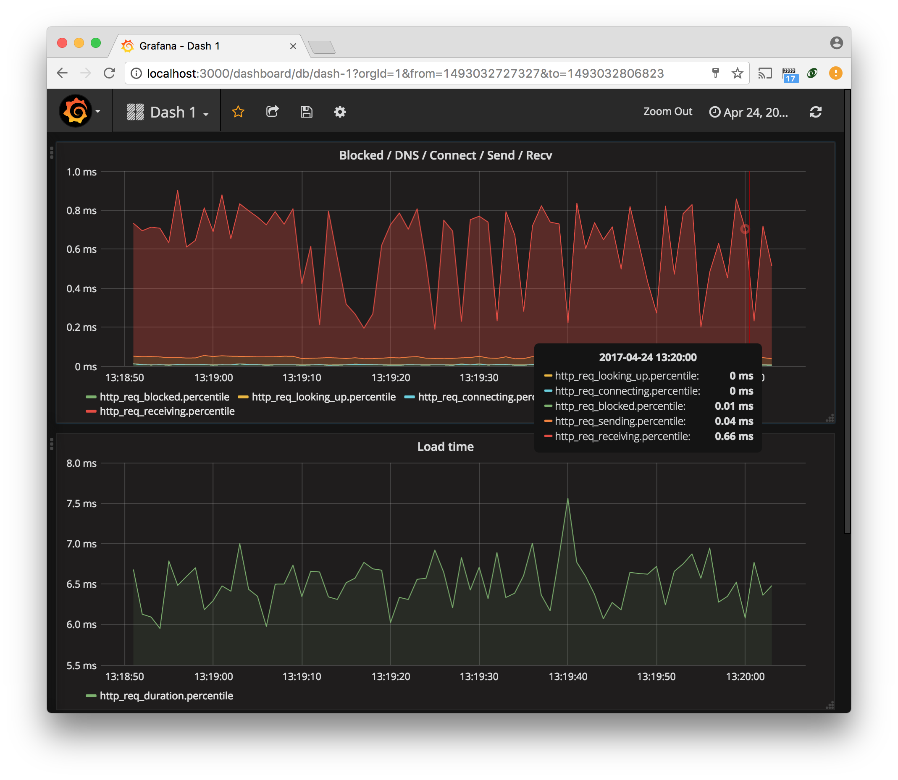
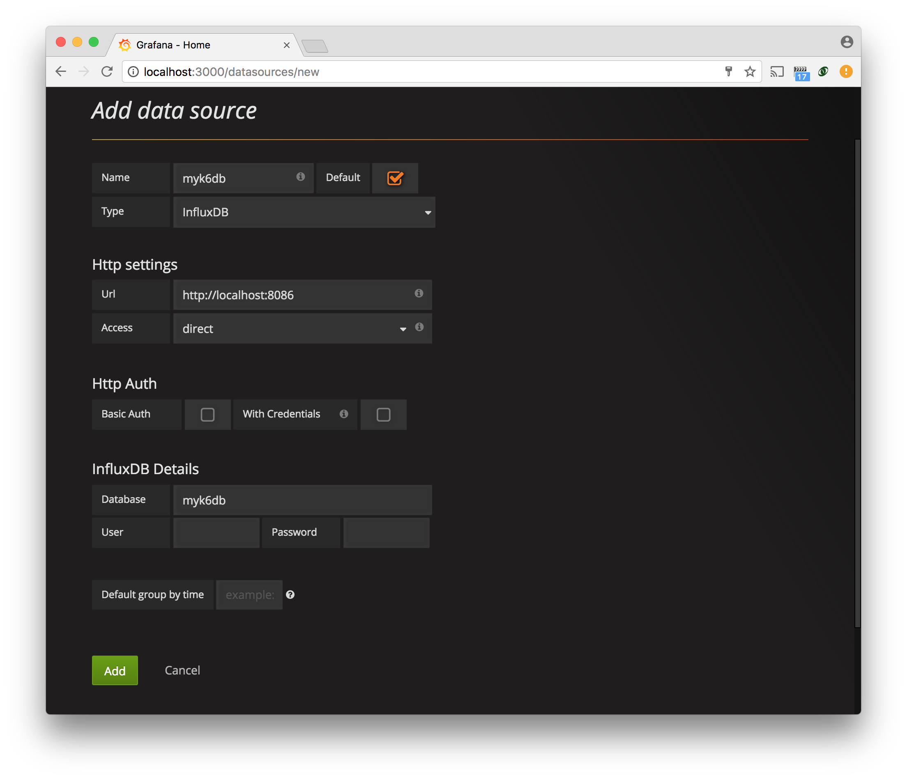
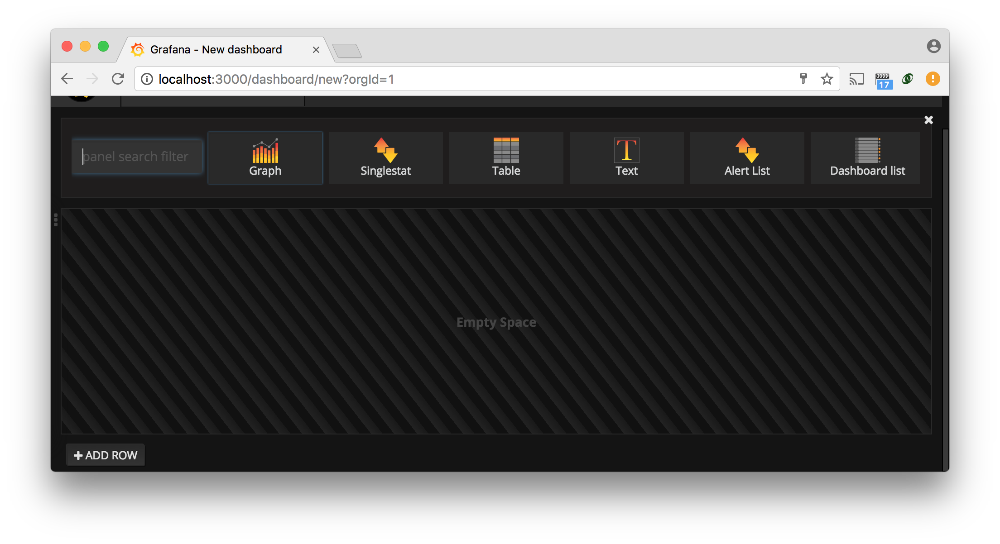
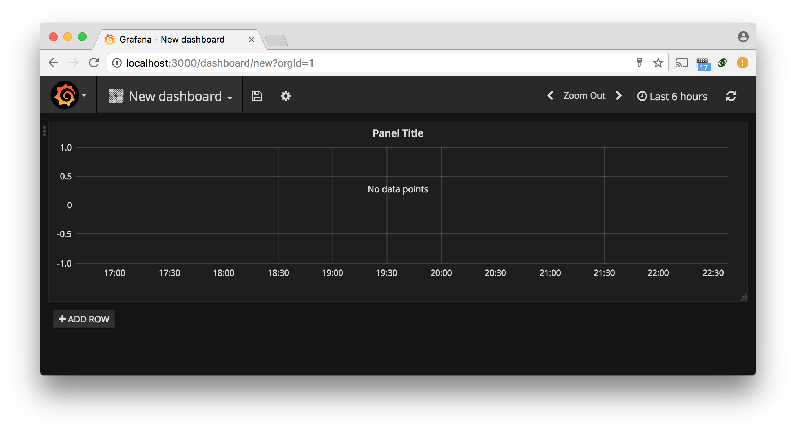
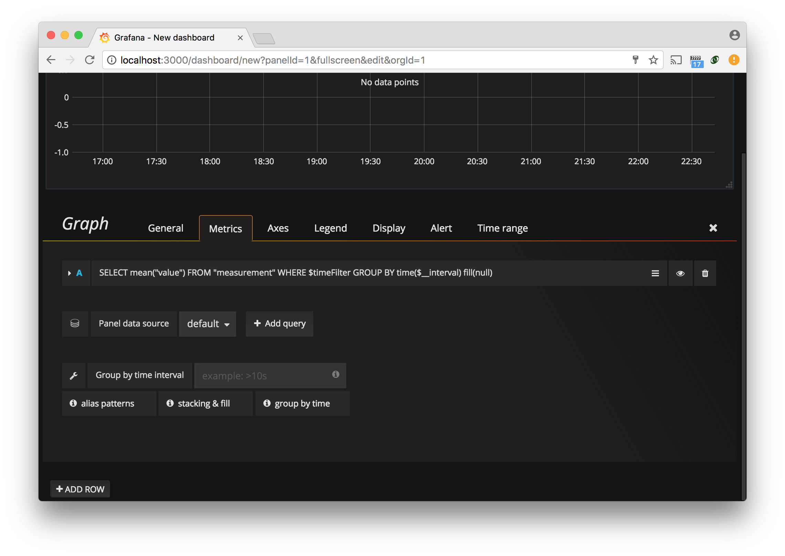
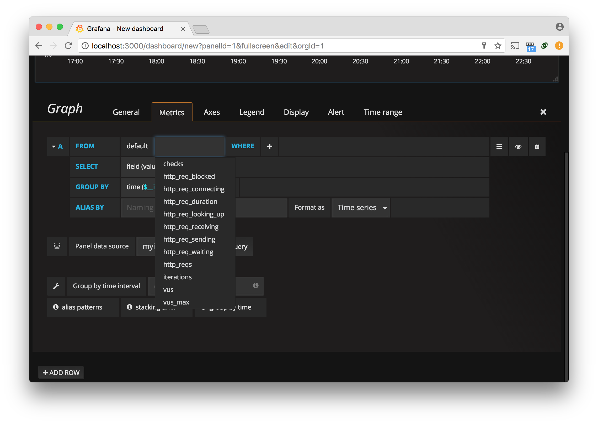
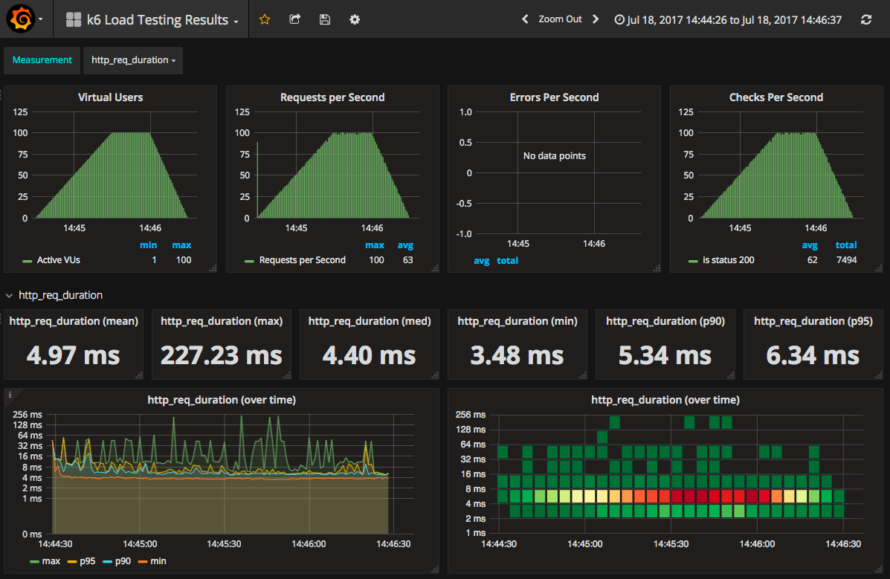

You can use [Grafana](https://grafana.com/grafana/) to visualize your k6 metrics.

The first step is to upload your test result metrics to a storage backend. And next, configure Grafana to fetch the data from your backend to visualize the test results.

This tutorial shows how to use [InfluxDB](https://github.com/influxdata/influxdb) instance as a destination for k6 output and to configure Grafana to query the [k6 metrics](/using-k6/metrics) from InfluxDB.



## Installing InfluxDB

Full installation instructions are available in [the InfluxDB docs](https://docs.influxdata.com/influxdb/v1.2/introduction/installation/).

<CodeGroup labels={["Linux (Debian/Ubuntu)", "macOS"]}>

```bash
$ sudo apt install influxdb
```

```bash
$ brew install influxdb
```

</CodeGroup>

## Run the test and upload the results to InfluxDB

k6 has built-in support for outputting results data directly to an InfluxDB database using
the `--out` (`-o`) switch:

<CodeGroup labels={["Linux & MacOS", "Docker"]}>

```bash
$ k6 run --out influxdb=http://localhost:8086/myk6db script.js
```

```bash
$ docker run --rm -i grafana/k6 run --out influxdb=http://localhost:8086/myk6db - <script.js
```

</CodeGroup>

The above command line makes k6 connect to a local influxdb instance, and send the results from
the test to a database named `myk6db`. If this database does not exist, k6 will create it
automatically.

Once you have k6 results in your InfluxDB database, you can then use Grafana to
create results visualizations.

## Install Grafana

Full installation instructions are available in [the Grafana docs](http://docs.grafana.org/installation/).

<CodeGroup labels={["Linux (Debian/Ubuntu)", "macOS"]}>

```bash
$ sudo apt install grafana
```

```bash
$ brew install grafana
```

</CodeGroup>

After the installation, you should have an InfluxDB server running on localhost, listening on port 8086,
and a Grafana server on `http://localhost:3000`. Now, we show two different ways to visualize your k6 metrics:

- [Custom Grafana dashboard](#custom-grafana-dashboard)

- [Preconfigured Grafana dashboards](#preconfigured-grafana-dashboards)

## Custom Grafana dashboard

- Open `http://localhost:3000` (or wherever your Grafana installation is located) in your browser.
- Create a data source:
  
- Now create a dashboard. Here is the newly created dashboard:
  
- Click `Graph` to create a new graph panel:
  
- Hover over any part of the panel to display the actions menu (three dots) on the top right corner. 
- Click the menu and select **Edit** to set up the graph panel:
  
- Set the panel data source to your `myk6db` database and click the `SELECT mean(value)...`
  statement to edit the metric:
  

## Preconfigured Grafana dashboards

You can find a list of Grafana dashboard configurations contributed by users, specifically for use with k6, at [grafana.com](https://grafana.com/grafana/dashboards?search=k6).

To enable a contributed Grafana dashboard is simple: you just choose to "import" a dashboard in the Grafana UI and then specify the ID number of the dashboard you want, see [http://docs.grafana.org/reference/export_import](http://docs.grafana.org/reference/export_import) for more details.



### Using our docker-compose setup

To make all the above even simpler, we have created a docker-compose setup that will:

- Start a Docker container with InfluxDB
- Start a Docker container with Grafana
- Make available a k6 container that you can use to run load tests

Make sure you have at least docker-compose version v1.12.0 installed.
You just need to do the following:

```bash
$ git clone 'https://github.com/grafana/k6'
$ cd k6
$ docker-compose up -d \
    influxdb \
    grafana
$ docker-compose run -v \
    $PWD/examples:/scripts \
    k6 run /scripts/es6sample.js
```

Now you should be able to connect to `localhost` on port 3000 with your browser and access the
Grafana installation in the Docker container.

## InfluxDB options

When uploading the k6 results to InfluxDB (`k6 run --out influxdb=`), you can configure other InfluxDB options passing these environment variables:

| InfluxDB Options             | Description                                                                                                                                                                                                                                                                                                                                                                                          | Default |
| ---------------------------- | ---------------------------------------------------------------------------------------------------------------------------------------------------------------------------------------------------------------------------------------------------------------------------------------------------------------------------------------------------------------------------------------------------- | ------- |
| `K6_INFLUXDB_USERNAME`       | InfluxDB username, optional                                                                                                                                                                                                                                                                                                                                                                          |         |
| `K6_INFLUXDB_PASSWORD`       | InfluxDB user password                                                                                                                                                                                                                                                                                                                                                                               |         |
| `K6_INFLUXDB_INSECURE`       | If `true`, it will skip https certificate verification                                                                                                                                                                                                                                                                                                                                               | `false` |
| `K6_INFLUXDB_TAGS_AS_FIELDS` | A comma-separated string to set k6 metrics as non-indexable [fields](https://docs.influxdata.com/influxdb/v1.8/concepts/glossary/#field) (instead of tags). An optional type can be specified using `:type` as in `vu:int` will make the field integer. The possible field types are `int`, `bool`, `float` and `string`, which is the default. Example: `vu:int,iter:int,url:string,event_time:int` |         |
| `K6_INFLUXDB_PUSH_INTERVAL`     | The flush's frequency of the `k6` metrics. | `1s` |
| `K6_INFLUXDB_CONCURRENT_WRITES` | Number of concurrent requests for flushing data. It is useful to not block the process when a request takes more than the expected time (more than push interval). | `4` |

## Read more

- [Tutorial about using k6 with InfluxDB and Grafana](https://k6.io/blog/k6-loves-grafana/)
- [Comparison of k6 test result visualizations](https://k6.io/blog/comparison-of-k6-test-result-visualizations)
