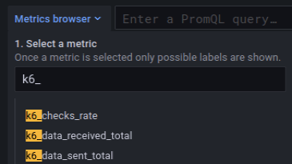
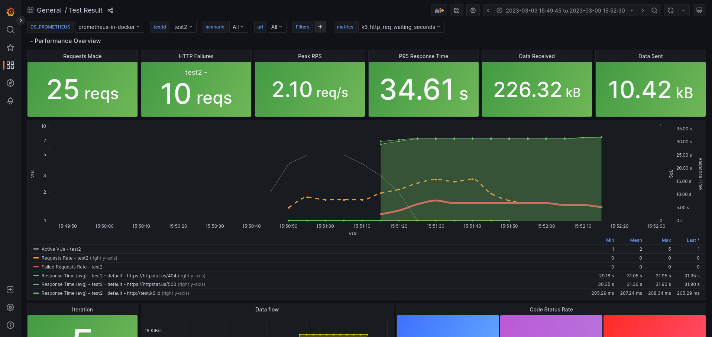

<ExperimentalBlockquote />

<Blockquote mod="note" title="">

If you want to export cloud results to remote write,
refer to [Cloud to Prometheus RW](/cloud/integrations/prometheus-remote-write/).

</Blockquote>

Prometheus remote write is a protocol that makes it possible to reliably propagate data in real-time from a sender to a receiver.
It has a defined [specification](https://docs.google.com/document/d/1LPhVRSFkGNSuU1fBd81ulhsCPR4hkSZyyBj1SZ8fWOM/edit)
and multiple implementations.
For example, you can store the metrics in [Prometheus](https://prometheus.io/docs/prometheus/latest/feature_flags/#remote-write-receiver).
For other implementations, check the [Prometheus Integrations](https://prometheus.io/docs/operating/integrations) guide.

With the Prometheus remote write output, k6 can send test-result metrics to a Prometheus remote write endpoint.
The output during the `k6 run` execution gets all the generated data points for the [built-in and custom metrics](/using-k6/metrics/).
It then generates the equivalent Prometheus remote write time series.


## Metrics mapping

All k6 metric types are converted into an equivalent Prometheus remote write type:

| k6      | Prometheus                | Name label           |
|---------|---------------------------|----------------------|
| Counter | Counter                   | `k6_*_total`         |
| Gauge   | Gauge                     | `k6_*_<unit-suffix>` |
| Rate    | Gauge                     | `k6_*_rate`          |
| Trend   | [Counter and Gauges (default)](#counter-and-gauges) or [Native Histogram](#prometheus-native-histogram) | `k6_*_<unit-suffix>` |

The output maps the metrics into time series with Name labels.
As much as possible, k6 respects the [naming best practices](https://prometheus.io/docs/practices/naming) that the Prometheus project defines:

* All time series are prefixed with the `k6_` namespace.
* All time series are suffixed with the base unit of the sample value (if k6 knows what the base unit is).
* Trends and rates have the relative suffixes, to make them more discoverable.

## Trend metric conversions

This output provides two distinct mechanisms to send [Trend metrics](/using-k6/metrics/) to Prometheus:

1. [Counter and Gauge metrics](#counter-and-gauges) (default)
2. [Prometheus Native histogram](#prometheus-native-histogram) 

Both options provide efficient storage of test results while providing high-precision queries.

Note that k6 aggregates trend metric data before sending it to Prometheus in both options. The reasons for aggregating data are:

- Prometheus stores data in a millisecond precision (`ms`), but k6 metrics collect data points with higher accuracy, nanosecond (`ns`).
- A load test could generate vast amounts of data points. High-precision raw data could quickly become expensive and complex to scale and is unnecessary when analyzing performance trends.

### Counter and Gauges

By default, Prometheus supports [Counter and Gauge Metric types](https://prometheus.io/docs/concepts/metric_types/). Therefore, this option is the default of this output and converts all the k6 `Trend` metrics to Counter and Gauges Prometheus metrics. 

You can configure how to convert all the k6 trend metrics with the [`K6_PROMETHEUS_RW_TREND_STATS` option](#options) that accepts a comma-separated list of stats functions: `count`, `sum`, `min`, `max`, `avg`, `med`, `p(x)`.


Given the list of stats functions, k6 converts all trend metrics to the respective math functions as Prometheus metrics.


For example, `K6_PROMETHEUS_RW_TREND_STATS=p(90),p(95),max` transforms each trend metric into three Prometheus metrics as follows:

- `k6_*_p90`
- `k6_*_p95`
- `k6_*_max`

This option provides a configurable solution to represent `Trend` metrics in Prometheus but has the following drawbacks:
- Convert a k6 `Trend` metric to several Prometheus metrics.
- It is impossible to aggregate some gauge values (especially percentiles).
- It uses a memory-expensive k6 data structure.

### Prometheus Native histogram


To resolve the previous drawbacks, you can convert k6 trend metrics to high-fidelity histograms using [Prometheus Native Histogram](https://prometheus.io/docs/concepts/metric_types/#histogram). Each k6 trend metric maps to its respective Prometheus histogram metric: `k6_*`.


<Blockquote mod="" title="">

To learn the benefits and outcomes of using Histograms, watch [High-resolution Histograms in the Prometheus TSDB](https://www.youtube.com/watch?v=F72Tk8iaWeA).

</Blockquote>

Note that Native Histogram is an experimental feature released in Prometheus v2.40.0, and other remote write implementations might not support it yet. In the future, when Prometheus makes this feature stable, k6 will consider using it as the default conversion method for Trend metrics.

The additional settings to use Native Histogram types are:

1. Enable the feature flag [--enable-feature=native-histograms](https://prometheus.io/docs/prometheus/latest/feature_flags/#native-histograms) in Prometheus.
2. Run the k6 test enabling the `K6_PROMETHEUS_RW_TREND_AS_NATIVE_HISTOGRAM=true` environment variable.


## Send test metrics to a remote write endpoint

To use remote write in Prometheus 2.x:

- Enable the feature flag [--web.enable-remote-write-receiver](https://prometheus.io/docs/prometheus/latest/feature_flags/#remote-write-receiver). For remote write storage options, refer to the [Prometheus docs](https://prometheus.io/docs/prometheus/latest/configuration/configuration/#remote_write).

- Optionally, enable the feature flag [--enable-feature=native-histograms](https://prometheus.io/docs/prometheus/latest/feature_flags/#native-histograms) in Prometheus 2.40.0 or higher to use [Prometheus Native Histogram](#prometheus-native-histogram).


To send k6 metrics to a remote write endpoint:
1. Set up a running remote write endpoint with an endpoint that k6 can reach.
2. Run your k6 script, using the `--out` flag with `experimental-prometheus-rw` as the argument:

  <CodeGroup labels={["Trend stats", "Native Histogram"]}>

  ```bash
  k6 run -o experimental-prometheus-rw script.js
  ```

  ```bash
  K6_PROMETHEUS_RW_TREND_AS_NATIVE_HISTOGRAM=true k6 run -o experimental-prometheus-rw script.js
  ```

  </CodeGroup>

    If the remote write endpoint requires authentication, the output supports the HTTP Basic authentication and it can be used with the following command:

  <CodeGroup labels={["Trend stats", "Native Histogram"]}>

  ```bash
    K6_PROMETHEUS_RW_USERNAME=foo \
    K6_PROMETHEUS_RW_PASSWORD=bar \
    ./k6 run script.js -o experimental-prometheus-rw
  ```

  ```bash
    K6_PROMETHEUS_RW_TREND_AS_NATIVE_HISTOGRAM=true \
    K6_PROMETHEUS_RW_USERNAME=foo \
    K6_PROMETHEUS_RW_PASSWORD=bar \
    ./k6 run script.js -o experimental-prometheus-rw
  ```

  </CodeGroup>

 
    All the time series have a [`k6_` prefix](#metrics-mapping).
    In the Metric Explorer UI in Grafana, it looks something  like this:

    


The [`xk6-output-prometheus-remote` extension](https://github.com/grafana/xk6-output-prometheus-remote) repository has some docker compose examples. Feel free to request more authentication methods or provide your experience in the [issue tracker](https://github.com/grafana/xk6-output-prometheus-remote/issues).

## Options

k6 has special options for remote write output.

| Name | Type |  Description |
| ---- | ---- |  ----------- |
| `K6_PROMETHEUS_RW_SERVER_URL` | `string`  | URL of the Prometheus remote write implementation's endpoint. Default is ``http://localhost:9090/api/v1/write`` |
| `K6_PROMETHEUS_RW_HEADERS_<here-the-header-key>` | list of `string` | Additional headers to include in the HTTP requests. `K6_PROMETHEUS_RW_HEADERS_X-MY-HEADER=foo`|
| `K6_PROMETHEUS_RW_USERNAME` | `string` | User for the HTTP Basic authentication at the Prometheus remote write endpoint. |
| `K6_PROMETHEUS_RW_PASSWORD` | `string` | Password for the HTTP Basic authentication at the Prometheus remote write endpoint. |
| `K6_PROMETHEUS_RW_PUSH_INTERVAL` | `string` | Interval of the metrics' aggregation and upload to the endpoint. Default is `5s` |
| `K6_PROMETHEUS_RW_TREND_AS_NATIVE_HISTOGRAM` | `boolean` | If true, it maps the all defined trend metrics as [Native Histograms](#prometheus-native-histogram). Default is `false`. |
| `K6_PROMETHEUS_RW_TREND_STATS` | list of `string` |  If Native Histogram is not enabled then it defines the stats functions to map for the all defined trend metrics. It's a comma-separated list of stats functions to include (e.g. `p(90),avg,sum`). Check the trend section to know the entire set of the supported stats. Default is `p(99)` |
| `K6_PROMETHEUS_RW_INSECURE_SKIP_TLS_VERIFY` | `boolean` | If true, the HTTP client skips TLS verification on the endpoint. Default is `false`. |
| `K6_PROMETHEUS_RW_STALE_MARKERS` | `boolean` | If true, the output at the end of the test marks all the seen time series as stale. Default is `false`. |

### Stale trend metrics

This k6 output can mark the time series at the end of the test as stale.
To enable the stale marker option, set the `K6_PROMETHEUS_RW_STALE_MARKERS` environment variable to `true`.

By default, the metrics are active for 5 minutes after the last flushed sample.
They are automatically marked as stale after.
For details about staleness, refer to the [Prometheus docs](https://prometheus.io/docs/prometheus/latest/querying/basics/#staleness).

## Time series visualization 

To visualize time series, you can use Grafana via explorer, importing the pre-built [official dashboard](https://grafana.com/grafana/dashboards/18030-official-k6-test-result/) or create a custom version. You can visualize them from [Grafana Cloud](/results-output/real-time/grafana-cloud-prometheus) integration or in a self-hosted instance.

If you want a local option, the [xk6 extension](https://github.com/grafana/xk6-output-prometheus-remote) repository includes a [docker-compose setup](https://github.com/grafana/xk6-output-prometheus-remote/blob/main/docker-compose.yml) with two pre-built Grafana dashboards.
You can use these dashboards to visualize the generated time series with Prometheus configured as a data source: 
- visualize the results of a test run
- list test runs



### Docker compose example 

Clone the repository to get started and follow these steps for using the [docker-compose.yml](https://github.com/grafana/xk6-output-prometheus-remote/blob/main/docker-compose.yml) file that starts _Prometheus_ and _Grafana_:

<Blockquote mod="note" title="">

The `docker-compose.yml` file has the Native Histogram mapping set as enabled.

</Blockquote>

1. Start the docker compose environment.

<CodeGroup labels={[""]}>

```shell
docker compose up -d prometheus grafana
```

</CodeGroup>

<CodeGroup labels={[""]}>

```shell
# Output
Creating xk6-output-prometheus-remote_grafana_1     ... done
Creating xk6-output-prometheus-remote_prometheus_1  ... done
```

</CodeGroup>

2. Use the k6 Docker image to run the k6 script and send metrics to the Prometheus container started on the previous step. You must set the `testid` tag as a [wide test tag](https://k6.io/docs/using-k6/tags-and-groups/#test-wide-tags) with a unique identifier to segment the metrics into discrete test runs for the pre-built Grafana dashboards.

<CodeGroup labels={[""]}>

```shell
K6_PROMETHEUS_RW_TREND_AS_NATIVE_HISTOGRAM=true \
  k6 run -o experimental-prometheus-rw --tag testid=<SET-HERE-A-UNIQUE-ID> ./samples/http_get.js
```

</CodeGroup>

`testid` can be any unique string that let you clearly identify the test. For convenience, a [docker-run.sh](https://github.com/grafana/xk6-output-prometheus-remote/blob/main/docker-run.sh) file is available with a time-based `testid`, and it can be simply:

<CodeGroup labels={[""]}>

```shell
docker-run.sh ./samples/http_get.js
```

</CodeGroup>

3. Visit [http://localhost:3000](http://localhost:3000) to view results in Grafana.
