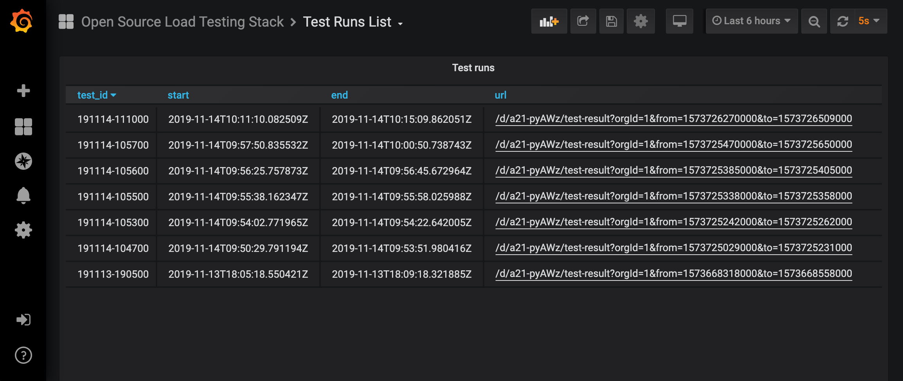

Using the [TimescaleDB k6 extension](https://github.com/grafana/xk6-output-timescaledb), you can store k6 metrics in [TimescaleDB](https://www.timescale.com/) and analyze your performance results with SQL and dashboards. The extension repository includes two Grafana dashboards.


## Build the k6 version

<InstallationInstructions extensionUrl="github.com/grafana/xk6-output-timescaledb"/>

## Run the test

Check that the TimescaleDB instance is running. Copy the Postgres connection string of the database, which will store the k6 metrics. 

Use the previous k6 binary and run the test passing the Postgres connection string to the [output option](/using-k6/k6-options/reference#results-output) as follows:


```bash
k6 run script.js -o timescaledb=postgresql://<postgresql_user_name>:<password>@<ip>:<port>/<database>
```

k6 runs the test script and sends the metrics in real-time to the TimescaleDB instance. You can now connect to TimescaleDB and query the [k6 metrics](/using-k6/metrics/).

```bash
k6=# SELECT metric,AVG (value) FROM samples GROUP BY metric;
```

### Options

Here is the full list of options that can be configured and passed to the extension:

| Name                                     | Value                                                                                                       |
| ---------------------------------------- | ----------------------------------------------------------------------------------------------------------- |
| `K6_TIMESCALEDB_PUSH_INTERVAL`                     | Define how often metrics are sent to TimescaleDB. The default value is 1s (1 second).  |

## Grafana Dashboards

The extension repository includes a [docker-compose setup](https://github.com/grafana/xk6-output-timescaledb/#docker-compose) with two pre-built dashboards to: 
- list test runs
- visualize the results of a test run





## Read more

- [Store k6 metrics in TimescaleDB and visualize with Grafana](https://k6.io/blog/store-k6-metrics-in-timescaledb-and-visualize-with-grafana/)
