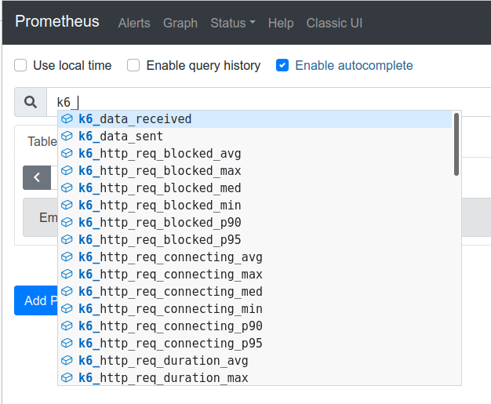

k6 supports Prometheus Remote Write via [xk6 extension](https://github.com/grafana/xk6-output-prometheus-remote) which allows sending test results to the endpoints supporting remote write [protocol](https://docs.google.com/document/d/1LPhVRSFkGNSuU1fBd81ulhsCPR4hkSZyyBj1SZ8fWOM/edit#). One option with this support is Prometheus itself; others can be found [here](https://prometheus.io/docs/operating/integrations/).

## HOWTO

First, build a new k6 binary with the PRW extension, using [xk6 tool](https://k6.io/blog/extending-k6-with-xk6):

<CodeGroup labels={["CLI"]}>

```bash
xk6 build --with github.com/grafana/xk6-output-prometheus-remote@latest
```

</CodeGroup>

Then run the test with the new binary as follows:

<CodeGroup labels={["CLI"]}>

```bash
K6_PROMETHEUS_REMOTE_URL=http://localhost:9090/api/v1/write \
    ./k6 run script.js -o output-prometheus-remote
```

</CodeGroup>

All metrics sent by the extension get the prefix `k6_` attached to their names. In case of Prometheus, k6 metrics can be seen in its UI:



If the remote write endpoint requires authentication, the following command can be used:

<CodeGroup labels={["CLI"]}>

```bash
K6_PROMETHEUS_REMOTE_URL=https://localhost:9090/api/v1/write \
    K6_PROMETHEUS_INSECURE_SKIP_TLS_VERIFY=false K6_CA_CERT_FILE=tls.crt \
    K6_PROMETHEUS_USER=foo K6_PROMETHEUS_PASSWORD=bar \
    ./k6 run script.js -o output-prometheus-remote
```

</CodeGroup>

## Supported options

Here is the full list of options that can be configured and passed to the extension:

| Name                                     | Value                                                                                                       |
| ---------------------------------------- | ----------------------------------------------------------------------------------------------------------- |
| `K6_PROMETHEUS_REMOTE_URL`               | Address of the Prometheus Remote Write endpoint. The default value is `http://localhost:9090/api/v1/write`. |
| `K6_PROMETHEUS_USER`                     | User for the basic HTTP authentication at the Prometheus Remote Write endpoint. Optional. |
| `K6_PROMETHEUS_PASSWORD`                 | Password for the basic HTTP authentication at the Prometheus Remote Write endpoint. Optional. |
| `K6_PROMETHEUS_FLUSH_PERIOD`             | Interval of the metrics' aggregation and upload to the endpoint. The default value is `1s`. |
| `K6_PROMETHEUS_MAPPING`                  | Type of mapping that indicates how k6 metric types should be mapped to remote storage metric types. The default value is `prometheus`. Other supported values: `raw`. |
| `K6_PROMETHEUS_INSECURE_SKIP_TLS_VERIFY` | Boolean option whether to skip TLS verification on the endpoint. The default value is `true`. |
| `K6_CA_CERT_FILE`                        | Location of the CA certificate file required by the endpoint. Optional. |
| `K6_KEEP_TAGS`                           | Boolean option whether to send k6 tags as labels for each metric. The default value is `true`. |
| `K6_KEEP_NAME_TAG`                       | Boolean option whether to add `name` k6 tag to labels for each metric. Note: see [HTTP Requests Tags](/using-k6/http-requests#http-request-tags) for explanation on values of `name` tag when HTTP requests are made. The default value is `false`. |
