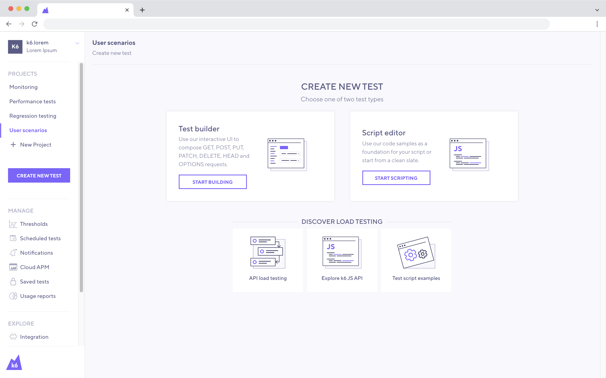
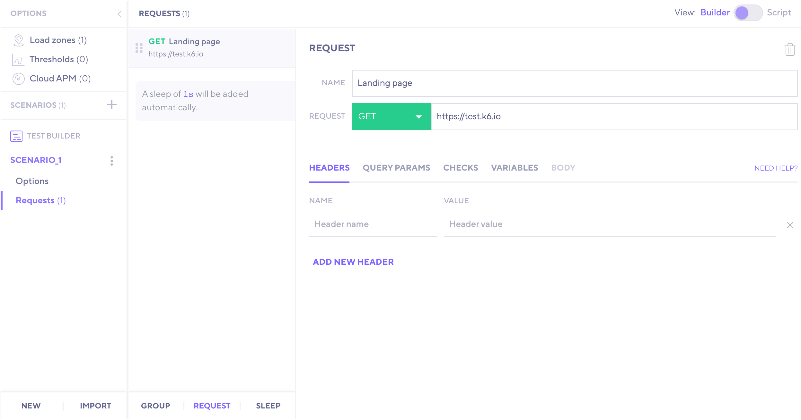
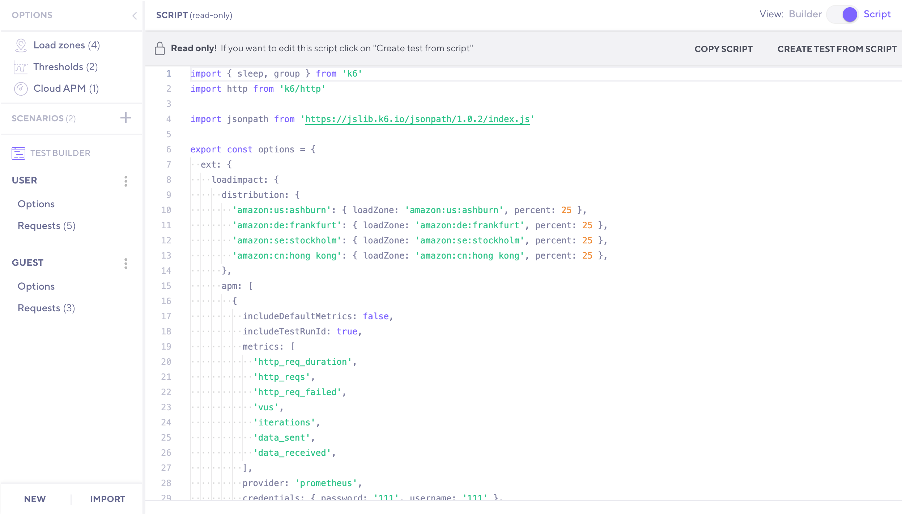

<Blockquote mod="note" title="Requires free k6 Cloud account">

To use the test builder, you need a [k6 Cloud](/cloud). However, it is **free to use**.

</Blockquote>

The k6 Test Builder provides a graphical interface to create a k6 test.

Based on your input, the test builder automatically generates the k6 script for you.
You can copy this script and [run the test from the CLI](/get-started/running-k6).

Though we strongly believe that scriptable, code-based tools will help you get the most out of your performance-testing efforts, a GUI-based tool like the test builder could help you:

- Speed up the test creation.
- Learn the [k6 API](/javascript-api) quickly.
- Collaborate with non-coders to build tests.

## Getting started

1. [Login](https://app.k6.io/account/login) into the k6 Cloud.

2. On the sidebar menu, select the **[Create New Test](https://app.k6.io/tests/new)** button.

3. Select **Test builder**.

  

4. Use the graphical interface to build your test.

## Load zones

Configure the geographical zones that the load test will run from.
* To distribute load equally across all zones select **Even**.
* To set a percentage of load for each chosen zone, select **manual**.

Check out the [list of supported load zones](/cloud/creating-and-running-a-test/cloud-tests-from-the-cli/cloud-execution-reference#load-zones).

## Thresholds

Set pass/fail criteria to specify the performance expectations of the system under test.
You can set thresholds on any result metrics. 

Read the [thresholds documentation](/using-k6/thresholds/).

## Cloud APM

Select where you want to export metrics from a running test in real-time.

Read the [Cloud APM](/cloud/integrations/cloud-apm/).

## Scenarios

Scenarios can schedule VUs and iterations to model diverse traffic patterns. 

You can create multiple scenarios in a test.
For each scenario, configure its options:

- The [scenario executor](/using-k6/scenarios/executors) and its particular configuration.
- The scenario name.
- When the scenario begins its execution. The time offset since the start of the test.
- The scenario [graceful stop](/using-k6/scenarios/concepts/graceful-stop/) option.

Read the [scenarios documentation](/using-k6/scenarios).

## Requests

Configure the requests that each scenario executes.
The test builder lets you:

- Add a request and name it for better description.
- Change the URL/Endpoint and `HTTP` method.
- Specify Headers and Query Parameters.
- Specify a request body (JSON, Text, or File Content).
- Reorganize requests by clicking and dragging.
- Duplicate or delete requests.

Read the [HTTP Requests documentation](/using-k6/http-requests/).

## View k6 script

At any moment, you can toggle the **View** button (top-right corner) to `Script` mode and see the auto-generated k6 script. 

Check out the script to get familiar with the [k6 API](/javascript-api/) or to copy the script and edit it on your IDE of preference.

  
## More features

- Add a [check](/javascript-api/k6/check) on a request response.
- Add [sleep](/javascript-api/k6/sleep) time between requests.
- Add a [group](/javascript-api/k6/group) to the test.
- Import recorded requests using the [browser recorder](/test-authoring/recording-a-session/browser-recorder).
- Import requests included in a [HAR file](<https://en.wikipedia.org/wiki/HAR_(file_format)>).
- Capture a variable when dealing with dynamic data, such as authentication tokens.
- Show relevant examples.
- Run the test on the k6 Cloud.
