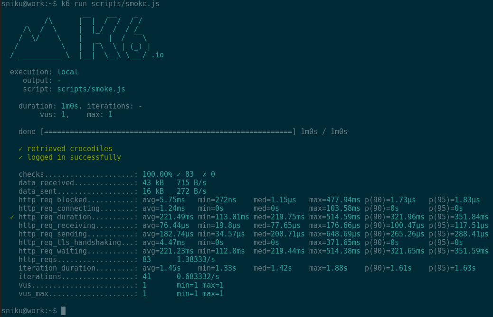

A smoke test is a test configured for minimal load.

Each time you write a new test script, it's a good idea to run a smoke to test first, which helps you:
- Verify that your test script doesn't have errors.
- Verify that your system doesn't throw any errors when under minimal load.

## Smoke testing in k6

The following script is a sample smoke test script to get you started.
You can copy it, change the end points, and start testing.
If you'd like to see more comprehensive script, check out our [example section](/examples).

<CodeGroup labels={["sample-smoke-test.js"]} lineNumbers={[true]} heightTogglers={[true]}>

```javascript
import http from 'k6/http';
import { check, group, sleep, fail } from 'k6';

export const options = {
  vus: 1, // 1 user looping for 1 minute
  duration: '1m',

  thresholds: {
    http_req_duration: ['p(99)<1500'], // 99% of requests must complete below 1.5s
  },
};

const BASE_URL = 'https://test-api.k6.io';
const USERNAME = 'TestUser';
const PASSWORD = 'SuperCroc2020';

export default () => {
  const loginRes = http.post(`${BASE_URL}/auth/token/login/`, {
    username: USERNAME,
    password: PASSWORD,
  });

  check(loginRes, {
    'logged in successfully': (resp) => resp.json('access') !== '',
  });

  const authHeaders = {
    headers: {
      Authorization: `Bearer ${loginRes.json('access')}`,
    },
  };

  const myObjects = http.get(`${BASE_URL}/my/crocodiles/`, authHeaders).json();
  check(myObjects, { 'retrieved crocodiles': (obj) => obj.length > 0 });

  sleep(1);
};
```

</CodeGroup>

The VU chart of a smoke test should look similar to this.
You want to use only 1 or 2 VUs.


If your smoke test produces any errors,
you should either correct the script or fix your environment before you continue.

The k6 output should look similar to this:


Once your smoke test shows zero errors, you can go to the next step and execute a [load test](/test-types/load-testing) to assess the performance of your system.
