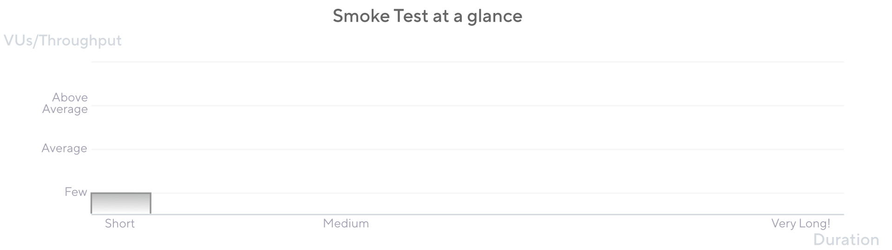

Smoke tests have a minimal load.
Run them to verify that the script works well, the system functions under minimal load, and to gather some minimum performance values.

This test type consists of running tests with only one or a few VUs. Keep the number of 5 VUs. Exceeding 5 could turn the test into a mini-load test.
Similarly, each of these VUs does not need to iterate many times. 3 to 10 iterations should be enough (or a iteration duration with a short period).



In some testing conversation, smoke tests are also called shakeout tests.

## When to run a Smoke test

Teams should run Smoke tests whenever a test script is created or updated. In the same way Smoke testing should be done every time new software functions or updates come by.

It's a good practice to run a Smoke test as a first steps, with 

- Verify that your test script doesn't have errors.
- Verify that your system doesn't throw any errors (performance or system related) when under minimal load.
- Gather baseline performance metrics of your system’s response under minimal load.
- With simple logic, serve as a synthetic test to monitor the performance and availability of productive environments.

## Considerations 

When you prepare a smoke test, consider the following:


- **Each time you create or update a script, run a smoke test**

  Because smoke tests verify test scripts, try to run one every time you create or update a script. Avoid running other test types with untest scripts.

- **Keep throughput small and duration short**
  
  Configure your test script to be executed by a small number of VUs (from 2 to 5) with few iterations (3 to 10) or brief durations (30 to 60 seconds).

## Smoke testing in k6

<CodeGroup labels={["smoke.js"]} lineNumbers={[]} showCopyButton={[true]}>

```javascript
import http from 'k6/http';
import { check, sleep} from 'k6';

export const options = {
  vus: 3, // Key for Smoke test. Keep it at 2, 3, max 5 VUs
  duration: '1m', // This can be shorter or just a few iterations
};

const BASE_URL = 'https://test-api.k6.io';

export default () => {
  const urlRes = http.req(`${BASE_URL}`);
  sleep(1);
  // MORE STEPS
  // Here you can have more steps or complex script
  // Step1
  // Step2
  // etc.
};

```

</CodeGroup>


The following script is an example Smoke test script sample. You can copy it, change the endpoints, and start testing.  Refer to [Examples](/examples) for more comprehensive or complex test steps in a script.
The VU chart of a smoke test should look similar to this.  Again, a smoke test should use only 2 or 3 VUs and run for only a brief period.


## Results analysis

The Smoke test initially validates that your script runs without errors. If any script-related errors appear, correct the script before trying any more extensive tests.

On the other hand, if you notice poor performance with these low VU numbers, report it, fix your environment, and try again with a Smoke test before any further tests.

Once your Smoke test shows zero errors and the performance results seem acceptable, you can proceed to other test types.


