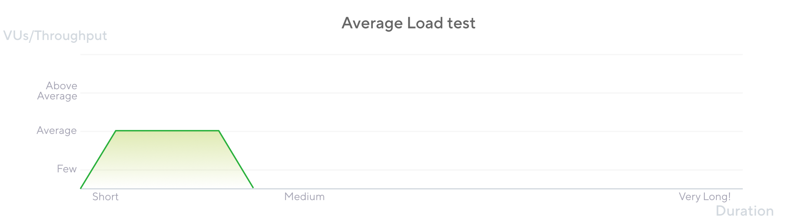

An average load test assesses how the system performs under typical load. Typical load might be a regular day in production or an average moment.

Since “Load test” might refer to all types of tests that simulate traffic, this guide uses the name “Average load test” to avoid confusing.

In some testing conversation, this test also might be called a day-in-life test or volume test.

There are several other names that you can find asides from just calling this type a Load test, where some call it a Stress test, Day-in-life test, Volume testing, etc.

Average-Load tests try to simulate the number of concurrent users and requests per second that reflect average behaviors in the production environment.This type of test typically increases the throughput or VUs gradually and keeps that average amount of load for some time. Depending on the system's characteristics, the test may stop suddenly or have a short ramp-down period.

## When to run an Average-Load test

Average-Load testing helps to understand if your system meets performance goals on a typical day (commonplace load). That means when an average number of users access the application at the same time, doing normal/average work.

You should run a Load Test to:

* Assess the performance of your system under a typical load.
* Identify early degradation signs during the ramp-up or full load periods.
* Assure that the system still meets the performance standards after system changes (code and infrastructure.)

## Considerations

* To design this test type, you must know your system's specific number of users and the typical throughput per process.
* To know user and throughput amounts, teams can find them through APMs or analytic tools that provide  information from the production environment. If none of these are accessible, the business must provide these estimations.
* Once you define the number of VUs and throughput needed, we recommend gradually increasing the load (ramp-up period.) This period usually lasts 5, 10, 15, or 30 minutes. A ramp-up period is essential:
    * It gives your system time to warm up or auto-scale to handle the traffic.
    * It lets you compare response times between the low-load and average-load stages.
    * If you run tests using our cloud service, a ramp up lets the automated performance alerts understand the expected behavior of your system.
* After the ramp up, maintain the load of the test for a period longer than the ramp-up—somewhere between 30 and 60 minutes. 
* Some tests may need a ramp-down period when virtual users gradually stop working. The ramp down usually lasts as long as the ramp up, or a bit less.

### Average-Load testing in k6

The critical element of an Average-Load test is to simulate the average amount of activity on a typical day in production. The pattern follows this sequence:

1. Increase the script's activity until it reaches the desired number of users and throughput. 
1. Maintain that load for a while
1. Depending on the test case, stop the test or let it ramp down gradually.

The essential instructions are in the options section.

This script logic has only one request (to open a web page). . Your test behavior likely has more steps. If you would like to see more complex tests that use groups, checks, thresholds, and helper functions, refer to examples.

The VU/throughput chart of a typical load test looks similar to this:

Note that the number of users or throughput starts at 0, gradually ramps up to the desired value, and stays there for the indicated period. Then load ramps down for  a short period.

<Blockquote mod="note" title="start small">

If this is your first time running load tests, we recommend starting small or configuring the ramp-up to be slow. Your application and infrastructure might not be as rock solid as you think. We've had thousands of users run load tests that quickly crash their applications (or staging environments).

</Blockquote>

## Results analysis

An initial outcome for the Average-Load test appears during the ramp-up period to find whether the response time degrades as the load and activity increases. Some systems might even fail during the ramp-up period, degrading the system's performance or failing it.

The test validates if the system's performance and resource consumption stay stable during the period of full load, as some systems may display erratic behavior in this period.

Once you know your system performs well and survives a typical load, you may need to push it further to determine how it behaves at above-average conditions. Some of these above-average conditions are known as Stress tests.

