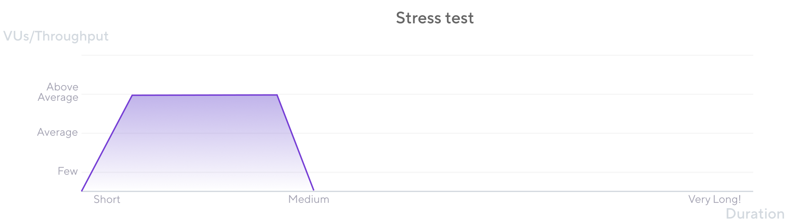
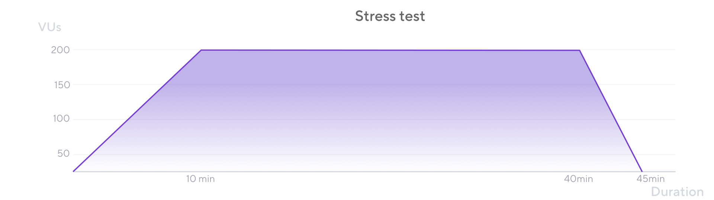

Whereas Average-Load tests assess  performance under standard conditions, stress testing assesses the system's performance, availability, and stability under  loads that are heavier than usual.
In some testing conversation, stress tests might also be called Rush-hour, Surge, or Scale tests.

The load pattern of a stress test resembles that of an average load test. The main difference is higher load.To account for higher load, the ramp-up period takes longer in proportion to how higher the load must increase. Similarly,  after the test reaches the desired load, it might last for slightly longer  than it would in  the Average-Load test.

## When to perform a Stress test

The purpose of this test is to verify the stability and reliability of the system under extreme conditions. Systems may receive higher than usual workloads on unusual moments such as process deadlines, paydays, rush hours, end of work on Friday, and many eventualities that might combine to create high-load events.

## Considerations

* The load for this test is higher than what the system experiences onaverage. Although some like to increase load by 50% or double it by default, this higher amount is not a fixed percentage of the average.

    The load simulated in a Stress test depends on the stressful situations that the system may be subject to. Sometimes this may be just a few percentage points above that average. Other times, it can be 50 to 100% higher, as mentioned above. Even some stressful situations can be twice, triple, or even orders of magnitude higher.

    Define the amount of above-averate load according to the risk load patterns that the system may receive.

* If you find or define thresholds after running the Average-Load test, do not expect them to apply here. This test aims to determine how much the performance degrades with the extra load and if the system survives it. 
* Only run a Stress test after running an Average-Load test. Identifying performance issues under Average-Load tests before trying anything more challenging is essential.
* It is recommended to use the same script as the Average-Load test and modify the parameters to have higher load/VUs.

## Stress testing in k6

The Stress test is almost the same as the Average-Load test, but it increases the script's activity further in a slower ramp-up until it reaches an above-average number of users or throughput. Then it keeps that load for a while. And finally, in the same way, depending on the test case, stops  or ramps down gradually.

For more complex tests, refer to [Examples](https://k6.io/docs/examples).

The VU or throughput chart of a Stress test looks similar to this:

Note that in the same way as the Average-Load test, the Stress test starts at 0 and increases beyond the point tested in the Average-Load type. The ramp-up and ramp-down periods are longer to allow a more realistic response.

<Blockquote mod="note" title="">

Run stress tests only after Smoke and Average-Load tests. Running this test type would be wasteful, and hard to pinpoint problems if they appear at low volumes or at loads under the average utilization.

</Blockquote>

## Results analysis

Like the Average-Load test, an initial outcome for the Stress test shows up during the ramp-up period to identify response time degradation as the load/activity increases further than the average utilization. Commonly, the performance degrades, and even the system's stability crashes as we push the system further than the Average-Load test.

During the full load period, verification is vital if the system's performance and resource consumption stays stable with a higher load.

Now that you know that your system can handle outstanding load events, the teams generally check if the system performs well over extended periods.

That test type is known as a Soak test.

