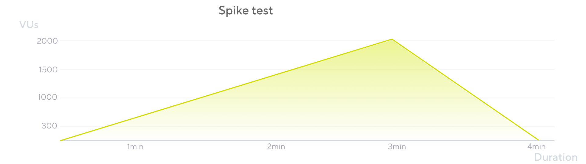

The Spike test verifies whether the system survives and performs under sudden and massive rushes of utilization. It is not a common practice. 

This test type applies when the system is involved in events when several users are suddenly allowed or summoned into a given functionality. These events are such as ticket sales (ComicCon, Taylor Swift), product launches (PS5, fashion apparel), sale announcements (Super Bowl ads), process deadlines (tax declaration), seasonal sales (Black Friday, Christmas, St.Valentine), etc.

Spike testing has a very short or non-existent time for the ramp-up, increasing to extremely high loads. Usually, it has no plateau period or is very brief, as real users generally do not stick around doing extra steps in these situations. In the same way, the ramp-down is very fast or non-existent, letting the process iterate only once.

This test usually includes very different processes than the previous test types, as these processes often aren't part of an average day in production. A recommendation is to automate the processes with heavy demand during the event. It may also require adding, removing, or modifying processes on the script that were not in the Average-Load tests.

Occasionally, teams should revamp the system to allow or prioritize resources for the high-demand processes during the event.

## When to perform a Spike test

Spike testing is the least frequent test type. This test must be executed when the system expects to receive a sudden rush of activity, which is not a common behavior on most platforms.
 
This test type applies when the system is involved in events when several users are suddenly allowed or summoned into a given functionality. These events are such as ticket sales (ComicCon, Taylor Swift), product launches (PS5, fashion apparel), sale announcements (Super Bowl ads), process deadlines (tax declaration), seasonal sales(BlackFriday, Christmas, St.Valentine), etc.

When the system expects this type of behavior, the Spike test helps identify how the system will behave and if it will survive the sudden rush of load. The load is considerably above the average and frequently focuses on a different set of processes than the other test types.

## Considerations

* Focus on key processes in this test type, generally the processes triggered are different from the other test types
* Often the test won’tfinish, as errors are common under these scenarios
* When your system is at risk of these events, the team must execute a Spike test and tune the system several times
* Backend monitoring is a must for successful outcomes of this test

## Spike testing in k6

The key differentiators of the Spike test are the simulation of  sudden and very high loads. It lacks a plateau (full load) duration or is usually brief. 

Sometimes, the test may require keeping the load plateau for some time, but generally, it is short. A ramp-down can also be quick or unnecessary as the goal is to suddenly increase the system's load.

The test increases the load or VUs quickly, reaching a high load. The ramp-down period follows as soon as the test reaches the maximum load, returning to 0 quickly.

A spike test gets its name from the shape of its load when represented graphically.

The horizontal spread of the graph may make it hard to appreciate the sudden increase of load to a high number of VUs, but it is an abrupt increase. Similar to the Breakpoint test, this is an aggressive test that pushes the system to its limits, similar to a DDoS attack.

## Results analysis

Some performance metrics to assess in spike tests include pod speeds, recovery times after the load rush, time to return to normal, or the behavior on crucial system processes during the overload.

Finding how the system responds ( if it survives) to the sudden rush helps to optimize it to guarantee that it can perform during a real event. Often the load is so high that the whole system may have to be optimized to deal with the key processes. In these cases,repeat the test until the system confidence is high.

