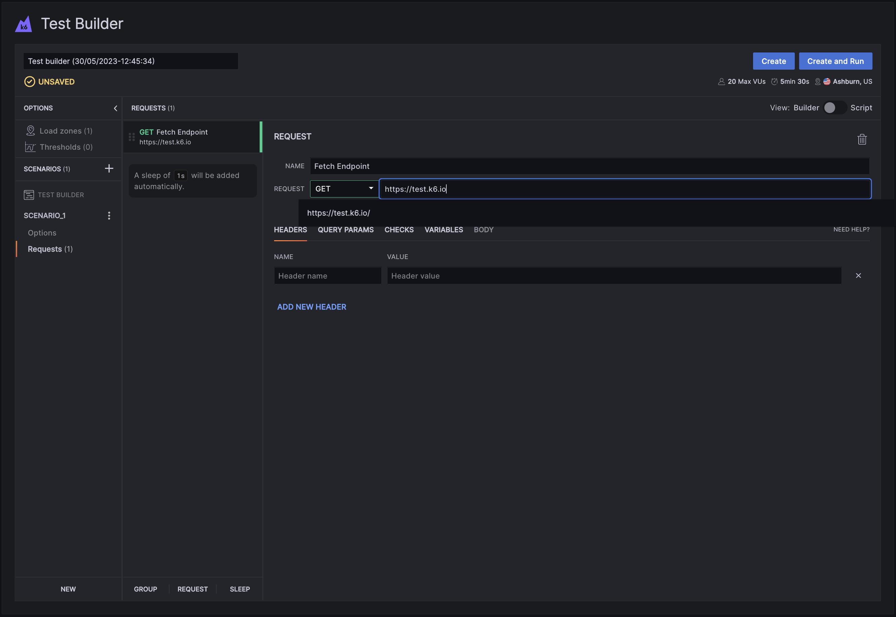

The k6 Test Builder provides a graphical interface to generate a k6 test script based on your input. Then, you can copy the test script and [run the test from the CLI](/get-started/running-k6).

Though we strongly believe that scriptable, code-based tools will help you get the most out of your performance-testing efforts, a GUI-based tool like the test builder could help you:

- Speed up the test creation.
- Learn the [k6 API](/javascript-api) quickly.
- Collaborate with non-coders to build tests.

The k6 Test Builder is **free to use** and is available in:
- [Grafana Cloud k6](https://grafana.com/docs/grafana-cloud/k6/author-run/test-builder/)
- [k6 Cloud](/cloud) (only available for existing customers)

