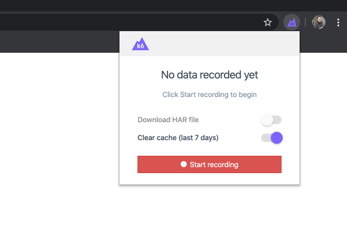
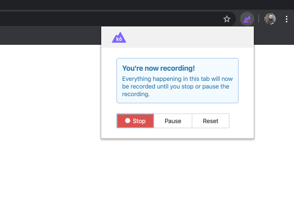
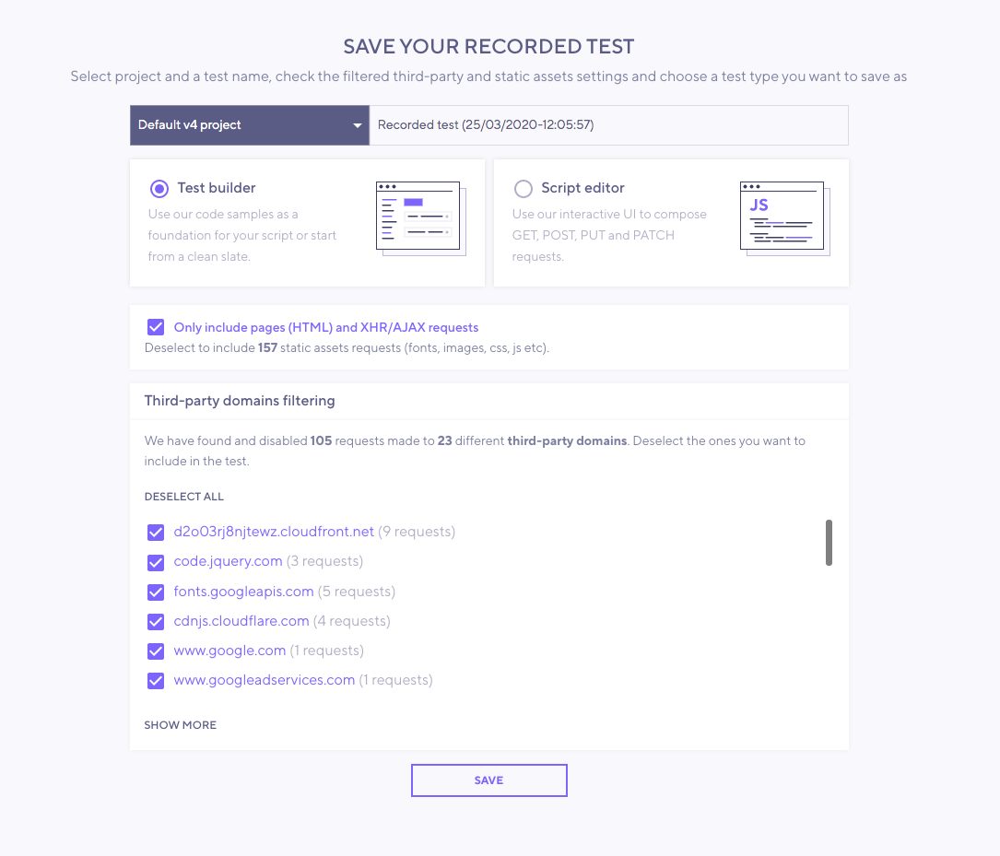

The browser recorder lets you generate a k6 script based on a web session.
It's available as an extension for [Chrome](https://chrome.google.com/webstore/detail/k6-browser-recorder/phjdhndljphphehjpgbmpocddnnmdbda?hl=en) and [Firefox](https://addons.mozilla.org/en-US/firefox/addon/k6-browser-recorder/).

## k6 Cloud integration

The browser recorder integrates with [k6 Cloud](/cloud).
When you finish recording the session, the extension uploads the auto-generated k6 test into the k6 Cloud account.

> **Note**: **the recorder is free to use**.
>
>You do not need an active k6 Cloud subscription.
> 
> Any user can copy the script from the [script editor](/cloud/creating-and-running-a-test/script-editor) to edit or run the test locally using the `k6 run` command. We also plan to make this feature work without a k6 Cloud account.

The recorder captures every HTTP(s) request loaded into the browser as you click.
This includes including ads, images, documents, etc.

## How to record

1. Install the [Chrome](https://chrome.google.com/webstore/detail/k6-browser-recorder/phjdhndljphphehjpgbmpocddnnmdbda?hl=en) or [Firefox](https://addons.mozilla.org/en-US/firefox/addon/k6-browser-recorder/) extension.
1. Open the extension by clicking the k6 logo.
1. Select **Start recording** to begin recording the current browser tab. 

1. When done, select **Stop recording**. You'll be taken to the app to review the recorded test script.
   
1. Save the recorded script in any of your projects.
  To include some of the requests in the _third party list_,  deselect the ones you want to include.
  
1. Edit your script as necessary. Depending on the type of testing, you might need to change different aspects of the script. 
   Typical changes are for [load options](/using-k6/options) and to handle [correlation and dynamic data](/examples/correlation-and-dynamic-data).
1. Run the test locally or in k6 Cloud.

  - To run a test from the k6 Cloud UI, select **Run** to start the test.
  - To use the k6 CLI to run a local or cloud test, copy the generated script to your local text editor and execute the `k6 run` or `k6 cloud` command to start the test. 

For more about running k6, refer to the [Running k6 guide](/get-started/running-k6).

## Trouble? Try the HAR converter

Some users have reported `413` errors when they try to upload long recordings.
In these cases, the easiest fix is to use the [HAR converter](/test-authoring/recording-a-session/har-converter/), which creates a k6 script from the HTTP requests included in a HAR file (it also powers the browser recorder).

Besides avoiding the `413` error,
the HAR converter catches some edge-case behavior that the browser recorder won't.
For example, the browser extension doesn't record other tabs or pop-up windows.

If you need to capture this information or are having a problem recording a request, try the HAR converter.
If the error persists with the HAR converter, please provide detailed information about the problem [in a new issue](https://github.com/k6io/har-to-k6/issues).
