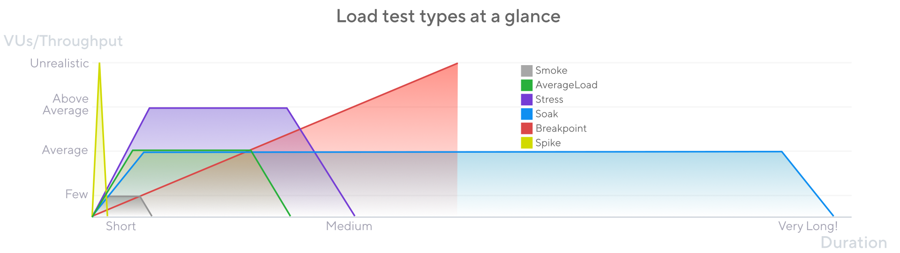

Many things can go wrong when a system is under load.
The system must run numerous operations simultaneously and respond to different requests from a variable number of users.
To prepare for these performance risks, teams use load testing.

But a good load-testing strategy requires more than just executing a single script.
Different patterns of traffic create different risk profiles for the application.
For comprehensive preparation, teams must test the system against different _test types_.

## Different tests for different goals

Start with smoke tests, then progress to higher loads and longer durations.

The main types are as follows. Each type has its own article outlining its essential concepts.

- [**Smoke tests**](../smoke-testing) validate that your script works and that the system performs adequately under minimal load.

- [**Average-load test**](../load-testing) assess how your system performs under expected normal conditions.

- [**Stress tests**](../stress-testing) assess how a system performs at its limits when load exceeds the expected average. 

- [**Soak tests**](../soak-testing) assess the reliability and performance of your system over extended periods.

- [**Spike tests**](../spike-testing) validate the behavior and survival of your system in cases of sudden, short, and massive increases in activity.

- [**Breakpoint tests**](../breakpoint-testing) gradually increase load to identify the capacity limits of the system.

<Blockquote mod="note" title="">

In k6 scripts, configure your load in the `options` object using [Scenarios](/using-k6/scenarios).
Because options are defined in [`init` context](/using-k6/test-lifecycle), the configuration is separate from the logic of VUs.

</Blockquote>

## Test-type cheat sheet 

The following table provides some broad comparisons.

| Type       | VUs/Throughput        | Duration                   | When?                                                                                                            |
|------------|-----------------------|----------------------------|------------------------------------------------------------------------------------------------------------------|
| Smoke      | Low                   | Quick (seconds or minutes) | Every time new code or a change is done. It checks scripts, baseline system metrics, and deviations from changes |
| Load       | Average production    | Mid (15-60 mins)           | Often to check system maintains performance with average use                                                     |
| Stress     | High (above average)  | Mid (15-60 mins)           | When system may receive above-average loads to check how it manages                                              |
| Soak       | Average               | Long (hours)               | After changes to check system under prolonged continuous use                                                     |
| Spike      | Very high             | Quick (secs to mins)       | Rarely, when system risks sudden rush                                                                            |
| Breakpoint | Increases until break | As long as necessary       | A few times to find the upper limits of the system                                                               |

## General recommendations

When you write and run different test types in k6, consider the following.

### Start with a smoke test

Start with a [smoke test](../smoke-testing).
Before beginning larger tests, validate that your scripts work as expected and that your system performs well with a few users.

After you know that the script works and the system responds correctly to minimal load,
you can move on to average-load tests.
From there, you can progress to more complex load patterns.

### The specifics depend on your use case

Systems have different architectures and different user bases. As a result, the correct load testing strategy is highly dependent on the risk profile for your organization. Avoid thinking in absolutes.

For example, k6 can model load by either number of VUs or by number of iterations per second ([open vs. closed](https://k6.io/docs/using-k6/scenarios/concepts/open-vs-closed/)).
When you design your test, consider which pattern makes sense for the type. 

What's more, **no single test type eliminates all risk.** 
To assess different failure modes of your system, incorporate multiple test types.
The risk profile of your system determines what test types to emphasize:
- Some systems are more at risk of longer use, in which case soaks should be prioritized.
- Others are more at risk of intensive use, in which case stress tests should take precedence.

In any case, **no single test can uncover all issues**.

What's more, the categories themselves are relative to use cases. A stress test for one application is an average-load test for another. Indeed, no consensus even exists about the names of these test types (each of the following topics provides alternative names).

### Aim for simple designs and reproducible results

While the specifics are greatly context-dependent, what's constant is that you want to make results that you can compare and interpret.

Stick to simple load patterns. For all test types, directions is enough: ramp-up, plateau, ramp-down.

Avoid "rollercoaster" series where load increases and decreases multiple times. These will waste resources and make it hard to isolate issues.

