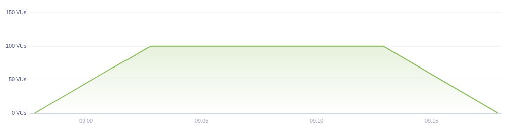

Load Testing is primarily concerned with assessing the current performance of your system in terms
of concurrent users or requests per second.

When you want to understand if your system is meeting the performance goals, this is the type of test you'll run.

> #### What is Load Testing
>
> Load Testing is a type of Performance Testing used to
> determine a system's behavior under both normal and peak conditions.
>
> Load Testing is used to ensure that the application performs satisfactorily
> when many users access it at the same time.

You should run a Load Test to:

1.  Assess the current performance of your system under typical and peak load.
2.  Make sure you continue to meet the performance standards as you make changes to your system (code and infrastructure).

You probably have some understanding about the amount of traffic your system is seeing on average and during peak hours.
This information will be useful when deciding what your performance goals should be, in other words,
how to configure the [performance thresholds](/using-k6/thresholds).

Let's say you're seeing around 60 concurrent users on average and 100 users during the peak hours of operation.

It's probably important to you to meet the performance goals both during normal hours and peak hours,
therefore it's recommended to configure the load test with the high load in mind - 100 users in this case.

## Load Testing in k6

Note, this test has one simple threshold. The response time for 99% requests must be below 1.5 seconds.
Thresholds are a way of ensuring that your system is meeting the performance goals you set for it.

<CodeGroup labels={["sample-load-test.js"]} lineNumbers={[true]} heightTogglers={[true]}>

```javascript
import http from 'k6/http';
import { check, group, sleep } from 'k6';

export const options = {
  stages: [
    { duration: '5m', target: 100 }, // simulate ramp-up of traffic from 1 to 100 users over 5 minutes.
    { duration: '10m', target: 100 }, // stay at 100 users for 10 minutes
    { duration: '5m', target: 0 }, // ramp-down to 0 users
  ],
  thresholds: {
    'http_req_duration': ['p(99)<1500'], // 99% of requests must complete below 1.5s
    'logged in successfully': ['p(99)<1500'], // 99% of requests must complete below 1.5s
  },
};

const BASE_URL = 'https://test-api.k6.io';
const USERNAME = 'TestUser';
const PASSWORD = 'SuperCroc2020';

export default () => {
  const loginRes = http.post(`${BASE_URL}/auth/token/login/`, {
    username: USERNAME,
    password: PASSWORD,
  });

  check(loginRes, {
    'logged in successfully': (resp) => resp.json('access') !== '',
  });

  const authHeaders = {
    headers: {
      Authorization: `Bearer ${loginRes.json('access')}`,
    },
  };

  const myObjects = http.get(`${BASE_URL}/my/crocodiles/`, authHeaders).json();
  check(myObjects, { 'retrieved crocodiles': (obj) => obj.length > 0 });

  sleep(1);
};
```

</CodeGroup>

This is a rather simple script that authenticates the user, and retrieves list of objects.
If you would like to see a more comprehensive test that makes use of groups, checks, thresholds,
helper functions, see our [examples section](/examples).

The VU chart of a typical load test looks similar to this


Note that the number of users starts at 0, and slowly ramps up to the nominal value, where it stays for an extended period of time.
The ramp down stage is optional.

We recommend you to always include a ramp-up stage in all your load tests because:

- It lets your system warm up or auto scale to handle the traffic.
- It lets you compare the response time between the low-load and nominal-load stages.
- If you run a load test using our SaaS cloud service, it allows the automated performance alerts to
  better understand the normal behaviour of your system.

## Load Testing scenario - simulating a normal day

You may also go one step further and configure the load test to resemble your normal and peak conditions more closely.
In that case you could configure the load test to stay at 60 users for most of the day, and ramp-up
to 100 users during the peak hours of operation, then ramp-down back to normal load.

Make sure you don't go over your normal number of VUs - that's not load testing, but [stress testing](/test-types/stress-testing).

<CodeGroup labels={["ramp-up-scenario.js"]} lineNumbers={[true]}>

```javascript
export const options = {
  stages: [
    { duration: '5m', target: 60 }, // simulate ramp-up of traffic from 1 to 60 users over 5 minutes.
    { duration: '10m', target: 60 }, // stay at 60 users for 10 minutes
    { duration: '3m', target: 100 }, // ramp-up to 100 users over 3 minutes (peak hour starts)
    { duration: '2m', target: 100 }, // stay at 100 users for short amount of time (peak hour)
    { duration: '3m', target: 60 }, // ramp-down to 60 users over 3 minutes (peak hour ends)
    { duration: '10m', target: 60 }, // continue at 60 for additional 10 minutes
    { duration: '5m', target: 0 }, // ramp-down to 0 users
  ],
  thresholds: {
    http_req_duration: ['p(99)<1500'], // 99% of requests must complete below 1.5s
  },
};
```

</CodeGroup>

The VU chart for the above configuration should look like this:


k6 is very flexible in simulating the ramp-up/ramp-down scenarios.

### Note about performance thresholds

Whenever you are load testing, you have some expectations in mind.

Typical expectations are:

- 99% of requests should finish within 5 seconds.
- 95% of requests should finish within 1 second.
- 99% users should be able to login successfully on the first try.

Performance thresholds are a way to describe your expectations in a formal way, and automatically
evaluate those expectations on each test run.
Once you have configured the thresholds you'll see a Pass/Fail metric for each threshold,
and you will know immediately if your system fulfills your expectations without analyzing the results in detail.

> #### Start small
>
> If this is your first time running load tests, start small. Your application and infrastructure
> might not be as rock solid as you think. We've had thousands of users run load tests that quickly
> crashed their applications (or staging environments).

If your system crashes under a load test, it means that your load test has morphed into a [stress test](/test-types/stress-testing),
which is the next type we're covering.
