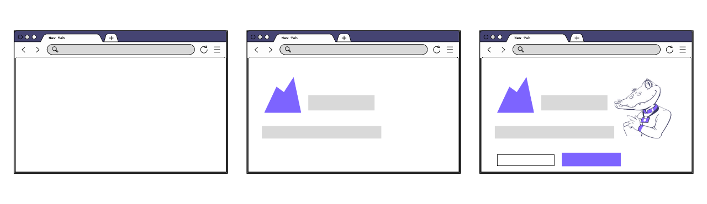

Load testing helps you simulate real user traffic against your application to prevent failures, improve reliability, and release new code with confidence. This guide provides guidance and recommendations for getting started, determining your load testing approach, scripting complex scenarios, and executing load tests specifically targeting websites.


## Backend vs frontend performance

On a website, performance is a crucial part of the user experience. It is often measured by the response time to visualize or interact with some information. The two main factors affecting the user experience response time are:

- Frontend performance
- Backend performance

### Frontend performance

Frontend performance testing verifies application performance on the interface level, measuring round-trip metrics that consider how and when page elements appear on the screen. It is concerned with the end-user experience of an application, usually involving a browser.



Frontend performance testing excels at identifying issues on a micro level but does not expose issues in the underlying architecture of a system.

Because it primarily measures a single user's experience of the system, frontend performance testing tends to be easier to carry out on a small scale.
Frontend performance testing has metrics that are distinct from backend performance testing. Frontend performance tests for things like:
- Whether the pages of the application are optimized to render quickly on a user's screen
- How long it takes a user to interact with the UI elements of the application.

Some concerns when doing this type of performance testing are its dependency on fully integrated environments and the cost of scaling. You can test frontend performance only once the application code and infrastructure have been integrated with a user interface. Tools to automate frontend testing are also inherently more resource-intensive, so they can be costly to run at scale and are not suitable for high load tests.

#### Why isn't frontend performance testing enough?

Since frontend performance testing already measures end-user experience, why do we even need backend performance testing?

Frontend testing tools are executed on the client side and are limited in scope. They do not provide enough information about backend components for fine-tuning beyond the user interface.

This limitation can lead to false confidence in overall application performance when the amount of traffic against an application increases. While the frontend component of response time remains more or less constant, the backend component of response time increases exponentially with the number of concurrent users:


Testing only frontend performance ignores a large part of the application, one more susceptible to increased failures and performance bottlenecks at higher levels of load.

### Backend performance

Backend performance testing targets the underlying application servers to see how they behave under production-like conditions. When it comes to websites, while frontend performance involves how assets included in the page are rendered, backend performance focuses on how those assets are processed by the application servers, served to users, and downloaded by browsers.


Backend testing is broader in scope than frontend performance testing. API testing can be used to target specific components or integrated components, meaning that application teams have more flexibility and higher chances of finding performance issues earlier. Backend testing is less resource-intensive than frontend performance testing and is thus more suitable for generating high load.

#### Why isn't backend performance testing enough?

Some concerns when doing this type of testing are its inability to test "the first mile" of user experience and breadth. Backend testing involves messaging at the protocol level rather than interacting with page elements. It verifies the foundation of an application rather than the highest layer of it that a user ultimately sees. Depending on the complexity of the application architecture, backend testing may also be more susceptible to scope creep.

### Which one should you test?

It depends! Ideally, both.

Testing both frontend and backend performance leads to the best overall performance and user experience for your application. Ignoring one or the other exposes you to performance bottlenecks that significantly decrease a user's satisfaction with your application.

However, if your testing is smaller in scope, you can choose to focus on either frontend or backend with the goal of eventually building a test suite that encompasses both.

## Load testing approaches

The decision of whether to test the frontend, backend, or both will also affect the type of load testing you should carry out and the kind of scripts you should write.

### Protocol-based, browser-based, or hybrid load testing


#### Protocol-based load testing

Protocol-based load testing verifies the backend performance of an application by simulating the requests underlying user actions. For websites, this commonly involves HTTP requests that bypass the user interface of your application and are sent directly to a server or application component.

For example, a protocol-based load testing script might request all the resources on a webpage from the application servers, but those resources are merely downloaded. The response times reported by a purely protocol-based script do not include frontend metrics such as the time taken for images to render on a browser. The load is generated by simulating many requests sent to application servers.

##### Steps for scripting on the protocol level

###### Record your user journey

If you want your load test to mimic user journeys as closely as possible, it may be worthwhile to record the actions that a typical user does. These user journeys, aka user scenarios, generally involve complex actions in a logical flow (dozens or hundreds of requests).

The process of creating this type of load test could be tedious. The recording of a user session could facilitate the job of starting the test creation for you. Check out the [Session Recording guide](/test-authoring/recording-a-session) to learn more about how to auto-generate your load test from a user session.

###### Add checks to each page

For every page, add a [check](https://k6.io/docs/using-k6/checks/) to verify the expected HTTP response or text returned in the body of the response. Doing so helps you clearly set expectations for how the application should behave, and aids in future troubleshooting in the case of reported errors during the test.

###### Parse HTML content

When testing web sites on the protocol level, you may have to interact with HTML to submit forms, extract data, check for existence of elements or text etc. For that reason, k6 has the [parseHTML](/javascript-api/k6-html/parsehtml) and the [Selection](/javascript-api/k6-html/selection) APIs that contains more or less all of the [jQuery API](http://api.jquery.com/) that makes sense in the context of k6.

<CodeGroup labels={["Parsing HTML content"]}>

```javascript
import { parseHTML } from 'k6/html';
import http from 'k6/http';

export default function () {
  const res = http.get('https://k6.io');
  const doc = parseHTML(res.body); // equivalent to res.html()
  const pageTitle = doc.find('head title').text();
  const langAttr = doc.find('html').attr('lang');
}
```

</CodeGroup>

For submitting a form, check out [Response.submitForm([params])](/javascript-api/k6-http/response/response-submitform).

###### Tag different types of resources

By default, the standard metrics of a load testing tool -- for example, the response time metric will aggregate the values of all the website requests. But you might want to see the results of these metrics filtered by the type of resources:

- 95th percentile response time of all the images.
- 99th percentile response time of all the API requests.

Different types of resources could behave very differently and could make **meaningless the value of the aggregated metrics**.

If you might want to filter your metrics based on different types of requests, consider using the [tagging feature](/using-k6/tags-and-groups#tags).

<CodeGroup labels={[]}>

```javascript
import http from 'k6/http';
http.get('http://myweb.com/images/logo.png', { tags: { assets: 'image' } });
```

</CodeGroup>

###### Group different webpages

[Groups](/using-k6/tags-and-groups#groups) help you organize your load test around a common logic.

Whether you're testing on the protocol level or the browser level, it's a good practice to set up a group for each webpage to organize your load test and facilitate the visualization of your test results.

<CodeGroup labels={[]}>

```javascript
import { group } from 'k6';

group('visit homepage', function () {
  // load homepage resources
});
group('login page', function () {
  // load login page and perform login
});
```

</CodeGroup>

###### Include or exclude static resources

When making HTTP requests on the protocol level, confirm whether your script is downloading the assets that are embedded into the page, such as images or scripts. A real user's browser would download these.

If you're using a Content Delivery Network (CDN), consider excluding static resources from your scripts unless you specifically want to test your CDN's performance. Often, load testing your CDN can incur additional costs or be against the Terms of Service.

###### Exclude third-party requests

You may have various external requests happening for a normal visitor on your site — for example, analytics tools, social networks, widgets, etc.

While these requests do impact the user experience on the frontend, they have no impact on the performance of your system on your backend. We highly recommend removing all third party requests from your test script for the following reasons:

- Third-party requests have no impact on your backend performance.
- Third parties may throttle requests, skewing your results.
- Third parties add a lot of noise to your test result data which makes understanding results harder.
- It may be against the TOS with the third party to run a test against their system.

###### Concurrent requests

(For protocol-level scripts) Modern browsers make parallel requests for resources. Does your script do the same?

##### Sample protocol-based test script

Below is an example of a protocol-based load testing script in k6 that fetches the homepage, and then the product page of the website.

```javascript
import http from 'k6/http';
import { sleep, check } from 'k6';

export default function () {
    // 01. Go to the homepage
    let res = http.get('https://mywebsite.com');
    check(res, {
        'is status 200': (r) => r.status === 200,
    });
    sleep(4);
    
    // 02. View products
    res = http.get('https://mywebsite.com/products');
    check(res, {
        'is status 200': (r) => r.status === 200,
    });
    sleep(1);
}
```


#### Browser-based load testing

Browser-based load testing verifies the frontend performance of an application by simulating real users using a browser to access your website.

For example, a browser-based load testing script might include instructions to navigate to a page, click on a button, and type out text on a form. Those user actions then trigger underlying requests on the protocol layer, but only user actions are scripted in browser-based testing.

Unlike protocol-based load testing, browser-based load testing scripts generate load by starting multiple instances of browsers and interacting with your application the way real users would. Testing at the browser level can also be the only option for testing Single-Page Applications where a lot of the application logic is executed by client-side scripts.

##### Steps for scripting on the browser level

Scripting on the browser level usually requires the use of different tools from the ones used to test at the protocol level. However, k6 has an extension called [xk6-browser](https://k6.io/docs/javascript-api/xk6-browser/) that allows the creation of browser-based test scripts alongside protocol-based ones. Below are some steps for getting started wit ha browser-level test script.

###### Determine user flow

While protocol-based testing sends requests to simulate user behavior, browser-based testing automates interactions with webpage elements.

Identify the steps that would be taken by a user that you'd like to simulate, focusing on the specific actions they might take to fulfill a general process, such as purchasing an item. Writing down every step helps you focus on what *users* do, rather than the messages their browsers send.

###### Identify unique selectors

Elements on a web page are given identifiers to distinguish them from each other. Since a script doesn't have the heuristic capabilities that a human user would, your browser-level script uses CSS *selectors* to identify elements to interact with. Choosing a good selector is essential to making frontend automated scripts that are reliable.

```javascript
const element = page.$('a[class="woocommerce-LoopProduct-link woocommerce-loop-product__link"]');
    element.click();
```

In the code snippet above, the selector identifies the link on the page that has the class `woocommerce-LoopProduct-link woocommerce-loop-product__link` before clicking on it. Selectors can be based on element types, attribute values, element position within the page, and others.

A good selector is:
- **Unique**. Choose a selector that identifies only one element on the page, to avoid confusion.
- **Static**. To avoid unnecessary rework of test scripts, choose a selector based on elements that are not changed frequently. For example, if the ID of a button is dynamically generated, consider using a selector based on the *label* of the button instead, which is less likely to change. If necessary, communicate to frontend developers to reduce unnecessary changes that break your test scripts.
- **Simple**. Identifying elements based on the hierarchy of the page is usually simpler than writing complex regular expressions that may be more flaky or more difficult to maintain.

Using the Element Inspector feature of [DevTools](https://developer.chrome.com/docs/devtools/) on most modern browsers can be very helpful in identifying the element you want your script to interact with. Some of them will even write selectors for you, but make sure you review them so that they follow the guidelines above.

###### Use elements to verify responses

In protocol-based test scripts, checks are used to verify that every page is successfully retrieved, usually by checking a part of the response headers or body. In browser-based test scripts, you can achieve the same type of verification by adding code that looks for key elements.

For example, the code below looks for the checkbox element before it proceeds with the rest of the test.

```javascript
const res = page.goto('https://test.k6.io/browser.php');
const checkbox = page.locator('#checkbox1');
checkbox.check();
```

###### Take screenshots

One of the advantages of using a browser-based test script is the ability to take screenshots during test execution. While it's good practice to handle all known errors within the script, it can also be useful to visually record what happened in the browser window for future troubleshooting.

The following command saves a screenshot to the specified path.

```javascript
page.screenshot({ path: 'screenshots/error.png' });
```

Having screenshots tied to key actions or errors may help debug the script, especially in the beginning.

###### Sample browser-based test script

Below is an example of a browser-based load testing script in k6 using xk6-browser. Instead of making an HTTP request, the script views the homepage, then looks for and clicks on a link to the product page.

```javascript
import launcher from 'k6/x/browser';
import { sleep } from 'k6';

export default function () {
	const browser = launcher.launch('chromium', { headless: true});
    const context = browser.newContext();
    const page = context.newPage();

	// 01. Go to the homepage
    page.goto('http://mywebsite.com', { waitUntil: 'networkidle' });
    page.waitForSelector('p[class="woocommerce-result-count"]');
    page.screenshot({ path: 'screenshots/01_homepage.png' });

    sleep(4);

    // 02. View products
    let element = page.$('a[class="woocommerce-LoopProduct-link woocommerce-loop-product__link"]');
    element.click();
    page.waitForSelector('button[name="add-to-cart"]');
    page.screenshot({ path: 'screenshots/02_view-product.png' });

    sleep(1);
}
```

#### Hybrid load testing

Hybrid load testing is a combination of protocol-based and browser-based load testing. While you can use two tools or two scripts to execute different types of load tests (one protocol-based and one browser-based), having both types of tests executed by the same script and the same tool is ideal. Aggregating results between different tools can be difficult at best and inconsistent at worst.

A best practice in hybrid load testing is to generate most of the load using the protocol-level test, and then to run a smaller number of the browser-level testing scripts. This approach:
- reduces the number of load generators needed, since protocol-level testing requires fewer machines to generate the same load
- measures backend and frontend performance in the same test execution
- provides a single source of aggregated output at the end
- reduces complexity in the creation and maintenance of scripts

##### Use scenarios and executors

When combining protocol-based and browser-based tests, use [scenarios](https://k6.io/docs/using-k6/scenarios/) to independently control their test parameters and [executors](https://k6.io/docs/using-k6/scenarios/executors/):

```javascript
export const options = {
    scenarios: {
        checkout_http: {
            executor: 'ramping-vus',
            exec: 'http',
            startVUs: 0,
            stages: [
                { duration: '1m', target: 10 },
                { duration: '3m', target: 10 },
                { duration: '1m', target: 0},
            ],
        },
        checkout_browser: {
            executor: 'per-vu-iterations',
            exec: 'xk6browser',
            vus: 10,
            iterations: 1,
            startTime: '1m',
        },
    },
};
```


### Component testing vs. end-to-end testing

When you're testing a web app, you may wonder whether how you structure your test scripts. Consider the two methods below.

#### Component testing

One way you could load test a web app is to load test its components. Maybe you know there are issues with a specific functionality due to previous production issues, or maybe you'd like to target components that are business-critical to reduce risk exposure.

In these cases, the type of test you write may: 
- be protocol-based
- call only those API endpoints that are relevant
- have smaller or no sleep/think time
- be focused on eventually stress testing a component or service or finding its breaking point

Testing in this way is more flexible. With protocol testing, you can specify the endpoints or servers you'd like to hit, and narrow your test's target that way. You can test specific functionalities while skipping others that come chronologically before it in a standard user flow. You can more finely control the type of traffic that is generated. If you're recreating a specific mix of requests, you can script those requests and reproduce them in a repeatable manner.

Doing component testing for load may not always require that your script behave like an end user. In fact, it may be necessary to artificially inflate traffic to more quickly reproduce issues, or to deflate traffic to reduce the noise in the logs. By the nature of this type of testing, scripts don't contain the full flow of a request that you would expect to see in production, so realism is not a priority.

#### End-to-end testing

You could also do end-to-end testing against a web app. End-to-end testing seeks to replicate real user behaviour and track its effects across the entire stack. When doing end-to-end testing, you might:
- do protocol-level, browser-level, or hybrid load testing
- replicate the actions in a typical user flow
- think about the performance of the entire workflow as well as how long a request took to be processed by each component
- write scripts that access the application the same way users would, such as by browsing to the homepage before finding their way to other parts of the website

This type of load testing is broader in scope than component testing, but shallower in terms of depth. With end-to-end testing, you get a better idea of the full user experience of the application as a whole. However, it can also be more complex to troubleshoot, as you have more components to monitor and more places to look for issues that are found.

End-to-end testing is based on real user behavior, so it's often important that end-to-end test scripts also be realistic.

##### Tips for realistic scripting

###### Determine cache and cookie behaviour

Are you simulating the behaviour of returning users, or real users? Choose your script's cache and cookie policies accordingly. Confirm both script caching *and* server-side caching.

k6 automatically resets cookies between iterations, but you can also [change this behavior](https://k6.io/docs/using-k6/k6-options/reference/#no-cookies-reset) if maintaining cookies would be more realistic:

```javascript
export const options = {
  noCookiesReset: true,
};
```

###### Dynamic think time and pacing

How long would a real user spend on each webpage before interacting with it? Consider adding varying [delays](https://k6.io/docs/javascript-api/k6/sleep/) so as to not artificially stagger a script with completely uniform delays:

```javascript
import { sleep } from 'k6';

sleep(Math.random() * 4);
```

The line above will provide a delay lasting from 0 to 4 seconds.

###### Test data

Real users typically don't search for or submit the same data repeatedly. Consider adding a [test data file](https://k6.io/docs/examples/data-parameterization/) for the script to iterate through.

###### Test parameters and load profile

Does your script create a load profile that matches what you see in production? In k6, you can use [test options](https://k6.io/docs/using-k6/k6-options/how-to) to determine the exact shape and profile of your load test script. Here's an example of how you could choose a [ramping arrival rate executor](https://k6.io/docs/using-k6/scenarios/executors/ramping-arrival-rate/) to determine how many VUs are started at different stages of the test:

```javascript
import http from 'k6/http';
import exec from 'k6/execution';

export const options = {
  discardResponseBodies: true,

  scenarios: {
    contacts: {
      executor: 'ramping-arrival-rate',
      startRate: 300,
      timeUnit: '1m',
      preAllocatedVUs: 2,
      maxVUs: 50,
      stages: [
        { target: 300, duration: '1m' },
        { target: 600, duration: '2m' },
        { target: 600, duration: '4m' },
        { target: 60, duration: '2m' },
      ],
    },
  },
};

export default function () {
  http.get('https://test.k6.io/contacts.php');
}

```

## Best practices and recommendations

### Run your tests in the appropriate environment

Testing in pre-production environments and in production environments both add value.

**Testing in pre-production environments** (staging, test, system integration testing, user acceptance testing, and production replica environments) enables you to identify performance defects early, which can save a lot of time and effort (and reputation) later on. Running in test environments also means you can often afford to be more aggressive with your tests. However, it's also more critical to get your load profiles right, and the test results you get may not necessarily apply to production.

**Testing in production** yields the most accurate results, but it's also more risky. Often, testing production is the only feasible alternative. You can reduce the risk of impact to real customers while testing in production by using lower levels of load when running load tests during peak hours, schedule tests for off-peak hours, choosing load test types that are less risky, using techniques like synthetic monitoring that generate less traffic, using real user monitoring tools to get snapshots of user performance at load, and ensuring that your observability stack is working at peak efficiency.

### Run tests where your customers are

The location of the load generator(s), where the traffic is coming *from*, can also have an impact on your test results. The question is: where are your end users located?

**On-premises load testing** can be ideal when testing early on in the development a website, or when there are machines that can be repurposed as load generators. However, testing entirely from within a corporate network may also yield false positives, in that response times reported are significantly lower than if the same application servers were accessed from across the country. 

**Load testing on the cloud** is an essential part of the testing strategy for many public-facing websites. Using load generators on the cloud gives you access to test in different states and geographical countries, creating a mix of load generators proportional to your users' locations. Cloud load generators are easier to provision and cheaper to maintain in the long run than on-premise ones. Load testing on the cloud can help you include the effects of network latency in your tests and yield results that are more realistic.

## Recommendations

Here are some recommendations to help you plan, script, and execute your load tests for websites.

If you want to test the last-mile user experience of your website: 
- focus on **frontend performance**,
- write **browser-based test scripts**,
- and consider doing more realistic **end-to-end** tests of the user flow.

If you want to test the underlying infrastructure of your website:
- focus on **backend performance**,
- write **protocol-based test scripts**,
- and consider starting with **component testing** and then gradually increasing the scope.

If your website is meant for internal or has limited access: 
- Use **on-premise load generators** located within the network that most of your users access the website from.
 
If your website is external and public-facing: 
- Use **cloud load generators** in the load zones where your users reside.

Test in **pre-production environments** when you can, but also consider **testing in production** in a limited capacity.


## Read more

- [Browser testing with xk6-browser](/javascript-api/xk6-browser/)
- [Test types](/test-types/introduction)
- [Running large tests](/testing-guides/running-large-tests/)
- [Session recording guide](/test-authoring/recording-a-session)
- [Determining concurrent users in your load tests](https://k6.io/blog/monthly-visits-concurrent-users)
- [Data correlation in your test script](/examples/correlation-and-dynamic-data)
- Interacting with HTML content: [parseHTML](/javascript-api/k6-html/parsehtml) and [Selection.find](/javascript-api/k6-html/selection/selection-find)
