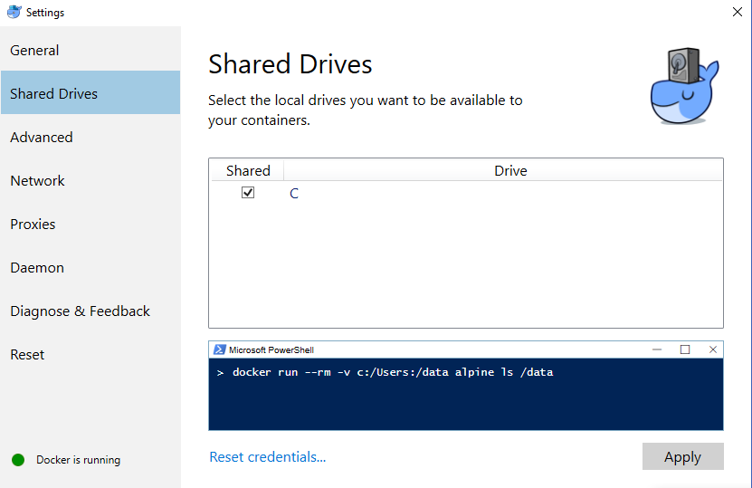

## Importando módulos

Al escribir scripts de prueba, es común importar diferentes módulos, o parte de ellos, para utilizarlos a lo largo del script. En k6, es posible importar tres tipos diferentes de módulos:

- Módulos de k6
- Módulos del sistema de archivos locales
- Módulos HTTP(S) remotos


### Módulos de k6

Estos módulos se proporcionan a través del núcleo de k6, y dan acceso a la funcionalidad incorporada en k6. Esto podría ser, por ejemplo, el cliente http utilizado para hacer peticiones contra el sistema bajo prueba. Para obtener una lista completa de los módulos incorporados, consulte la [documentación de la API](/javascript-api).

```javascript
import http from 'k6/http';
```

### Módulos del sistema de archivos locales


Estos módulos se almacenan en el sistema de archivos local y se accede a ellos mediante rutas relativas o absolutas del sistema de archivos. Para que un módulo que reside en el sistema de archivos local sea compatible con k6, el propio módulo sólo puede utilizar importaciones relativas o absolutas del sistema de archivos para acceder a sus dependencias.

```javascript
//helpers.js
export function someHelper() {
  ...
}
```

```javascript
//my-test.js
import { someHelper } from './helpers.js';

export default function () {
  someHelper();
}
```

### Módulos HTTP(S) remotos

Se accede a estos módulos a través de HTTP(S), desde una fuente como el [k6 JSLib](#the-jslib-repository) o desde cualquier servidor web de acceso público. Los módulos importados serán descargados y ejecutados en tiempo de ejecución, por lo que es extremadamente importante asegurarse de que el código es legítimo y de confianza antes de incluirlo en un script de prueba.

```javascript
import { randomItem } from 'https://jslib.k6.io/k6-utils/1.0.0/index.js';

export default function () {
  randomItem();
}
```

### The JSLib repository

JSLib es un conjunto de bibliotecas que se sabe que funcionan bien con k6, y que están disponibles en https://jslib.k6.io/.

Estas bibliotecas pueden descargarse e incluirse con el proyecto de prueba o cargarse directamente utilizando importaciones HTTP como se muestra arriba.

## Bundling node modules

> #### ⚠️ Compatibilidad limitada
>
> k6 no es NodeJS, ni es un navegador. Los paquetes que dependen de las APIs proporcionadas por NodeJS, por ejemplo los módulos os y fs, no funcionarán en k6. Lo mismo ocurre con las APIs específicas del navegador como el objeto ventana.

Los pasos a seguir son los siguientes:

- Configurar el bundler
  - Instalación de paquetes
  - Configurar Webpack
  - Añadir un comando bundle
- Ejecutar el bundler
- Ejecución de las pruebas


> ### Using the k6-es6 starter
>
> Un starter de Webpack y Babel está disponible para usar en [GitHub](https://github.com/k6io/k6-es6).

## Usando los módulos locales con un Docker


Cuando se ejecuta k6 en un contenedor Docker hay que asegurarse de montar las carpetas necesarias del host en el contenedor, utilizando volúmenes Docker, para que k6 pueda ver todos los módulos JS que necesita importar.
Por ejemplo, digamos que tiene la siguiente estructura en su máquina anfitriona:

- `/home/k6/ejemplo/src/index.js`
- `/home/k6/ejemplo/src/modules/module.js`


<CodeGroup labels={["index.js"]} lineNumbers={[true]}>

```javascript
import { hello_world } from './modules/module.js';

export default function () {
  hello_world();
}
```

</CodeGroup>

<CodeGroup labels={["./modules/module.js"]} lineNumbers={[true]}>

```javascript
export function hello_world() {
  console.log('Hello world');
}
```

</CodeGroup>

Para ejecutar index.js y hacer que los módulos estén disponibles para su importación ejecutamos el siguiente comando Docker con la carpeta host `/home/k6/example/src` montada en `/src` en el contenedor:

<CodeGroup labels={[]} lineNumbers={[false]}>

```bash
$ docker run -v /home/k6/example/src:/src -i loadimpact/k6 run /src/index.js
```

</CodeGroup>

Tenga en cuenta que en Windows, también tiene que asegurarse de que su unidad en cuestión, digamos `C:\`, ha sido marcada para compartir en la configuración de Docker:



## See also

- [ES6 template](https://github.com/k6io/template-es6): un plantilla de proyecto para utilizar ES6 en sus scripts k6.
- [TypeScript template](https://github.com/k6io/template-typescript): un plantilla de proyecto para utilizar TypeScript en sus scripts k6.
