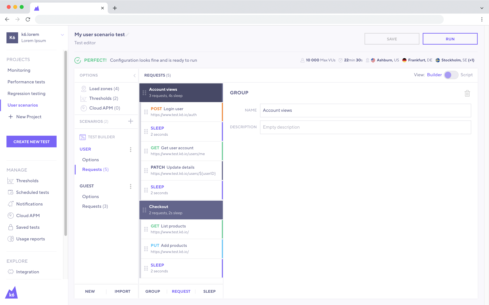
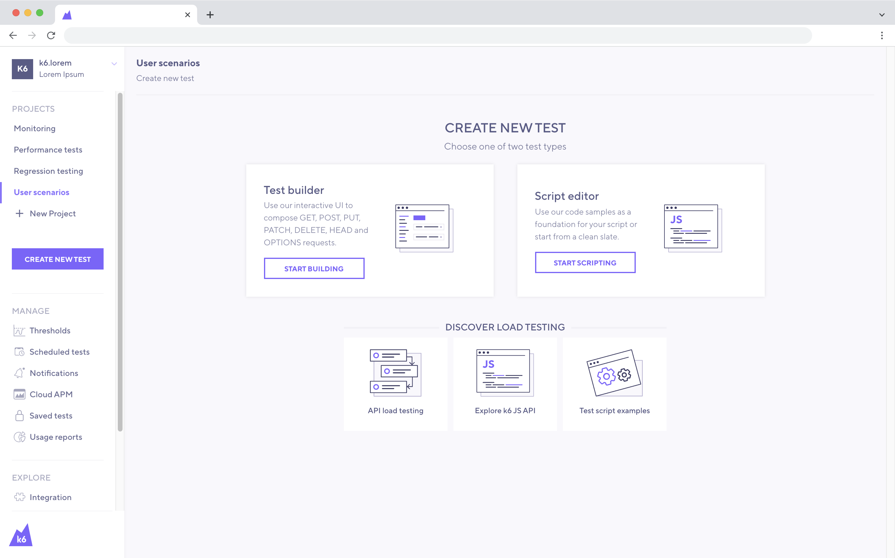

El constructor de pruebas (Test Builder) permite utilizar una interfaz gráfica para crear una prueba.

Basándose en los datos de entrada, el constructor de pruebas le generará automáticamente el script. Una vez hecho esto, puede copiar el script y [ejecutar la prueba desde la CLI (command line interface) ](/es/empezando/ejecucion-de-k6/).

> **Nota**: Es necesario tener una cuenta de k6 Cloud para utilizar el constructor de pruebas. Sin embargo, su uso es gratuito y por lo tanto no necesita una suscripción activa para utilizar esta función.

Aunque creemos firmemente que las herramientas basadas en scripts o códigos le ayudarán a sacar el máximo provecho de sus esfuerzos en las pruebas de rendimiento, una herramienta basada en la interfaz gráfica de usuario como el constructor de pruebas podría beneficiar en:

- Acelerar la creación de pruebas.
- Aprender rápidamente sobre la [API de k6](/javascript-api).
- Colaborar en la construcción de pruebas con otras personas que no codifican.

## Instrucciones

1 - [Inicie sesión](https://app.k6.io/account/login) en k6 Cloud.

2 -  En el menú de la barra lateral, haga clic en la opción [Create New Test](https://app.k6.io/tests/new) button.

3 - Seleccione `Test builder`.

4 - Ahora, puede empezar a construir su prueba con k6 utilizando la interfaz gráfica.

## Características

Continuamente mejoramos y añadimos nuevas características al generador de pruebas. Algunas de las características más destacadas son las siguientes:

**Configuración de pruebas**
- Configurar el ramping(aka [stages](/es/usando-k6/opciones/#stages)) usando VUs y la duración.
- Configurar las [zonas de carga](/cloud/creating-and-running-a-test/cloud-scripting-extras/load-zones) para ejecutarlo desde k6 Cloud.

**Solicitudes HTTP**
- Añadir una solicitud y nombrarla para una mejor descripción.
- Cambiar la URL/Endpoint.
- Cambiar el método HTTP utilizando el menú desplegable.
- Especificar las cabeceras.
- Especificar los parámetros de consulta.
- Especificar el body de la solicitud (JSON, texto o contenido del archivo) para las solicitudes POST/PUT/PATCH.
- Reorganizar las peticiones haciendo clic y arrastrando.
- Duplicar o eliminar solicitudes al pasar el mouse por encima de una solicitud específica.

**API de k6**
- Define [thresholds](/es/usando-k6/thresholds/).
- Añada [checks](/javascript-api/k6/check).
- Añada [sleep](/javascript-api/k6/sleep).
- Añada [group](/javascript-api/k6/group).

**Algunas otras características**
- Rellenar el constructor de pruebas con las peticiones grabadas utilizando el [grabador del navegador](/es/creacion-de-pruebas/grabar-una-sesion/grabador-de-navegador/).
- Rellenar el constructor de pruebas con las peticiones incluidas en un [archivo HAR](<https://en.wikipedia.org/wiki/HAR_(file_format)>).
- Capturar una variable cuando se trata de datos dinámicos, como los tokens de autenticación.
- Mostrar ejemplos para un mejor entendimiento.
- Cambiar el modo de visualización para ver o copiar el script de k6 generado.
- Ejecute la prueba en k6 Cloud.
