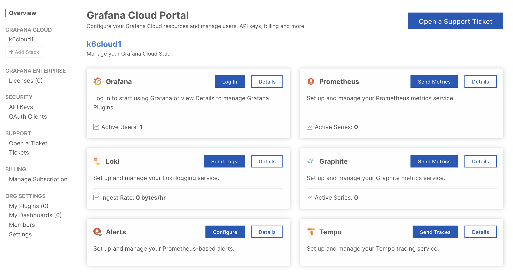
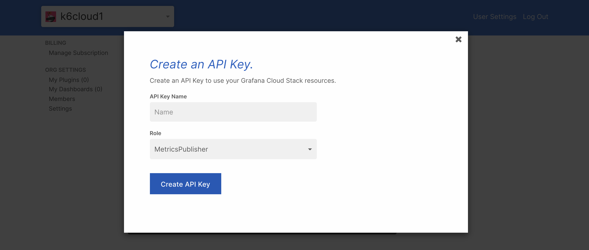
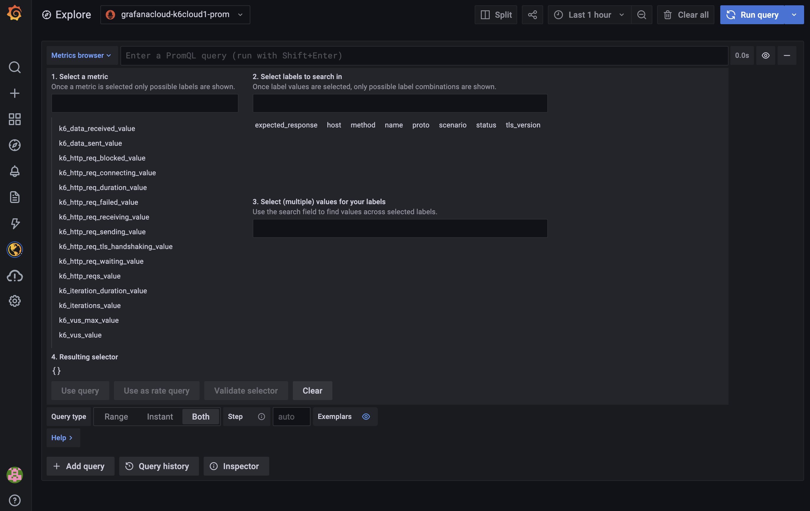

Con Grafana Cloud Prometheus, puedes enviar tus k6 métricas dentro [Grafana Cloud](https://grafana.com/products/cloud/) para visualizar mejor los resultados de sus pruebas, lo que le permite correlacionar las métricas k6 con otras métricas de sus servicios supervisados mediante Grafana.

> Mientras este artículo se centra en Grafana Cloud, cualquier instalación de Prometheus con capacidad de escritura remota es compatible con este enfoque.

## Prerrequisitos

- [Telegraf](https://www.influxdata.com/time-series-platform/telegraf/)
- [Grafana Cloud Prometheus](https://grafana.com/products/cloud/features/#cloud-metrics)
- Credenciales para el `/api/prom/push` endpoint

## Configuración

Si no tiene una cuenta de Grafana Cloud, puede registrarse [aquí](https://grafana.com/products/cloud/). El plan gratuito incluye 10,000 series Prometheus.

Ahora, necesita la URL, el nombre de usuario y la contraseña de su instancia de Grafana Cloud Prometheus para configurar la integración.

Inicie sesión en Grafana.com y visite el [Cloud Portal](https://grafana.com/docs/grafana-cloud/what-are/cloud-portal/). Haga clic en el botón `Details` de su servicio Prometheus.


Copie la URL del Remote Write Endpoint y el Username / Instance ID. Crea y copia un API key de `MetricsPublisher` role que se utilizará como contraseña.



A continuación, configuramos y ejecutamos telegraf. Telegraf recopilará las métricas k6 y las reenviará, utilizando el Prometheus Remote Write endpoint - to Grafana Cloud Prometheus.

Para instalar telegraf, siga las [Documentación Oficial de Telegraf](https://docs.influxdata.com/telegraf).

Edite su archivo `telegraf.conf` usando el siguiente ejemplo. El ejemplo solo requiere que cambie el nombre de usuario, la contraseña y la URL de la salida HTTP para que coincida con su configuración de Grafana Cloud Prometheus.
<CodeGroup labels={["telegraf.conf"]} lineNumbers={[true]}>

```toml
[agent]
  interval = "10s"
  round_interval = true
  metric_batch_size = 5000
  metric_buffer_limit = 100000
  collection_jitter = "0s"
  flush_interval = "1s"
  flush_jitter = "0s"
  precision = ""
  debug = true
  logtarget = "stderr"
  hostname = ""
  omit_hostname = false

[[outputs.http]]
  url = "https://prometheus-us-central1.grafana.net/api/prom/push" # <--
  method = "POST"
  username = "Prometheus username or Instance ID" # <--
  password = "Grafana API Key (MetricsPublisher role)"    # <--
  data_format = "prometheusremotewrite"

[outputs.http.headers]
  Content-Type = "application/x-protobuf"
  Content-Encoding = "snappy"
  X-Prometheus-Remote-Write-Version = "0.1.0"

[[inputs.influxdb_listener]]
  service_address = ":8186"
  read_timeout = "10s"
  write_timeout = "10s"
  max_body_size = "32MiB"
  name_prefix = "k6_"
```

</CodeGroup>

Ahora puede ejecutar la instancia de Telegraf de la siguiente manera:
  
```bash
telegraf -config $PATH/telegraf.conf
```

> Un repositorio de ejemplo que usa Docker para ejecutar Telegraf está disponible enGitHub at [https://github.com/k6io/example-k6-to-grafana-cloud](https://github.com/k6io/example-k6-to-grafana-cloud). 

## Ejecutar test

Cuando se está ejecutando telegraf, puede ejecutar su prueba k6 y configurar k6 para generar las métricas en la instancia de telegraf. Telegraf enviará las métricas k6 a su Grafana Cloud Prometheus.

  ```bash
# si telegraf se está ejecutando en otra máquina
$ k6 run --out influxdb=http://my-telegraf-host:8186 my-test.js

# si Telegraf se ejecuta en el mismo host y puerta 8186:
$ k6 run --out influxdb my-test.js
```

## Explore las métricas de k6
  
En Grafana Cloud, haga clic en el icono Explorar en la barra de menú y elija la fuente de datos de Prometheus en el menú desplegable en la parte superior izquierda. En el campo de consulta, consulta las métricas k6 para explorar los resultados de tus tests.

