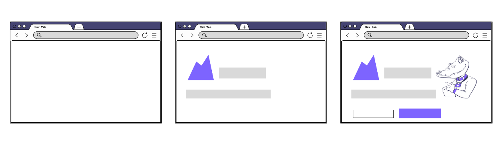
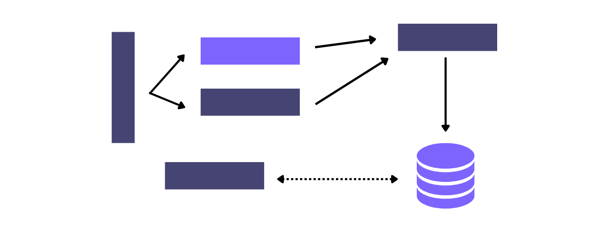
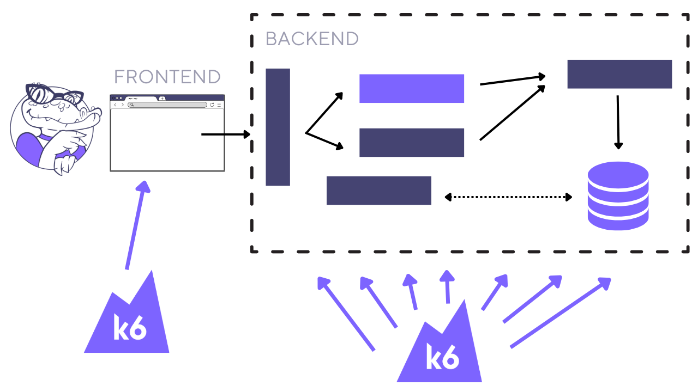

Este documento explica algunos conceptos clave sobre las pruebas de carga de los sitios web, como:
- La diferencia entre las pruebas de rendimiento del backend y del frontend.
- Cuándo elegir scripts basados en protocolos, scripts basados en el navegador o scripts híbridos.
- Prácticas recomendadas sobre cómo realizar pruebas de carga de sitios web.

Todas las pruebas de carga intentan simular el tráfico real de usuarios para evitar fallos, mejorar la fiabilidad y poder implementar código nuevo con confianza. Pero el enfoque de sus pruebas de carga debe adaptarse al tipo de aplicación que quiera probar.

En esta guía, aprenderá una serie de estrategias para probar sitios web, entre las que se incluyen recomendaciones específicas para scripts de escenarios complejos y ejecución de pruebas.


## Enfoques de pruebas de carga

Cuando vaya a realizar una prueba de carga, considere primero los siguientes puntos:
- Rendimiento del backend frente al rendimiento del frontend.
- Pruebas de carga basadas en protocolos, en el navegador o híbridas.
- Pruebas de componentes o pruebas de extremo a extremo.


## Rendimiento del backend frente al rendimiento del frontend

El rendimiento tiene influye considerablemente en la experiencia del usuario de un sitio web.

Por ejemplo, cuando los usuarios quieren visualizar o interactuar con cierta información, esperan que el sitio web reaccione rápidamente.

Para medir el rendimiento, los evaluadores a menudo observan los tiempos de respuesta, que se ven afectados por dos factores principales:

- Rendimiento del frontend.
- Rendimiento del backend.


### Rendimiento del frontend

Las pruebas de rendimiento del frontend verifican el rendimiento de la aplicación a nivel de interfaz, midiendo las métricas de ida y vuelta que analizan cómo y cuándo aparecen los elementos de la página en la pantalla. Hace referencia a la experiencia del usuario final de una aplicación, que generalmente involucra el uso de un navegador.



Las pruebas de rendimiento del frontend destacan en la identificación de problemas a nivel micro, pero no exponen problemas en la arquitectura subyacente de un sistema.

Dado que se mide principalmente la experiencia de un solo usuario del sistema, las pruebas de rendimiento del frontend tienden a ser más fáciles de ejecutar a pequeña escala. Las pruebas de rendimiento del frontend utilizan métricas distintas a las de las pruebas de rendimiento del backend. Pruebas de rendimiento del frontend para cosas como:
- Comprobar si las páginas de la aplicación están optimizadas para renderizarse rápidamente en la pantalla de un usuario.
- Averiguar cuánto tiempo tarda un usuario en interactuar con los elementos de la interfaz de usuario de la aplicación.


Algunas preocupaciones al realizar este tipo de pruebas de rendimiento son su dependencia de entornos totalmente integrados y el coste de escalabilidad. Para probar el rendimiento del frontend, el código de la aplicación y la infraestructura se deben haber integrado con una interfaz de usuario. Las herramientas para automatizar las pruebas del frontend también requieren más recursos de por sí, por lo que pueden resultar costosas de ejecutar a escala y no son adecuadas para pruebas de alta carga.

### Rendimiento del backend

Las pruebas de rendimiento del backend se llevan a cabo en servidores de aplicaciones subyacentes para ver cómo se comportan en condiciones similares a las de producción. En los sitios web, el rendimiento del frontend abarca cómo se representan los activos incluidos en la página, y el rendimiento del backend se centra en cómo los servidores de aplicaciones procesan esos activos, cómo se ponen a disposición de los usuarios y cómo los descargan los navegadores.



Las pruebas del backend tienen un mayor alcance que las pruebas de rendimiento del frontend. Las pruebas de API se pueden usar para analizar componentes específicos o integrados, lo que significa que los equipos de aplicaciones tienen una mayor flexibilidad y más posibilidades de encontrar problemas de rendimiento antes. Las pruebas del backend consumen menos recursos que las pruebas de rendimiento del frontend y, por lo tanto, son más adecuadas para generar altas cargas.

### ¿Cuál debería probar?

¡Depende! Lo ideal sería realizar ambas.

Las herramientas de prueba del frontend se ejecutan en el lado del cliente y tienen un alcance limitado: no proporcionan suficiente información sobre los componentes del backend para su puesta a punto más allá de la interfaz de usuario.

Esta limitación puede llevar a una falsa confianza en el rendimiento general de la aplicación cuando aumenta la cantidad de tráfico. Mientras que el componente de tiempo de respuesta del frontend permanece más o menos constante, el componente de tiempo de respuesta del backend aumenta exponencialmente con el número de usuarios concurrentes:


Al probar *solo* el rendimiento del frontend, se ignora una gran parte de la aplicación, una más susceptible a sufrir mayores fallos y cuellos de botella de rendimiento en niveles de carga más altos.

Por otro lado, probar *solo* el rendimiento del backend ignora «los primeros pasos» de la experiencia y el alcance de los usuarios. Las pruebas del backend se centran en el intercambio de mensajes a nivel de protocolos en lugar de interactuar con los elementos de la página de la manera en que lo haría un usuario real. Verifican la base de una aplicación en lugar de la capa más alta de la misma, que, de hecho, es la que un usuario ve en última instancia.

Las pruebas de rendimiento, tanto del frontend como del backend, ayudan a mejorar la experiencia de usuario y el rendimiento general de su aplicación. Ignorar cualquiera de ellas lo expone a cuellos de botella de rendimiento que disminuyen significativamente la satisfacción de un usuario con su aplicación.

Sin embargo, si su prueba es de menor alcance, puede optar por centrarse en el frontend o en el backend, con el objetivo de ir creando un conjunto de pruebas que abarque ambos.

## Pruebas de componentes o pruebas de extremo a extremo

Cuando vaya a probar una aplicación web, puede preguntarse cómo va a estructurar sus scripts de prueba. Considere los siguientes dos métodos.

### Pruebas de componentes

Una forma en que puede realizar pruebas de carga de una aplicación web es probar la carga de sus componentes. Tal vez sepa que una función específica no funciona correctamente, debido a que ha generado problemas de producción anteriormente, o quizás le gustaría analizar los componentes críticos para el negocio para reducir la exposición al riesgo.

En estos casos, el tipo de prueba que escriba puede:
- Estar basada en protocolos.
- Llamar solo a aquellos puntos finales de API que sean relevantes.
- Tener menos tiempo (o ninguno) de suspensión/reflexión.
- Enfocarse en probar la resistencia de un componente o servicio o encontrar su punto de ruptura.


De esta manera, las pruebas son más flexibles. Con las pruebas de protocolo, puede especificar los puntos finales o los servidores que le gustaría analizar y reducir el objetivo de su prueba de esa manera. Puede realizar pruebas en funciones específicas mientras omite otras que aparecerían cronológicamente antes en un flujo de usuario estándar. Puede controlar de manera más precisa el tipo de tráfico que se genera. Si quiere recrear una combinación específica de solicitudes, puede escribirlas y reproducirlas de manera reiterada.

Realizar pruebas de cargas de componentes no siempre requiere que el script se comporte como un usuario final. De hecho, puede ser necesario inflar artificialmente el tráfico para reproducir más rápidamente los problemas, o desinflarlo para reducir el ruido en los logs. Por la naturaleza de este tipo de pruebas, los scripts no contienen el flujo completo de una solicitud que se esperaría ver en producción, por lo que el realismo no es una prioridad.


### Pruebas de extremo a extremo

También puede hacer pruebas de extremo a extremo en una aplicación web. Las pruebas de extremo a extremo buscan reproducir el comportamiento real del usuario y monitorizar sus efectos en todo el entorno. En las pruebas de extremo a extremo, puede:
- Realizar pruebas de carga a nivel de protocolos, de navegador o híbridas.
- Reproducir las acciones en un flujo de usuario típico.
- Pensar en el rendimiento de todo el flujo de trabajo, así como en el tiempo que tardó cada componente en procesar una solicitud.
- Escribir scripts que accedan a la aplicación de la misma manera que lo harían los usuarios, como entrar en la página de inicio antes de visitar otras partes del sitio web.


Este tipo de pruebas de carga tienen un alcance mayor que las pruebas de componentes, pero son menos exhaustivas. Con las pruebas de extremo a extremo, se puede entender mejor la experiencia de usuario completa de la aplicación en su conjunto. No obstante, también puede ser más difícil solucionar los problemas, ya que hay más componentes para monitorizar y más lugares donde buscar.

Las pruebas de extremo a extremo se basan en el comportamiento real del usuario, por lo que suele ser importante que los scripts de prueba de extremo a extremo también sean realistas.

## Pruebas de carga basadas en protocolos, en el navegador o híbridas

La decisión de probar el frontend, el backend o ambos también afectará al tipo de prueba de carga que deberá llevar a cabo y al tipo de scripts que deberá escribir.

### Pruebas de carga basadas en protocolos

Las pruebas de carga basadas en protocolos verifican el rendimiento del backend de una aplicación simulando las solicitudes subyacentes a las acciones del usuario. Para los sitios web, esto comúnmente implica solicitudes HTTP que se saltan la interfaz de usuario de su aplicación y se envían directamente a un servidor o componente de la aplicación.

Por ejemplo, un script de prueba de carga basado en protocolos puede solicitar todos los recursos de una página web a los servidores de las aplicaciones, pero esos recursos simplemente se descargan. Los tiempos de respuesta notificados por un script puramente basado en protocolos no incluyen métricas del frontend, como el tiempo que tardan las imágenes en renderizarse en un navegador. La carga se genera simulando muchas solicitudes que se envían a los servidores de las aplicaciones.

Si bien puede parecer que las pruebas de carga basadas en protocolos se prestan mejor a las pruebas de componentes, también puede realizar pruebas de sitios web de extremo a extremo con scripts de nivel de protocolos.


#### Ejemplo de script de prueba basada en protocolos

A continuación le mostramos un ejemplo de un script de prueba de carga basado en protocolos en k6 que recupera la página de inicio, así como los recursos insertados en la página.

```javascript
import http from 'k6/http';
import { sleep, check } from 'k6';

export function Homepage() {
  const params = {
    'sec-ch-ua': '"Chromium";v="94", "Google Chrome";v="94", ";Not A Brand";v="99"',
    'accept-encoding': 'gzip, deflate, br',
    'accept-language': 'en-GB,en;q=0.9',
  };

  // 01. Go to the homepage
  let responses = http.batch([
    ['GET', 'https://mywebsite.com/', params],
    ['GET', 'https://mywebsite.com/style.min.css', params],
    ['GET', 'https://website.com/header.png', params],
    ['GET', 'https://website.com/polyfill.min.js', params],
  ]);
  check(responses, {
    'Homepage loaded': (r) => JSON.stringify(r).includes('Welcome to my site'),
  });

  sleep(4);

  // 02. View products
  responses = http.batch([
    ['GET', 'https://mywebsite.com/products', params],
    ['GET', 'https://mywebsite.com/style.css', params],
    ['GET', 'https://website.com/product1.jpg', params],
    ['GET', 'https://website.com/product2.jpg', params],
    ['GET', 'https://website.com/displaylist.js', params],
  ]);
  check(responses, {
    'Products loaded': (r) => JSON.stringify(r).includes('Add to Cart'),
  });

  sleep(1);
}
```

[Registrar el tráfico del navegador](https://k6.io/docs/test-authoring/create-tests-from-recordings/using-the-browser-recorder/) le ayuda a crear prototipos para probar sitios web a nivel de protocolos.

### Pruebas de carga basadas en el navegador

Las pruebas de carga basadas en el navegador verifican el rendimiento del frontend de una aplicación simulando usuarios reales que utilizan un navegador para acceder a su sitio web.

Por ejemplo, un script de prueba de carga basado en el navegador puede incluir instrucciones para acceder a una página, hacer clic en un botón y escribir texto en un formulario. Esas acciones del usuario activan las solicitudes subyacentes en la capa de protocolo, pero solo las acciones del usuario se programan en las pruebas basadas en el navegador.

A diferencia de las pruebas de carga basadas en protocolos, los scripts de prueba de carga basados en el navegador generan carga al iniciar múltiples instancias de navegadores e interactuar con su aplicación de la manera en que lo harían los usuarios reales. Las pruebas a nivel de navegador también pueden ser la única opción para probar aplicaciones de una sola página donde gran parte de la lógica de la aplicación se ejecuta mediante scripts del lado del cliente.

Por lo general, los scripts en el nivel del navegador requieren el uso de diferentes herramientas de las que se emplean para realizar pruebas a nivel de protocolos. Sin embargo, k6 tiene una extensión llamada [xk6-browser](https://k6.io/docs/javascript-api/xk6-browser/) que permite crear scripts de prueba basados en el navegador junto con scripts basados en protocolos.

#### Ejemplo de un script de prueba basado en el navegador

A continuación, le mostramos un ejemplo de un script de prueba de carga basado en el navegador en k6 que utiliza xk6-browser en un sitio web ficticio. En lugar de realizar una solicitud HTTP, el script ve la página de inicio, luego realiza una búsqueda y hace clic en un enlace que lleva a la página del producto.

```javascript
import { chromium } from 'k6/x/browser';
import { sleep } from 'k6';

export default function () {
  const browser = chromium.launch({ headless: false });
  const page = browser.newPage();

  // 01. Go to the homepage
  page
    .goto('https://mywebsite.com', { waitUntil: 'networkidle' })
    .then(() => {
      page.waitForSelector('p[class="woocommerce-result-count"]"]');
      page.screenshot({ path: 'screenshots/01_homepage.png' });

      sleep(4);

      // 02. View products
      const element = page.$(
        'a[class="woocommerce-LoopProduct-link woocommerce-loop-product__link"]'
      );
      element.click();
      page.waitForSelector('button[name="add-to-cart"]');
      page.screenshot({ path: 'screenshots/02_view-product.png' });

      sleep(1);
    })
    .finally(() => {
      page.close();
      browser.close();
    });
}
```


#### Consejos para escribir scripts a nivel de navegador

Los siguientes pasos pueden ayudarlo a empezar a escribir scripts de pruebas a nivel de navegador.

**Programe scripts de acciones del usuario, no de solicitudes.**  Determine lo que un usuario podría hacer para una tarea en particular y programe las interacciones con los elementos en el nivel del navegador. Por ejemplo, escriba qué botones pulsaría el usuario.


**Identifique selectores únicos.** Una vez que haya identificado con qué elementos de la página interactuaría un usuario, use el Inspector de elementos de DevTools en su navegador para encontrar una forma única, estática y simple de identificar cada elemento. El script necesita selectores para encontrar el elemento correcto con el que interactuar.

**Utilice los elementos para verificar las respuestas.** Después de cada acción, use [locators](https://k6.io/docs/javascript-api/k6-experimental/browser/locator/) para buscar los elementos de la página que esperaría encontrar. Esta verificación ayuda a garantizar que el script haya llegado a la página esperada.

**Tome capturas de pantalla para cada acción mientras depura.** Una de las ventajas de las pruebas basadas en el navegador es la posibilidad de tomar capturas de pantalla. Después de cada interacción del usuario simulada por el script, use [page.screenshot](https://k6.io/docs/javascript-api/k6-experimental/browser/page/) para guardar una imagen visual de lo que el script encontró para solucionar los problemas posteriores.


### Pruebas de carga híbridas

Las pruebas de carga híbridas son una combinación de pruebas de carga basadas en protocolo y pruebas basadas en el navegador. Si bien puede usar dos herramientas o dos scripts para ejecutar diferentes tipos de pruebas de carga (una basada en protocolo y otra basada en el navegador), lo ideal es que ambos tipos de pruebas se ejecuten con el mismo script y la misma herramienta. Juntar los resultados de diferentes herramientas puede ser difícil en el mejor de los casos e inconsistente en el peor.



Lo recomendado para las pruebas de carga híbridas es generar la mayor parte de la carga utilizando una prueba a nivel de protocolos y luego ejecutar un número menor de scripts de prueba a nivel del navegador. Este enfoque:
- Reduce el número de generadores de carga necesarios, ya que las pruebas a nivel de protocolos requieren menos máquinas para generar la misma carga.
- Mide el rendimiento del backend y del frontend en la misma ejecución de prueba.
- Proporciona una única fuente de producción agregada al final.
- Reduce la complejidad en la creación y el mantenimiento de scripts.


## Consideraciones a la hora de crear scripts

Cuando escriba un script de prueba para un sitio web, considere estas recomendaciones.

### Considere los factores que afectan al realismo del script

**Grabe su recorrido de usuario.**  Usar la grabadora del navegador puede servir de ayuda para empezar a crear el script de prueba al capturar todos los recursos insertados en las páginas web. Consulte [Session Recording guide](https://k6.io/docs/test-authoring/create-tests-from-recordings) para obtener más información sobre cómo generar automáticamente su prueba de carga a partir de una sesión de usuario.

**Correlacione los datos.** Las grabaciones a menudo no tienen en cuenta los valores dinámicos que se generan de nuevo cada vez que se realiza una solicitud. Revise las solicitudes grabadas y determine si necesita [extraer valores de respuestas anteriores](https://k6.io/docs/examples/correlation-and-dynamic-data/) y usar parámetros en solicitudes posteriores. Esta práctica garantiza que sus usuarios virtuales se comporten de una forma más parecida a como lo harían los usuarios reales.

**Incluya o excluya recursos estáticos.** Decida si debe incluir o excluir en las páginas recursos estáticos como imágenes, JavaScript, etc. Considere incluirlos si desea medir la experiencia general del usuario. Plantéese excluirlos si está utilizando una red de distribución de contenido (CDN, por sus siglas en inglés) que opera bajo un acuerdo de nivel de servicio (SLA) separado.

**Excluya solicitudes de terceros.** No cargue servidores de prueba que no le pertenezcan. Muchas aplicaciones hacen llamadas a proveedores externos para la autenticación, el intercambio social y el análisis de marketing. Deshabilite estas solicitudes a menos que tenga permiso para incluirlas en sus pruebas.

**Use solicitudes concurrentes.** Para imitar la forma en que los navegadores modernos descargan algunas solicitudes en paralelo, utilice [batching](https://k6.io/docs/javascript-api/k6-http/batch/).

**Defina el comportamiento de la caché y las cookies.**  k6 restablece automáticamente las cookies entre iteraciones, pero también puede [cambiar este comportamiento](https://k6.io/docs/using-k6/k6-options/reference/#no-cookies-reset) si mantener las cookies sería más realista.

**Utilice un ritmo y un tiempo de reflexión dinámicos.**  Contemple añadir [retrasos](https://k6.io/docs/javascript-api/k6/sleep/) variables para no escalonar artificialmente un script con retrasos completamente uniformes.

**Use datos de prueba.** Los usuarios reales generalmente no buscan ni envían los mismos datos repetidamente. Considere añadir un [archivo de datos de prueba](https://k6.io/docs/examples/data-parameterization/) para que el script lo repita.

**Modele los parámetros de prueba y el perfil de carga después de la producción.** En k6, puede usar las [opciones de prueba](https://k6.io/docs/using-k6/k6-options/how-to) para determinar la forma y el perfil exactos de su script de prueba de carga. Seleccione [executors](https://k6.io/docs/using-k6/scenarios/executors/) apropiados para el trabajo.

### Cree un marco reutilizable

**Utilice etiquetas y grupos.** Organizar las solicitudes [etiquetándolas y agrupándolas](https://k6.io/docs/using-k6/tags-and-groups/) le ayudará a consolidar métricas similares y hará que sus scripts de prueba sean más fáciles de entender.

**Use scenarios.** Al combinar pruebas basadas en protocolos y en navegadores, use [scenarios](https://k6.io/docs/using-k6/scenarios/) para controlar de forma independiente sus parámetros de prueba y [executors](https://k6.io/docs/using-k6/scenarios/executors/).

**Modularice los scripts.** Use [módulos](https://k6.io/docs/using-k6/modules/) para separar y organizar funciones para pruebas a nivel de protocolos y a nivel del navegador, y luego use un script de ejecución de pruebas para ejecutarlas. Este enfoque implica que se pueden versionar y modificar diferentes scripts sin afectar al resto.

**Integre sus pruebas en su canalización de CI.** Adoptar un enfoque de «pruebas como código» le permite vincular sus pruebas de carga más estrechamente con los procesos de CI/CD existentes de su proyecto y le ayuda a aprovechar cada prueba al máximo.


### Realice pruebas con umbrales en mente

**Cree umbrales para ambos tipos de pruebas.** Algunas métricas a nivel del navegador y a nivel de protocolos no se pueden combinar porque no cuantifican lo mismo. Establezca [thresholds](https://k6.io/docs/using-k6/thresholds/) para las métricas relevantes tanto del script a nivel del navegador como del script de protocolos.

### Cuando sea posible, utilice pruebas de carga híbridas

**Utilice scripts basados en protocolos para generar la mayor parte de la carga.** Al escribir el escenario de prueba, utilice las solicitudes basadas en protocolos para simular la mayor parte del tráfico y emplee menos usuarios virtuales para las solicitudes basadas en el navegador. Confiar en el tráfico a nivel de protocolos ayuda a mantener un bajo uso de recursos en los generadores de carga.


## Consideraciones de ejecución

Cuando ejecute pruebas, considere el entorno de prueba y la ubicación del generador de carga.

### Realice sus pruebas en el entorno adecuado

Las pruebas en entornos de preproducción y en entornos de producción añaden valor.

**Las pruebas en entornos de preproducción** (preparación, pruebas, pruebas de integración de sistemas, pruebas de aceptación del usuario y entornos de réplica de producción) le permiten identificar defectos de rendimiento de forma temprana, lo que puede ahorrarle mucho tiempo y esfuerzo (y reputación) en el futuro. Ejecutarlas en entornos de prueba también implica que a menudo puede darse el lujo de utilizar pruebas más agresivas. No obstante, también es más crucial para obtener los perfiles de carga correctos, y los resultados de las pruebas que obtiene pueden no aplicarse necesariamente a la producción.

**Las pruebas en producción** generan resultados más precisos, pero también conllevan más riesgos. A menudo, realizar pruebas durante la producción es la única alternativa factible. Puede reducir el riesgo de impacto para los clientes reales durante las pruebas en la etapa de producción mediante el uso de niveles más bajos de carga al ejecutar pruebas de carga durante las horas pico, programando pruebas para fuera de las horas pico, eligiendo tipos de pruebas de carga que conlleven menos riesgos, utilizando técnicas como la monitorización sintética que generen menos tráfico, usando herramientas de monitorización de usuarios reales para obtener información del rendimiento del usuario en la carga y asegurándose de que su pila de observabilidad funcione con la máxima eficiencia.


### Realice pruebas donde estén sus clientes

La ubicación de los generadores de carga, de donde proviene el tráfico, también puede tener un impacto en los resultados de la prueba. La pregunta es: ¿dónde se encuentran sus usuarios finales?

**Las pruebas de carga en las instalaciones** pueden ser ideales cuando se realizan al principio del desarrollo de un sitio web, o cuando hay máquinas que pueden reutilizarse como generadores de carga. Sin embargo, las pruebas que se llevan a cabo completamente desde dentro de una red corporativa también pueden dar falsos positivos, ya que los tiempos de respuesta recogidos son significativamente más bajos que si se accediera a los mismos servidores de aplicaciones desde todo el país.

**Las pruebas de carga en la nube** son una parte esencial de la estrategia de pruebas para muchos sitios web públicos. El uso de generadores de carga en la nube le da acceso a pruebas en diferentes estados y países, creando una combinación de generadores de carga proporcional a las ubicaciones de sus usuarios. Los generadores de carga en la nube son más fáciles de proveer y más baratos de mantener a largo plazo que los locales. Las pruebas de carga en la nube pueden ayudar a incluir los efectos de la latencia de la red en sus pruebas y obtener resultados más realistas.

## Recomendaciones

Aquí tiene algunas recomendaciones para ayudarle a planificar, programar y ejecutar sus pruebas de carga para sitios web.

Si desea probar la experiencia de usuario de último tramo de su sitio web:
- céntrese en el **rendimiento del frontend**;
- escriba scripts de **prueba basados en el navegador**;
- y considere hacer pruebas más realistas de **extremo a extremo** del flujo de usuarios.
  
Si desea probar la infraestructura subyacente de su sitio web:
- céntrese en el **rendimiento del backend**;
- escriba scripts de **prueba basados en protocolos**;
- y considere comenzar con las **pruebas de componentes** y luego aumentar gradualmente el alcance.
  
Si su sitio web es para uso interno o tiene acceso limitado:
- Utilice generadores de carga locales ubicados **dentro de la red** desde la que la mayoría de sus usuarios acceden al sitio web.

Si su sitio web es externo y público:
- Utilice generadores de **carga en la nube** en las zonas de carga donde residan sus usuarios.

Realice pruebas en **entornos de preproducción** cuando pueda, pero también considere llevarlas a cabo en la etapa de producción de manera limitada.
  
Las pruebas de carga de los sitios web pueden ser complejas debido a la cantidad de enfoques de pruebas viables disponibles, el alcance de las pruebas de rendimiento y los efectos potenciales de liberar código subprueba. Siguiendo las recomendaciones que hemos presentado aquí, puede adaptar sus pruebas a sus objetivos de manera más precisa.


## Léase también

- [Browser testing with xk6-browser](https://k6.io/docs/javascript-api/xk6-browser/)
- [Test types](https://k6.io/docs/test-types/introduction)
- [Session recording guide](https://k6.io/docs/test-authoring/create-tests-from-recordings/)
- [Determining concurrent users in your load tests](https://k6.io/blog/monthly-visits-concurrent-users)
- [Data correlation in your test script](https://k6.io/docs/examples/correlation-and-dynamic-data)
